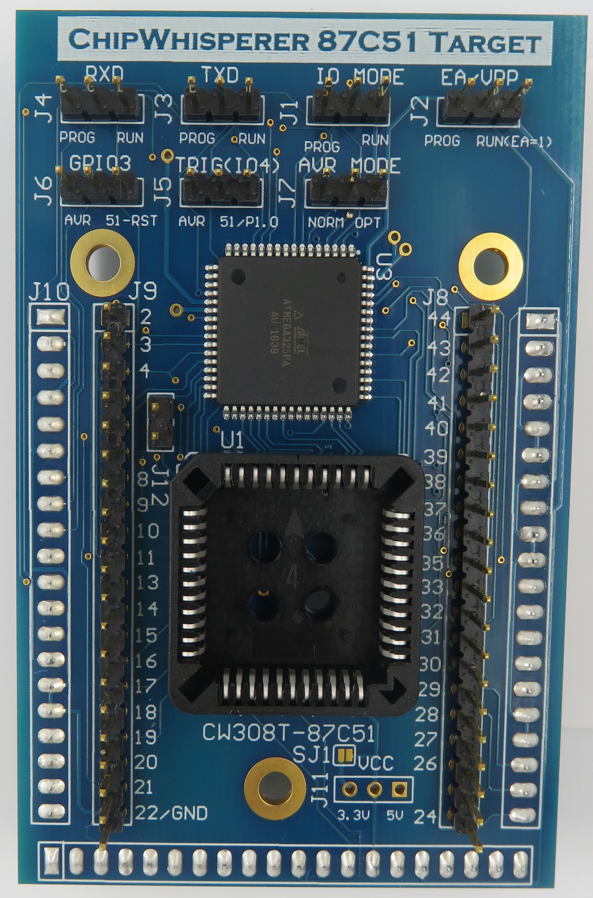
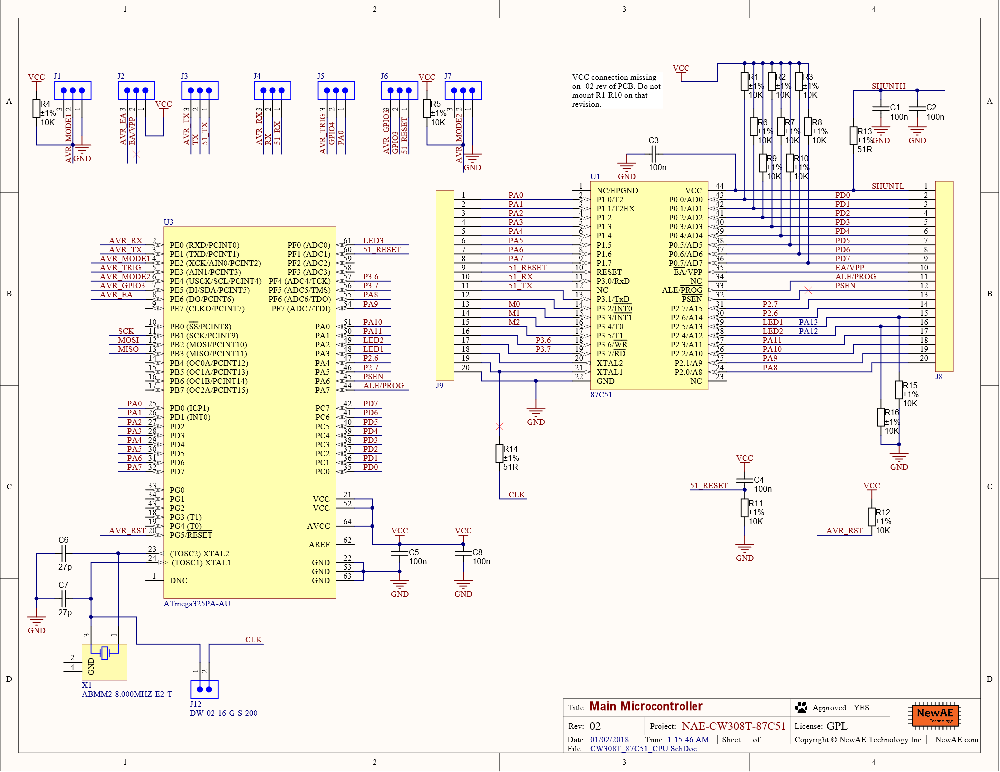
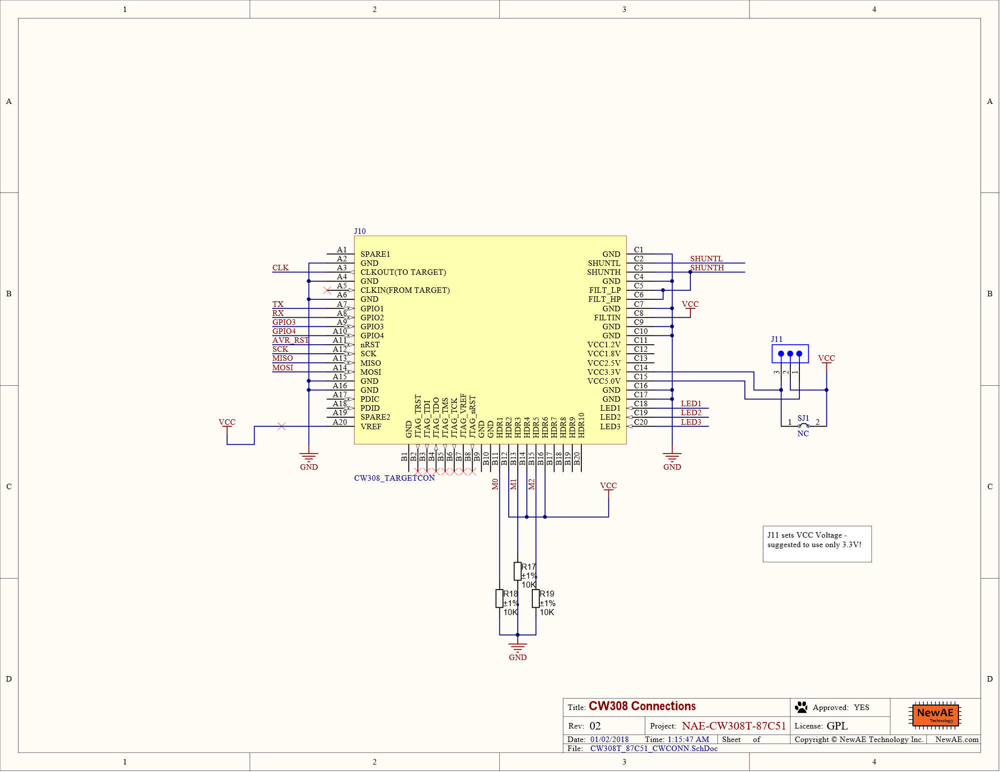

# CW308T-87C51

The 87C51 target is designed for a line of 8051 processors made by Intel
in PLCC44 package, although other manufactures make equivalent devices
as well (notably NXP as well). This target board allows for two types of
side channel attacks:

1.  Regular power analysis or glitching on the 87C51 firmware (ex: attacking an AES key while the 87C51 performs AES encryption)

2.  Attacks on the verification process in order to bypass the device's encryption table or security fuses

This page describes the setup of the 87C51 target and shows how it can
be used to perform these two types of attacks.

---

## Specifications

| Feature | Notes/Range |
|---------|----------|
| Target Device | 8xC51 |
| Target Architecture | 8-bit 8051 |
| Vcc | 3.3V |
| Programming | Preprogrammed, not reprogrammable |
| Hardware Crypto | No |
| Availability | Standalone |
| Status | Released |
| Shunt | 51Ω |

Available from [Mouser](https://www.mouser.com/ProductDetail/NewAE/NAE-CW308T-87C51?qs=r5DSvlrkXmJ64F4k9ZvzhA%3D%3D)
and the [NewAE Store](https://store.newae.com/87c51-cw308-target-plcc44-package/)

## Hardware Details

### **Programming Microcontroller**

The target board contains an ATMega165PA/ATMega325PA (referred to as the
'AVR' hereafter), which can be used for performing program verification.
It is also used to generate trigger points for attacks such as
encryption table read-out & inserting glitches into the program read
logic. The programming interface contains the following limitations:

  - No programming is possible as there is no VPP generation.

  - Address lines A0 - A13 are mapped to the AVR. The upper two lines are shared with LED1/LED2 outputs. (A14 and A15 aren't needed because the 87C51 model that's used only has 16 KB = 2^14 bytes of memory.)

### **Target Microcontroller**

The default target device is an Intel EE87C51RB1 (16K EPROM, 512 RAM).
Useful references:

  - [Intel 8xC51RA,RB,RC
    Datasheet](http://media.digikey.com/pdf/Data%20Sheets/Intel%20PDFs/8xC51RA,RB,RC.pdf)
  - [NXP 8XC51RA+/RB+
    Datasheet](http://www.nxp.com/documents/data_sheet/8XC54_51FX_51RX.pdf)

NOTE: The Intel datasheet is fairly short (20 pages) and does not
include full details of the programming. This can be found in the NXP
datasheet.

There are 2 20-pin headers on the top side of the board connected to the
pins of the 87C51. If you're keeping track, the remaining 4 pins are
labelled NC - they aren't used internally, so all of the functional pins
are broken out to these headers. These headers make it easier to connect
an oscilloscope or logic analyzer to the target.

**NOTE:** The 87C51 devices are either EPROM memories. Some may have a
UV window but some don't, those without the UV window are OTP devices.
You may wish to use a 89C51 device instead in some cases. See note below
about 89C51 devices.

>#### _Using 89C51 Devices_

The 89C51 devices are also possible to be used with this board, which
can be more easily reprogrammed. The 89C51 devices do not normally have
the "XOR encryption table" however, so you cannot attempt attacks on
that encryption table.

### **Jumpers**

A number of jumpers are present on the target board. They are mostly
used to select different features and options on the target board.
First, there are 7 jumpers that connect to the IO lines of the two
microcontrollers

  - **IO MODE (J1):** Selects if the AVR is enabled or not. When the
    board is powered on, if this is set to "RUN", the AVR will enter
    sleep mode until the power is cut. If it is set to "PROG", the AVR
    will continue executing its program.
  - **EA/VPP (J2):** Selects the 8051's EA pin connection. In "PROG"
    mode, the AVR has control of this pin; in "RUN" mode, it is always
    set to 1. This is necessary to allow the 8051 to execute code from
    internal EPROM memory.
  - **TXD (J3):** Connects the Target IO2 line (Serial TXD) to one of
    the chips. In "PROG" mode, this is connected to AVR PE1. In "RUN"
    mode, it is connected to 8051 P3.1.
  - **RXD (J4):** Connects the Target IO1 line (Serial RXD) to one of
    the chips. In "PROG" mode, this is connected to AVR PE0. In "RUN"
    mode, it is connected to 8051 P3.0.
  - **GPIO4 (J5):** Connects the Target IO4 line to AVR PE3 ("AVR" mode)
    or 8051 P1.0 ("51/P1.0" mode). This line is intended to be used as a
    trigger, so firmware on the 8051 and AVR can cause a trigger by
    toggling these wires.
  - **GPIO3 (J6):** Connects the Target IO3 line to AVR PE5 ("AVR" mode)
    or 8051 RESET ("51-RST" mode). In the former, the AVR has control
    over the 8051's reset line. In the latter, the 8051 uses an
    active-high reset, so the device runs when GPIO3 is set low.
  - **AVR MODE (J7):** Connects to AVR PE4. This is normally pulled up
    to VCC. With a jumper connected in "OPT" mode, this is set low.

Then, there are two jumpers that control the power and clock signals:

  - **VCC (J11):** Connects to the board's VCC rails. This can be
    connected to the baseboard's 5V rail or to one of the 3.3V regulator
    outputs. Be cautious with this - in particular, the ChipWhisperer
    Lite does NOT have 5V tolerant IO lines\!
  - **J12:** When J12 is not connected, the AVR runs on its own 7.37 MHz
    crystal. With J12 connected, the AVR's clock line is connected to
    CLKIN signal, which is also the 8051's clock line. Connecting the
    clock signals is useful for ensuring that the devices are
    synchronized, but it also causes any glitched clock signals to be
    routed to AVR.

Finally, the baseboard's "Target-Defined Programming" header (J15) is
connected to some of the 8051 pins. P3.3, P3.4, and P3.5 are connected
to H2, H4, and H6. Normally, these pins are all pulled down to ground
(logic 0). When a jumper is mounted to H1-H2, H3-H4, or H5-H6, these
pins are instead connected to VCC (logic 1).

---

>## AVR Firmware

The AVR on the target board has its own firmware to control the 87C51
code verification process. This firmware is one Atmel Studio project in
the Git repository. The compiled hex file can be programmed onto the AVR
using the AVR Programmer in the capture software.

If you have a target board that's never been programmed before, the AVR
fuses will need to be programmed from their default values. A [fuse
calculator](http://www.engbedded.com/fusecalc/) is helpful here. The
fuses should be written to:

  - Low fuse: `0xED`
  - High fuse: `0x99`
  - Ext fuse: `0xFF`

To program these, the AVR programmer will have to use Slow Clock Mode.
Once these fuses are set, slow clock mode can be disabled again.

---

>## 87C51 Firmware

### **Developing Firmware for the 87C51**

There are a number of tools that can be used to develop firmware for the
87C51 processor. The best 8051-specific software can be pretty
expensive, but it is possible to get by with free software:

**Compiler:** The [SDCC](http://sdcc.sourceforge.net/) (Small Device C
Compiler) is a compiler that is made for devices with limited amounts of
memory. It can be used to compile code specifically for a number of
targets, including the 8051 line of processors. A few of the useful
flags are:

  - `-mmcs51`: Compile code specifically for an MCS51 target
  - `--iram-size [size]`: Specify that the device has `[size]` bytes of
    internal RAM
  - `--xram-size [size]`: Same as above, but for external RAM
  - `--code-size [size]`: Same as above, but for code memory (EPROM)
  - `--out-fmt-ihx`: Produce an Intel HEX file as the output of the
    linking stage
  - `--stack-auto`: Put all automatic variables on the stack, rather
    than storing a specific location in RAM for them. This can be a huge
    RAM saver\!

Note that SDCC has [not completely
implemented](http://sdcc.sourceforge.net/mediawiki/index.php/Standard_compliance)
the ISO C99/C11 standards. One very noticeable change is that SDCC does
not allow variables declarations to be intermingled with code. That is,
the following will not compile:

    void func()
    {
        int x = 1; // OK
        x += 2;    // OK
        int y = x; // syntax error: token -> 'int'
    }

**Simulator**: The 87C51 is one-time programmable, so it is extremely
helpful to have a simulator to test firmware before burning it onto a
physical processor. There are very few free simulators for the 8051
core. One free sim is [EdSim51](http://www.edsim51.com/). This program
can load a hex file and run the code one step at a time. There are a few
big issues:

  - The simulator has no way of translating your compiled binary file
    back into C. This means that the debugging process is a bit blind -
    moving through the program one line at a time isn't particularly
    helpful because one line of C will typically be many lines of
    assembly. It's still possible to debug code by printing variables,
    but this leaves something to be desired.
  - EdSim51 is designed for an 8051 core with 128 B of RAM. This means
    that you cannot simulate any programs that use more than 128 B of
    RAM. However, this is enough space for a lot of tasks - our full
    piece of firmware does AES over SimpleSerial in this much space\!

**Programmer**: To write a program into the code EPROM, an EPROM
programmer is needed. We used a [MiniPro TL866
programmer](http://minipro.txt.si/index.php?title=Main_Page) along with
their free software. However, any programmer compatible with the 87C51
should be fine.

### **Example Firmware**

We've written a couple of firmware examples and put them together into
one big 87C51 project. Combining multiple pieces of code together means
that we can use one chip for all of the side channel attacks - we don't
need separate processors to work on different pieces of firmware. This
project has six different parts:

  - `print`: prints "Testing 1\\nTesting 2\\nTesting 3...". Easy to
    confirm that the processor is running correctly.
  - `passcheck`: waits for the user to enter a password and checks
    whether it is correct. The correct password is
    "[Tr0ub4dor&3\\r](http://xkcd.com/936/)".
  - `glitchloop`: calculates 200 \* 200 using a very long and tedious
    loop. Inserting a successful glitch will corrupt this result.
  - `xor`: implements the SimpleSerial protocol with 128 bit key and
    plaintexts. The response is the XOR of the plaintext and key.
  - `aes`: implements SimpleSerial with AES-128 encryption (128 bit key
    and plaintext)
  - `tea`: implements SimpleSerial with TEA encryption (256 bit key and
    128 bit plaintext)

When the 87C51 is powered on, it reads the state of the Target-Defined
Programming header J15 to decide which mode to run in. In the following
table, a Y means that the jumper is mounted, and an N means that no
jumper is mounted:

| **H5-H6** | **H3-H4** | **H1-H2** | **Mode**       |
| --------- | --------- | --------- | -------------- |
| N         | N         | N         | Print          |
| N         | N         | Y         | Password check |
| N         | Y         | N         | Glitch loop    |
| N         | Y         | Y         | XOR            |
| Y         | N         | N         | AES            |
| Y         | N         | Y         | TEA            |
| Y         | Y         | N         | —              |
| Y         | Y         | Y         | —              |

---

>## Code Verification

### **Verification Process**

The process to read back code from the 87C51's EPROM memory is described
in the NXP datasheet (in the EPROM Characteristics section). However,
there's a lot of info in this section about *writing* to the EPROM
memory, which we can't do on the target board. The bare minimum to
verify code bytes is repeated here:

1\. Set the following levels on these pins:

| **Pin**  | **Level** |
| -------- | --------- |
| RST      | 1         |
| P3.6     | 1         |
| P3.7     | 1         |
| EA/VPP   | 1         |
| ALE/PROG | 1         |
| PSEN     | 0         |
| P2.6     | 0         |
| P2.7     | 1         |

2\. Write the 16 bit address to the following pins:

| **Pin**   | **Address** |
| --------- | ----------- |
| P1.0-P1.7 | A0-A7       |
| P2.0-P2.5 | A8-A13      |
| P3.4      | A14         |
| P3.5      | A15         |

Note that the 87C51 that we've used for this project only has 16 KB of
memory, so addresses over 0x3FFF are meaningless (ie: A14 and A15 have
no purpose).

3\. Write P2.7 to 0 to begin the read. Wait at least 48 clock cycles.

4\. Read the 8 bits of data from P0.0-P0.7. These pins use open drain
outputs, so pull-up resistors are needed - the AVR's internal pullups
are good enough for this.

5\. Write P2.7 to 1 to stop reading the device.

### **Security**

There are two security features built into the 87C51 to stop end-users
from reading the firmware out of EPROM. Companies might use these
features as an anti-piracy measure: if they can keep their competitors
from reading their source code, then they can avoid giving away any of
their trade secrets. Both of these security features can be enabled
using the Minipro programmer.

First, the 87C51 has a 64 byte encryption table stored in EPROM. By
default, this table contains 64 `0xFF` bytes. When the chip is being
programmed, the table can be loaded with secret values. Then, when a
byte of the code is read from the code memory, it is XNORed with a
corresponding byte from the encryption table. In pseudocode, this is

    displayed_byte = ~(data[address] ^ enc_table[address % 64]);

Notice that the default encryption table has no effect on the data -
there is no encryption until the table has been written with some
values.

Second, the 87C51 has three lock bits that can be enabled. Lock bit 2
cannot be enabled until lock 1 is, and lock 3 cannot be enabled until
lock 2 is. The three locks have the following functions:

1.  EPROM can no longer be programmed. Also, some restrictions are
    placed on programs that use external memory.
2.  Verification is disabled. The device will read `0xFF` for every
    address.
3.  Programs cannot be executed from external memory.

The most critical of these locks is the second: it stops all
verification.

### **Gotchas**

This section describes a few quirks/caveats that we found with the 87C51
and its target board.

The 87C51 does some crazy things with the clock signal. First, the
external clock is fed into a divide by 2 counter to guarantee a 50% duty
cycle. Second, every instruction that the 8051 core executes takes a
multiple of 6 clock cycles. In other words, one "machine cycle" on the
chip is 6 internal cycles, which is 12 oscillator cycles.

When performing side channel attacks on the verify process, the relative
phase of the "machine clock" is important: the power consumption changes
significantly if we load the address on oscillator cycle 1, 2, 3, ...,
or 12. (The changes are more severe than a simple shift in time.) To
avoid these phase shifts, we tried to synchronize the AVR's verify
methods with the 8051's machine clock. We found that the 8051 has an
output (ALE/PROG) that is used for external timing - it is emitted at
1/6 of the oscillator frequency. By syncing to this signal, we narrowed
down the phase shift from 12 possible shifts to 2. However, we could not
find a way to remove this 1/2 chance. If you are capturing multiple sets
of traces, please look to see that the main features of the traces don't
move between captures\!

The 87C51 has a synchronous reset input (?\!) - a reset requires 12
oscillator cycles to take effect, and the machine clock's phase does not
change during a reset\! This means that the only way to change the
machine clock's phase is to power cycle the 87C51. (The "Read Signature"
button in the AVR Programmer does this. Pulling out the processor and
re-mounting it does too.)

## Schematic and Layout

