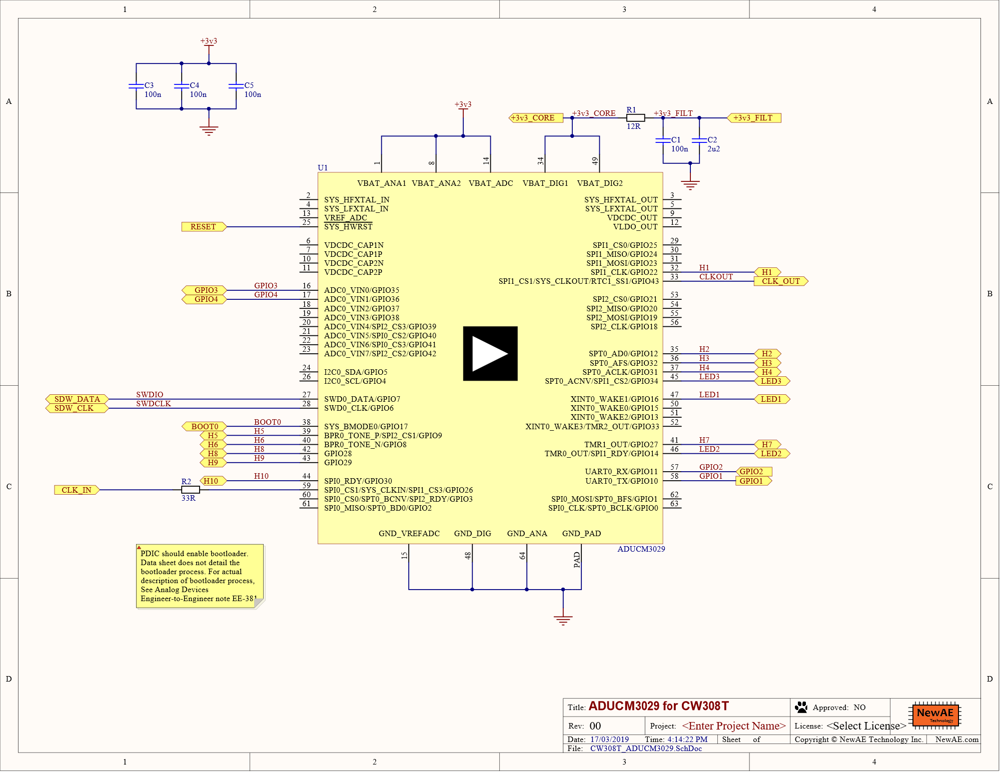
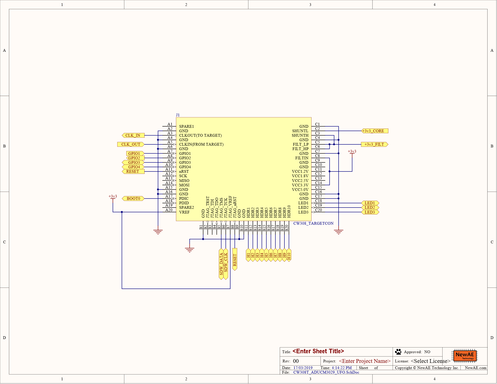

# CW308T-ADUCM3029

This board supports the Analog Devices ADuCM3029 microcontroller. The
mounted chip is the ADUCM3029BCPZ.

This is a BETA target and not yet available. This page will continue to be updated until release. Gerbers are available in the GIT repo if you live dangerously.

## Specficiations

| Feature | Notes/Range |
|---------|----------|
| Target Device | ADuCM3029 |
| Target Architecture | Arm Cortex M3 |
| Vcc | 1.8V-3.3V |
| Programming | Serial bootloader, SWD |
| Hardware Crypto | Yes |
| Availability | Gerbers/Source |
| Status | In development  |
| Shunt | 12Ω |

---

## Power Supply

The ADuCM3029 can run from a core supply voltage between 1.8 and 3.3
volts. By default the core is fed from the 3.3v supply but the
adjustable regulator on the CW308T can be used to set any viable core
voltage. Sometimes power analysis is more viable at different supply
voltages.

---

## Cryptographic Accelerator

As described in the [ADuCM3027/3029 Data Sheet](http://www.analog.com/media/en/technical-documentation/data-sheets/ADuCM3027_3029.pdf), The cryptographic
accelerator is a 32-bit APB DMA capable peripheral. There are two 32-bit
buffers provided for data input/output operations. These buffers read in
or read out 128 bits in four data accesses. Big endian and little endian
data formats are supported, as are the following modes:

  - Electronic code book (ECB) mode—
  - AES mode (128 and 256)
  - Counter (CTR) mode

  - Cipher block chaining (CBC) mode
  - Message authentication code (MAC) mode
  - Cipher block chaining-message authentication code (CCM/CCM) mode
  - SHA-256 mode

---

## Programming

The ADuCM3029 supports a serial bootloader which is enabled by pulling
down the PDIC pin on the CW308T. Details for using the serial bootloader
can be found in the application note [EE-381](http://www.analog.com/media/en/technical-documentation/application-notes/EE381v01.pdf). Currently,
ChipWhisperer doesn't have support for this bootloader, meaning
the user must code their own programmer application. Also, the
bootloader only supports writing memory to SRAM, meaning
the user's code is responsible for writing itself to flash.
 
Single wire debug (SWD) is also supported for programming and debugging.

---

## Schematic and Layout

---
