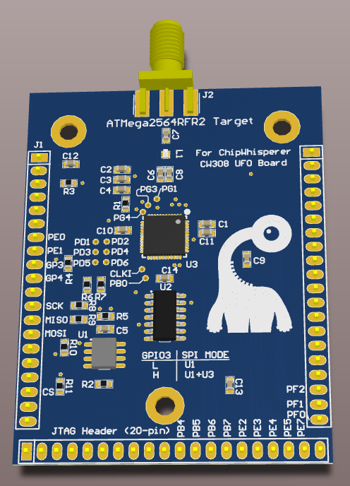

# CW308T-MEGARF

This is a BETA target and not yet available. This page will continue to be updated until release.

This target is for the ATMega2564RFR2. This makes a great target for
exploring IoT technologies, such as mesh networking protocols.

---

| Feature | Notes/Range |
|---------|----------|
| Target Device | ATMega2564RFR2 |
| Target Architecture | 8-bit Harvard |
| Vcc | 3.3V |
| Programming | SPI, ISP, JTAG |
| Hardware Crypto | Yes |
| Availability | Gerbers/Source Files |
| Status | In development |
| Shunt | 51Ω |

## Usage Notes

### **Internal / External DVDD Supply**

By default the MegaRF will provide the DVDD supply using a regulator
inside the MegaRF chip. If you wish to use an external supply you will
have to use the VADJ setting on the CW308 to set the DVDD supply to be
slightly higher than 1.8V, which would cause the MegaRF on-board
regulator to shut down.

In our experimentation the internal DVDD regulator worked fairly well,
and did not add significant noise to any measurements.

### **SPI Connections**

There is a SPI flash chip connected to the ATmegaRF2564RFR2. During
development you may require an external programmer to load this flash
chip, and the MegaRF must be disconnected to do this safely. If you do
not disconnect the MegaRF SPI lines & try holding the MegaRF in reset to
tri-state the SPI lines, you may end up accidentally loading an ISP
programming command.

GPIO3 is normally used to switche the 4066 electronic switch from
connecting the external SPI connections between the SPI-Flash memory
chip and the MegaRF device. You must set GPIO3 high to allow programming
of the MegaRF chip, otherwise it is pulled low which disconnects the
MegaRF.

---

## Programming

The ChipWhisperer's AVR programmer supports this target directly. No
external programmer is required.

---

## Schematic

See GIT Repo for PDF of schematic.

---

## Board Layout

See GIT Repo for gerber files.

---

## Radio Usage

Note NO ANTENNA is provided as the board is sold only as a sub-assembly
and not designed to be used as a radio transmitter. Mounting a 2.4 GHz
radio antenna (SMA, NOT reverse-polarity SMA) like Digi-Key P/N
1475-1014-ND could potentially require you to meet FCC/CE guidelines for
RF emissions and is UNSUPPORTED USAGE.

---

## Errata

### **\-02 Version**

Balun pinout is incorrect and will not work.

### **\-01 Version**

The following is the original (-01) schematic. The -01 PCBs were never
publicly released and used during development only. The following
changes were made in -02:

  - MOSI/MISO was switched on Atmel device (requires PCB fix on -01, or
    PCB will not work)
  - TST connected to ground (requires PCB fix on -01, or PCB will not
    work)
  - CLKI pull down
  - GPIO3 is now optionally in control of 4066 instead of being
    hardwired
  - Serial resistors added on SCK/MISO/MOSI lines

