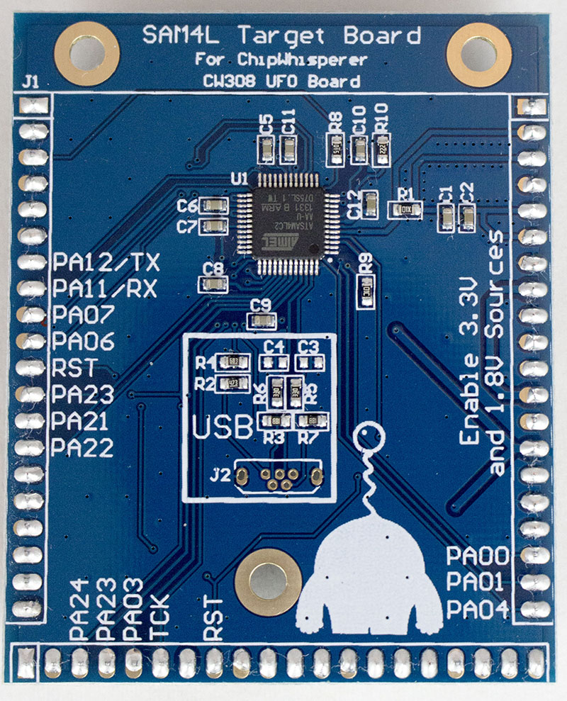
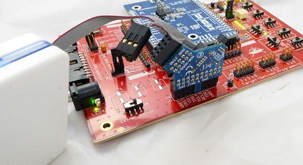
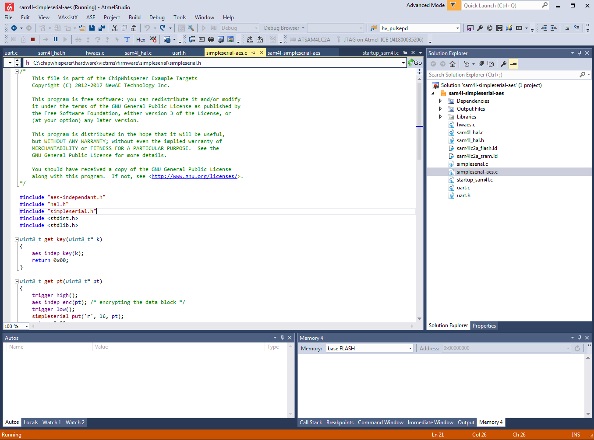

# CW308T-SAM4L

This board supports the Atmel SAM4L microcontroller. The default build
has the Atmel ATSAM4LC2AA-AU, which has 128KB flash and 32KB SRAM.



---

## Specifications

| Feature | Notes/Range |
|---------|----------|
| Target Device | ATSAM4L |
| Target Architecture | Arm Cortex-M4 |
| Vcc | 1.8V |
| Programming | JTAG |
| Hardware Crypto | Yes (includes countermeasures) |
| Availability | Standalone |
| Status | Released |
| Shunt | 10Ω |

Available from [Mouser](https://www.mouser.com/ProductDetail/NewAE/NAE-CW308T-ATSAM4L?qs=PzGy0jfpSMv5ToVL8lnUZg%3D%3D)

## Power Supply

The Atmel SAM4L has an internal 1.8V regulator. This regulator is not
used in the board, instead power for the core is supplied by an external
LDO on the UFO board. Be sure to enable the 1.8V and 3.3V regulators on
the UFO board for the SAM4L board to function.

---

## Hardware AES

The SAM4L has a hardware AES module, with optional countermeasures that
can be enabled. These countermeasures are described in the SAM4L
datasheet as the following options:

  - Type 1: Randomly add one cycle to data processing
  - Type 2: Randomly add one cycle to data processing (other version)

  - Type 3: Add a random number of clock cycles to data processing,
    subject to a maximum of 11 clock cycles for key size of 128 bits
  - Type 4: Add random spurious power consumption during data processing

Interestingly they can be individually enabled/disabled. This makes the
SAM4L a useful training target for power analysis attacks against
various hardware countermeasures.

---

## Programming

An external programmer is needed for this target. The SAM4L has an
internal bootloader you can use via an external serial port, which is
not yet supported directly by the ChipWhisperer-Capture software.

### **JTAG Programmer**

The 20-pin JTAG port (J6 on CW308 Board) can be used with the
[ATATMEL-ICE](https://www.digikey.com/product-detail/en/microchip-technology/ATATMEL-ICE/ATATMEL-ICE-ND/4753379)
which is Atmel's JTAG programmer. You can use any other ARM programmer
you might have as well (i.e., OpenOCD, Segger J-Link, etc).



### **Using Atmel SAM-BA**

Atmel SAM4L has a built-in bootloader. Not this bootloader is NOT
ROM-Resident - if you reprogram the device the bootloader is lost, since
it is stored in flash memory. It is recommended to use an external JTAG
programmer for this target, as since the bootloader is not ROM-resident
it can easily be overwritten by accident (i.e., if connecting a JTAG
programmer).

---

## SimpleSerial Program

The SimpleSerial-AES program can be built for this target. This can use
either hardware crypto or a software AES. This project is currently
built via the Atmel Studio IDE, and the project file is located at
[hardware/victims/firmware/simpleserial-aes/ide\_projects/asf/sam4l-simpleserial-aes](https://github.com/newaetech/chipwhisperer/tree/develop/hardware/victims/firmware/simpleserial-aes/ide_projects/asf/sam4l-simpleserial-aes)
with the ChipWhisperer release.

If an Atmel ICE is attached as above, you should be able to build and
run the example in 'debug' mode:



An automatically generated makefile can be modified to built in Linux,
but currently has not been integrated into the rest of the system. This
makefile is checked into the GIT repository.

### **Adjusting Hardware AES**

Inside the file *hwaes.c* you will find the AES hardware initilization.
This is given in the following code sample:

``` c
void aes_init(void)
{
    periclk_aesa_init();
    SCIF->SCIF_GCCTRL[AESA_GCLK_NUM].SCIF_GCCTRL = SCIF_GCCTRL_OSCSEL(GENCLK_SRC_CLK_CPU) |  SCIF_GCCTRL_CEN;

    /* AES Enable */
    AESA->AESA_CTRL = AESA_CTRL_ENABLE | AESA_CTRL_NEWMSG; /* Enable, auto-accept new messages */

    //Use with debugger to check PARAMETER register value
    //volatile uint32_t param = AESA->AESA_PARAMETER;

    /* AES Mode */
    AESA->AESA_MODE = AESA_MODE_ENCRYPT | (AESA_MODE_CTYPE(0x0F)); /* Encrypt Mode, with all countermeasures */
    //AESA->AESA_MODE = AESA_MODE_ENCRYPT; /* Encrypt Mode, without countermeasures */

    /* Setup random seed for countermeasures to work */
    AESA->AESA_DRNGSEED = 0xDEADBEEF; //A very random number
}
```

Note there are two options shown, where countermeasures can be enabled
or disabled. You can see the SAM4L datasheet for a description of the
countermeasures. The following compares the power traces with and
without countermeasures:

The following shows countermeasures enabled, you can see various
execution paths taken during the encryption:


Compare this to the countermeasures disabled:


---

## Schematic

See GIT Repo for PDF of schematic.


---

## Board Layout

See GIT Repo for gerber files.
