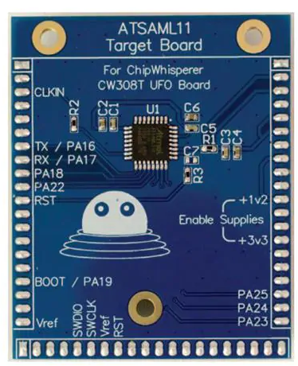
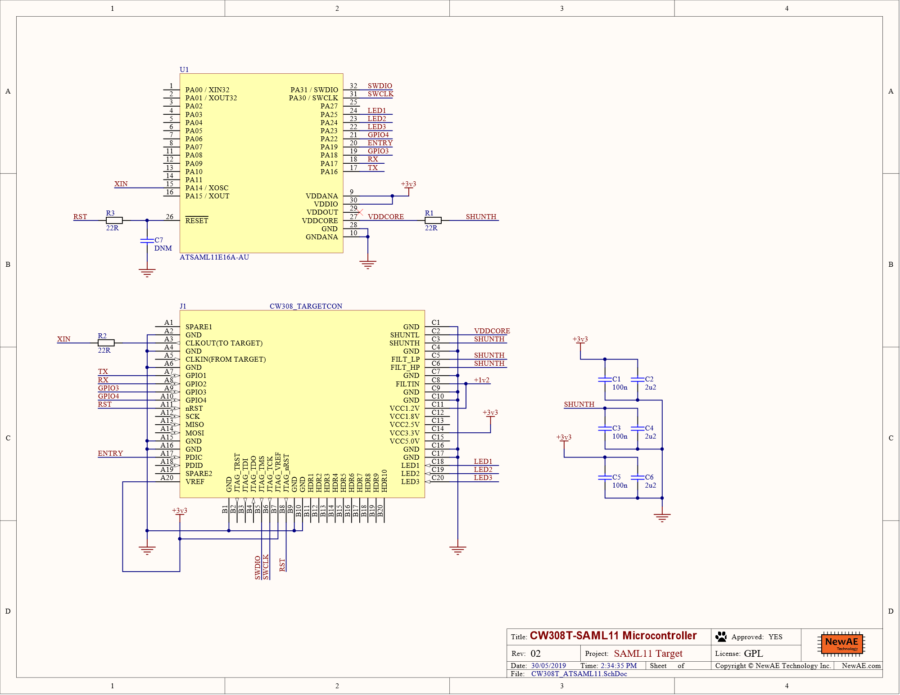

# CW308T-ATSAML11

This board supports the Microchip ATSAML11 microcontroller.

## Specifications

| Feature | Notes/Range |
|---------|----------|
| Target Device | ATSAML11E16A |
| Target Architecture | Arm Cortex-M23 |
| Vcc | 1.2V |
| Programming | Serial Bootloader, SWD |
| Hardware Crypto | Accelerator |
| Availability | Standalone |
| Status | Released |
| Shunt | 22Ω |

Available from [Mouser](https://www.mouser.com/ProductDetail/NewAE/NAE-CW308T-ATSAML11?qs=PzGy0jfpSMuVApvEE0Yklw%3D%3D).

---

## Power Supply

The core of the SAML11 chip runs from a 1.2v supply. This is supplied
through the CW308T 1.2v regulator. The I/O busses are supplied with
3.3v.

---

## Security Features

The SAML11 platform integrates many advanced security features
including:

  - Up to four tamper pins for static and dynamic intrusion detections
  - Silent flash access for side channel attack resistance
  - Data scrambling with user-defined keys for both Flash and RAM
  - A True Random Number Generator

Since it's a Cortex-M23 core, it's also got Arm TrustZone-M.

For a full list of security features see the product family data
sheet\[1\]

---

## Programming

The SAML10/11 family implements a serial bootloader. Usage of this
bootloader is not detailed in the data sheet, for usage information see
Microchip Application note AN2699\[2\]. This bootloader doesn't have a
driver in ChipWhisperer, but one could be added.

Serial Wire Debug (SWD) is also supported for programming and debugging
applications.

---

## Schematic and Layout

---

1.  <http://ww1.microchip.com/downloads/en/DeviceDoc/SAM-L10L11%20Family-DataSheet%20-%20DS60001513B.pdf>
2.  <http://ww1.microchip.com/downloads/en/AppNotes/00002699A-UART%20Bootloader%20for%20SAM%20L10%20%20SAM%20L11.pdf>
