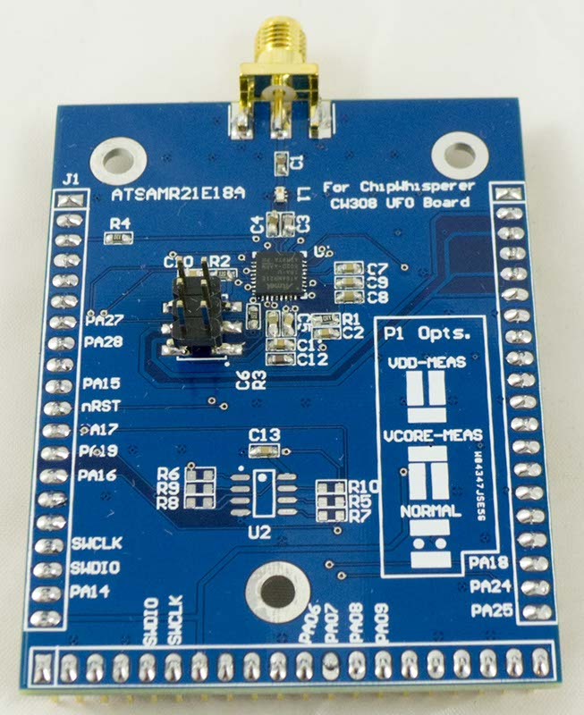

# CW308T-ATSAMR21

This is a BETA target and not yet available. This page will continue to be updated until release. Gerbers are available in the GIT repo if you live dangerously.

## Specficiations

| Feature | Notes/Range |
|---------|----------|
| Target Device | ATSAMR21 |
| Target Architecture | Arm Cortex-M0+ |
| Vcc | 1.2V/1.8V |
| Programming | SWD |
| Hardware Crypto | No |
| Availability | Gerbers/Source |
| Status | In development |
| Shunt | 51Ω |

---

## Power Analysis

The SAMR21E contains two internal dies: an Atmel Cortex M0+ device, and
an AT86RF233 radio chip. They are connected via a SPI bus inside the
device, but there is actually two separate power pins. P1 is used to
select which device you'd like to measure.

  - VCORE is connected to the SAM processor core.
  - VDD is connected to the AT86RF233 digital portion (which includes
    the AES hardware accelerator).

Both of these have internal voltage regulators. If you wish to 'disable'
them, you can measure the voltage on TP5, and then supply a voltage
slightly higher than this using VADJ. To do this:

1.  Remove jumper J14.
2.  Set P1 to desired measurement target.
3.  Measure voltage at TP5 (should be around 1.2V or 1.8V depending on
    if targeting VCORE or VDD).
4.  Adjust VADJ to be +0.1V higher than measured at TP5.
5.  Using J14, set FILT_LP/FILT_HP source as being VADJ.
6.  Measuring voltage at TP5 still, continue to carefully adjust VADJ
    such that a higher voltage is seen on TP5. You may need to perform
    this step to overcome voltage drops in the filter and/or shunt
    resistor.

**WARNING: Be VERY CAREFUL when adjusting VADJ. In addition once done it
is recommended to set J14 back to 'default' values. If you switch P1 to
the wrong setting and forget that J14 is set to use VADJ, you could have
an incorrect voltage applied to your microcontroller.**

---

## JTAG Programming

The SAMR21E uses the 2-pin programming (SWDIO/SWCLK) interface. This is
routed to the 20-pin ARM JTAG header, which can be used with standard
Atmel programming tools:

---

## Schematic

NOTE: Schematic is marked as unapproved until hardware has been fully
validated.

---

## Board Layout

See GIT Repo for gerber files.

---

## Radio Usage

Note NO ANTENNA is provided as the board is sold only as a sub-assembly
and not designed to be used as a radio transmitter. Mounting a 2.4 GHz
radio antenna (SMA, NOT reverse-polarity SMA) like Digi-Key P/N
1475-1014-ND could potentially require you to meet FCC/CE guidelines for
RF emissions and is UNSUPPORTED USAGE. All example source code DOES NOT
enable the RF blocks.
