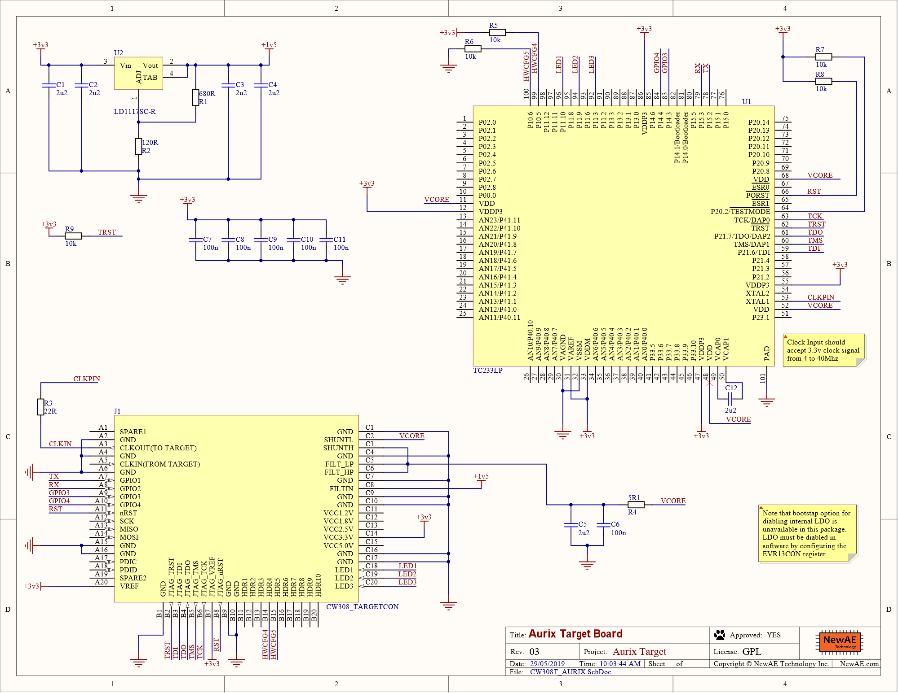

# CW308T-AURIX

This board supports the Infineon TC233LP microcontroller.

## Specficiations

| Feature | Notes/Range |
|---------|----------|
| Target Device | Infineon TC233LP |
| Target Architecture | 32-bit TriCore |
| Vcc | 1.3V |
| Programming | JTAG |
| Hardware Crypto | No |
| Availability | Standalone |
| Status | Released |
| Shunt | 5.1Ω |

Available from:

 * [Mouser](https://www.mouser.com/Search/Refine?Keyword=NAE-CW308T-AURIX-TC233)
 * [NewAE Store](https://store.newae.com/aurix-tricore-tc233lp-target-for-cw308/)

---

## Power Supply

The core of the TC233LP chip runs from a 1.3v supply that is generated
from an on-board regulator. The I/O buses are supplied with 3.3v.

---

## Clock

The TC233LP currently requires a 7.37MHz clock from the ChipWhisperer.
The PLL is setup to run at x1 speed (so still 7.37MHz).

---

## Security Features

The TC233LP has an additional Lockstep core that runs the same
instructions as the Master core (CPU0). The outputs of these cores are
compared and mismatches are reported in the Safety Management Unit of
the chip. This feature can only be enabled by editing the boot header of
the hex file you program the chip with.

---

## Programming

Programming of the AURIX board can currently only be done over JTAG with
the Infineon DAP miniWiggler v3 using Infineon Memtool. To program the
AURIX chip, begin by plugging in the miniWiggler to J6 on the CW308
board. Next, open Memtool.

Next, you'll need to add a target for the TC233LP chip. Navigate to
Target \> Browse and hit New. Select "Use a default target
configuration" and find "Application Kit with TC234 (DAS)" under
"Application Kits (DAS)", then hit "Finish". Hit "Connect". If "Ready
for Memtool Command" appeared next to it, everything went smoothly.

To actually program the device, open your hex file using "Open File..."
on the left hand side. Click on the address beginning with `0xA0000000`
and hit "Add Sel.\>\>". Finally, hit Program. Press the nRST button on
the CW308. Current versions of the HAL will light up LED1 upon starting,
so if this LED is on, your program has been successfully flashed.

The correct header to use on the miniWiggler is the DAP header (closest to the FT2232)>
The following 20-pin to 10-pin adapter can be used to connect the miniWiggler to
the ChipWhisperer: https://www.olimex.com/Products/ARM/JTAG/ARM-JTAG-20-10/

---

## Building Projects

To build projects for the TC233LP, you'll need [HighTec's Tricore Tool
Chain](https://free-entry-toolchain.hightec-rt.com/). Once the toolchain
is installed, you'll need to add it to your path.

Once that's done, standard ChipWhisperer projects should build with
`make PLATFORM=CW308_AURIX CRYPTO_TARGET=TINYAES128C`.

---

## Modifying Boot Header

To access some features of the TC233LP, such as the Lockstep control and
disabling boot pins, the boot header at the beginning of the hex file
must be modified. One way to do this is to use the "Edit" button in
Memtool. After selecting the first memory range (should begin with
0xA0000000), hit "Edit". Most of the important settings (including
lockstep control and boot control) are in the final 2 bytes of the
second word (address 0xA0000004).

After modifying the boot header, you'll need to calculate the CRC32 of
the header for addresses 0xA0000000 to 0xA0000017, as well as its
compliment (bitwise NOT). A resource like
<https://www.lammertbies.nl/comm/info/crc-calculation.html> can be used
to calculate the CRC. Make sure the input type is hex. The CRC32 should
go in address 0xA0000018, while its compliment should go in address
0xA000001C. For example, the full boot header for lockstep enabled
operation should be: 00000000 B3590170 00000000 00000000 00000000
00000000 964C0E85 69B3F17A.

Note that the boot header must be manually edited each time a project is
recompiled. One way to avoid this is to edit the startup file that sets
the boot header. This is included in the hal/aurix folder in
ChipWhisperer's firmware directory as crt0-tc2x.S. The boot header can
be found on lines 72 to 79. Note that the CRC32/compliment still has to
be calculated for lines 72 to 77, replacing the values of lines 78 and
79.

If LED1 does not illuminate after changing the boot header, something in
the header (like the CRC32) is likely incorrect.

---

## Schematic and Layout

