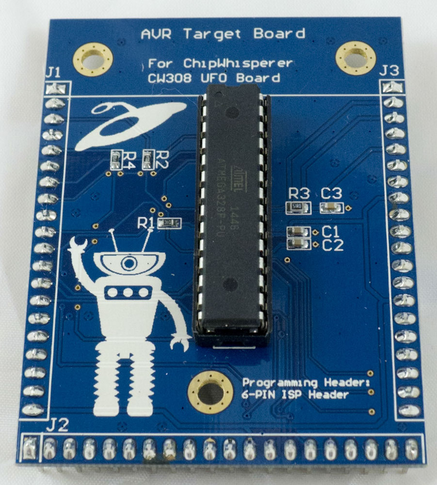
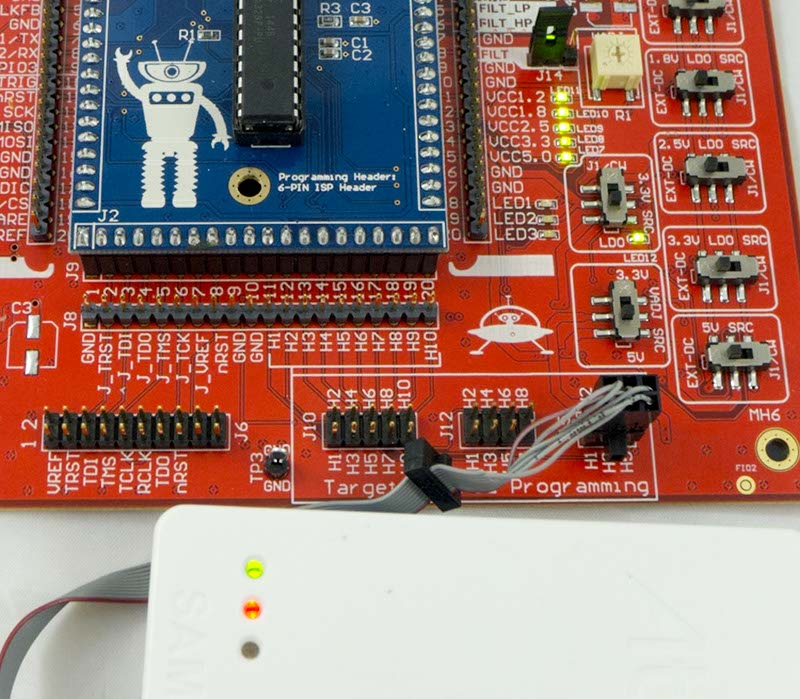

# CW308T-AVR

---

## Specifications

| Feature | Notes/Range |
|---------|----------|
| Target Device | Atmel AVR |
| Target Architecture | 8-bit Harvard |
| Vcc | 3.3V |
| Programming | ISP |
| Hardware Crypto | No |
| Availability | Standalone |
| Status | Released |
| Shunt | 51Ω |

This target used to come with many of NewAE's starter kits, but has been replaced with the CW308T-STM32F3.

## I/O Connections

**NOTE:** The serial pins for this target are swapped comapred to the usual setup. An example setup script can be found here: https://github.com/newaetech/chipwhisperer-jupyter/blob/1ccd1b1fbd8a3295e1033efb37e53e1022d47cc5/Helper_Scripts/Setup_Notduino.ipynb

The pinout of this module matches the "NOTDuino" kit along with the
"CW301 Multi-Target Board" routing. The following is the connection
between GPIO1-4 and the I/O lines on the AVR:

| **CW308 Pin** | **ATMega328P Pin** | **Notes**                                                                                   |
| --------- | -------------- | --------------------------------------------------------------------------------------- |
| GPIO1     | PD0 (RXD)      | Serial INPUT to AVR.                                                                    |
| GPIO2     | PD1 (TXD)      | Serial OUTPUT from AVR.                                                                 |
| GPIO3     | N/C            |                                                                                         |
| GPIO4     | PC0            | Trigger pin (mapped to ADC-port such that I/O driver power comes from AVCC).            |
| CLKIN     | XTAL1          |                                                                                         |
| CLKFB     | PB0            | Can set this pin as CLKO with fuse. Useful for synchronizing to internal RC oscillator. |
| nRST      | nRST (PC6)     | Used by in-system-programming (ISP) interface.                                          |
| MOSI      | PB3 (MOSI)     | Used by in-system-programming (ISP) interface.                                          |
| MISO      | PB4 (MISO)     | Used by in-system-programming (ISP) interface.                                          |
| SCK       | PB5 (SCK)      | Used by in-system-programming (ISP) interface.                                          |

---

## Programming Header

The 6-pin programming heading can be used with the Atmel ISP interface.
The pinout of the 6-pin programming header on the main-board allows it
to work with standard Atmel ISP tools:

---

## Schematic

