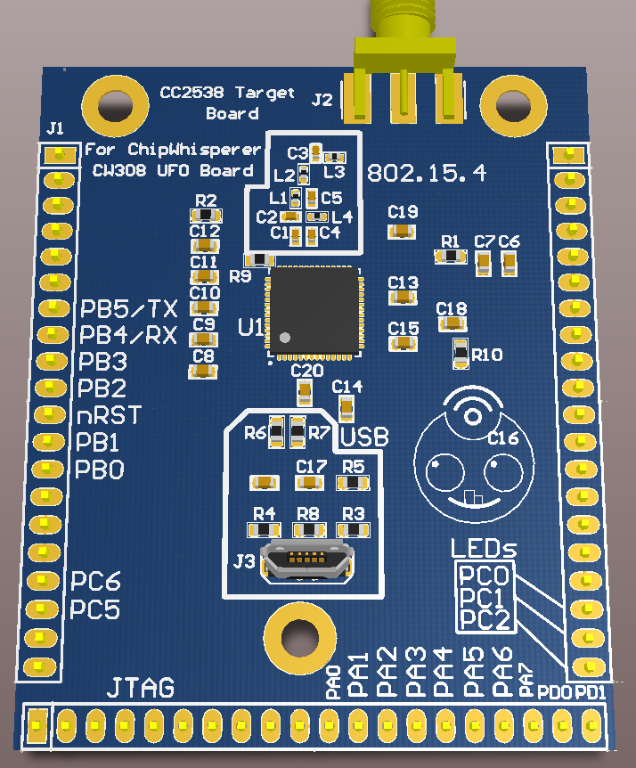
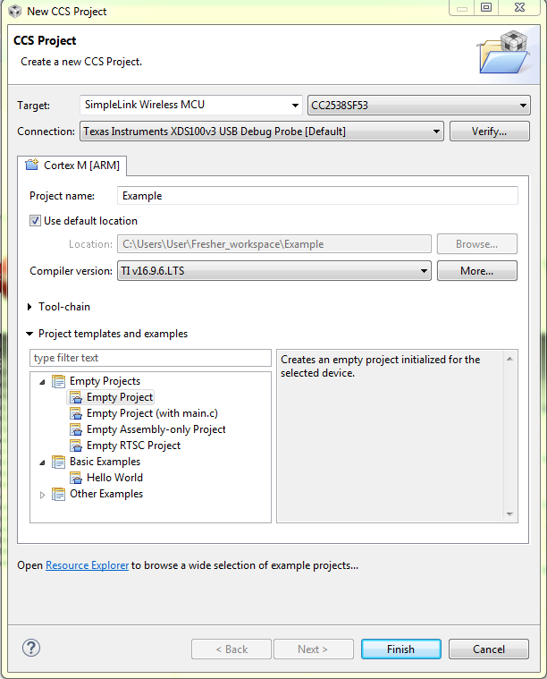
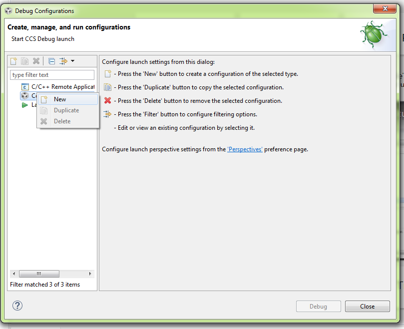

# CW308T-CC2538

The CC2538 target uses the CC2538SF53 from TI.

---

## Specifications

| Feature | Notes/Range |
|---------|----------|
| Target Device | CC2538 |
| Target Architecture | Arm Cortex-M3 |
| Vcc | 1.8V |
| Programming | JTAG |
| Hardware Crypto | Yes |
| Availability | Gerbers/Source |
| Status | Released |
| Shunt | 22Ω |

## Building Chipwhisperer Programs

The regular firmware build process will work once the updated build
system is released, utilizing a HAL module. Firmware for the device was
pulled from the CC2538 Foundation Firmware, while the code to provide
startup instructions and memory mapping was pulled and modified from the
STM32F2 HAL. Once released, it will build with all of the SimpleSerial
projects. To build:

`make PLATFORM=CW308_CC2538 CRYPTO_TARGET=TINYAES128C`

Assuming the build works, the file size and platform will be printed.

---

## Programming

An external programmer is needed for this target. It has currently only
been tested with the TMS320-XDS100v3+ JTAG debugger through TI's Code
Composer Studio v7 (CCS). To upload through CCS, create a new CCS
project. There, select the CC2538SF53 as the target. To make your search
easier, CC2538SF53 is a SimpleLink Wireless MCU. For Connection, select
Texas Instruments XDS100v3 USB Debug Probe. Pick any unused project name
and hit Finish.

Next, go to Run->Debug Configurations. Right click "Code Composer
Studio - Device Debugging" and hit "New".

Under Main, click "Use default target configuration". Next, go to
program, hit "File System", and navigate to your binary. If you built
using Chipwhisperer's build system, you want the .elf file from this
process. Hit "Apply", then "Debug". If the target does not connect, go
to Run-\>Connect Target. Finally, go to Run-\>Resume to start the
program. Closing CCS should leave the program running on the CC2538.

---

## Schematic

See GIT Repo for PDF of schematic.

---

## Board Layout

See GIT Repo for gerber files.
