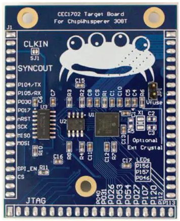

# CW308T-CEC1702

The CEC1702 is an embedded controller with strong cryptographic support,
customized for Internet of Things (IOT) platforms. The chip implements a
highly-configurable, mixed signal, advanced I/O controller architecture.
The device incorporates a 32-bit ARM Cortex M4F Microcontroller core
with closely-coupled SRAM for code and data. A secure bootloader is
used to download the custom firmware image from the system’s shared SPI
Flash device, thereby allowing system designers to customize the
device’s behavior.\[1\]

The CW308T-CEC1702 incorporates the main chip with a 16MB SPI flash chip
and a bi-directional SPI Buffer. The target board has standard power
monitoring, UART serial, and clock In/Out compatibility with the CW308.
JTAG pins and many GPIO pins are also exposed for prototyping and
testing use.

This device is interesting in that it has a lot of hardware crypto and
security functionality.

---

## Specifications

| Feature | Notes/Range |
|---------|----------|
| Target Device | MCHP CEC1702 |
| Target Architecture | Arm Cortex M4F |
| Vcc | 3.3V |
| Programming | SPI Flash, JTAG (SRAM only) |
| Hardware Crypto | Yes |
| Availability | Standalone |
| Status | Released |
| Shunt | 10Ω |

Available from [Mouser](https://www.mouser.com/ProductDetail/NewAE/NAE-CW308T-CEC1702?qs=PzGy0jfpSMvD%2FsklzPsozg%3D%3D)

## I/O Connections

| **CW308 Pin** | **CEC1702 Pin** | **Function**                                                                          |
| --------- | ----------- | --------------------------------------------------------------------------------- |
| GPIO1     | P104 (TXD0) | Serial OUTPUT from CEC1702                                                        |
| GPIO2     | P105 (RXD0) | Serial INPUT to CEC1702                                                           |
| GPIO3     | P030        | GPIO                                                                              |
| GPIO4     | P017        | Trigger pin                                                                       |
| CLKIN     | XTAL2       | Optional CLKIN                                                                    |
| CLKFB     | P002 (PWM5) | Can output 12MHz PWM on this pin. Useful for synchronizing to internal oscillator |
| J\_TRST   | JTAG\_RST   | JTAG Reset                                                                        |
| J\_TDI    | JTAG\_TDI   | JTAG TDI                                                                          |
| J\_TDO    | JTAG\_TDO   | JTAG TDO                                                                          |
| J\_TMS    | JTAG\_TMS   | JTAG TMS                                                                          |
| J\_TCK    | JTAG\_CLK   | JTAG Clock                                                                        |
| LED1      | P156        | GPIO, Breathing LED0                                                              |
| LED2      | P157        | GPIO, Breathing LED1                                                              |
| LED3      | PA7         | GPIO, LED                                                                         |
| PDIC      |             | SPI buffer output enable, drive high to enable SPI programming and sniffing       |
| PDID/CS   | QSPI0\_CS   | SPI chip select for SPI flash chip                                                |
| H1        | P040        | GPIO                                                                              |
| H2        | P031        | GPIO                                                                              |
| H3        | P026        | GPIO                                                                              |
| H4        | P053        | GPIO                                                                              |
| H5        | P054        | GPIO                                                                              |
| H6        | P027        | GPIO                                                                              |
| H7        | P107        | GPIO                                                                              |
| H8        | P120        | GPIO                                                                              |
| H9        | P112        | GPIO                                                                              |
| H10       | P113        | GPIO                                                                              |

---

## Hardware Cryptography

### **Multi-purpose AES Cryptographic Engine**

\- Hardware support for ECB, CTR, CBC, and OFB AES modes

\- Support for 128-bit, 192-bit and 256-bit key length

\- DMA interface to SRAM, shared with Hash engine

### **Cryptographic Hash Engine**

\- Support for SHA-1, SHA-256, SHA-512

\- DMA interface to SRAM, shared with AES engine

### **Public Key Cryptographic Engine**

\- Hardware support for RSA and Elliptic Curve public key algorithms

\- RSA keys length from 1024 to 4096 bits

\- ECC Prime Field and Binary Field keys up to 640 bits

\- Microcoded support for standard public key algorithms

### **Other Cryptographic Features**

\- True Random Number Generator

\- 1 Kbit FIFO

\- Monotonic Counter

---

## Firmware

The firmware provided with Chipwhisperer (or its own repo) is designed
to work with the [MikroC PRO for ARM
IDE](http://www.mikroe.com/mikroc/arm). This IDE supports the many
peripherals of the CEC1702, including the hardware security features and
comes with extensive libraries and example code. The board layout has
been designed to be compatible with many of the provided examples, while
some others can be easily modified to work with the CW308T-CEC1702.
After the binaries have been created, they can either be loaded into SPI
Flash or directly into RAM via JTAG.

### **Creating and Modifying Examples**

The following notes may prove useful when using mikroC PRO examples or
creating your own:

  - Any example which uses UART1 needs to be changed to use UART0 by
    changing the UART1\_\* functions to UART0\_\*.
  - The plain text and encrypted text buffers need to be 16 byte aligned
    for the CEC1702's DMA to function properly. If the aes\_crypt() call
    fails or the encryption never completes, this may be the cause. See
    simpleserial\_base.c or mikroC PRO's AES examples for examples of
    this.
  - All variable declarations need to be done at the beginning of
    functions, before any variables are modified or functions are
    called.
  - The mikroC PRO compiler may have strange sizes for integer
    constants, meaning changing 4 8 bit numbers into a 32 bit number via
    bitshifts may not work as intended. Instead, using memcpy() may
    prove easier and more reliable.
  - When using mikroC PRO's "Clean Project Folder", ensure that .mcpar,
    .c, .h, and .xml files are not selected, as this will cause the
    source/project/Flash Center
  - The port base for use with the GPIO library is actually
    GPIO\_PORT\_xxx\_xxx, not \_GPIO\_PORT\_xxx\_xxx. Additionally, this
    is not a pointer, meaning the address of this variable needs to be
    passed to the gpio functions
  - There are no GPIO library functions to write or read from pins.
    Instead, use GPIO\_OUTPUT\_xxx\_xxx.Bn/GPIO\_INPUT\_xxx\_xxx.Bn for
    bit n of pin range xxx-xxx.

### **Compilation Settings**

**Project \> Edit Project**

Select CEC1702 in the MCU Name dropbox, change the MCU Clock Frequency
to 48MHz.

If you want to program and run off of the SPI flash, additional
configuration is needed:

**\> General Output Settings ...**

Make sure _**Generate BIN image file**_ is checked. Press OK on the
window and the previous edit project window.

**Build \> Build**

The messages dialog should indicate a successful build, and the image
binary (PROJECTNAME\_img.bin) and hex (PROJECTNAME.hex) can now be found
in the project output folder. To confirm correct build settings, check
the image binary using your SPI flash software or a HEX editor. The
image binary should begin with the 8 bytes **01 00 00 3E 01 00 00 3E**
at offset 000000, and the rest of the program should begin at offset 000100.

---

## Programming the Device

The CEC1702 supports loading code in two ways: from external flash
memory into RAM and directly into RAM over JTAG.

### **Programming the SPI Flash**

The [SST26VF016B](http://ww1.microchip.com/downloads/en/DeviceDoc/20005262C.pdf) flash chip on the target board can be programmed by an SPI programmer
attached to the SPI pins of the CW308. To program the chip, the nRST
chip must be pulled to ground by holding the nRST button down or by
connecting a jumper to J8 on the CW308. Additionally, the PDIC pin must
be driven high during the programming process to enable communication
through a buffer chip.

The [SST26VF016B](http://ww1.microchip.com/downloads/en/DeviceDoc/20005262C.pdf) flash chip uses global block protection that must be disabled before
every write operation. This is done by sending the command code **98**
to the chip before erasing or writing to the device. This can be done by
configuring a custom transaction in your flash programming software.
Below is a table of useful information for configuring your programming
software. The Parameters listed here have been tested with the Total
Phase Flash Center software and the Aardvark I2C/SPI Host
adapter. Additionally, a [Total Phase Flash Center](https://www.totalphase.com/products/flash-center/) script is
provided with the firmware for additional reference. See the
[SST26VF016B data
sheet](http://ww1.microchip.com/downloads/en/DeviceDoc/20005262C.pdf)
and the manual for your SPI flash program for more details.

| **Parameter**                     | **Value**                                 |
| ----------------------------- | ------------------------------------- |
| deviceName                    | SST26VF016B                           |
| deviceDescription             | SST SST26VF016B 16 Megabyte SPI Flash |
| capacity                      | 16\*1024\*1024                        |
| maxBitrate                    | 8\*1000                               |
| addressWidth                  | 3                                     |
| eraseInstruction              | 0x20                                  |
| eraseSize                     | 4\*1024                               |
| eraseTime                     | 18000                                 |
| writeSize                     | 256                                   |
| writeTime                     | 64                                    |
| writeAutoAddressIncrementSize | 2                                     |
| writeAutoAddressIncrementTime | 10                                    |
| readDeviceIdInstruction       | 0x9F                                  |
| expectedDeviceId              | \\xbf\\x26\\x41                       |
| readInstruction               | 0x03                                  |
| eraseAllInstruction           | 0xC7                                  |
| eraseAllTime                  | 16000                                 |
| userTransaction1              | \\x98                                 |
| userTransaction1Time          | 10000                                 |
| userTransaction1WriteEnable   | false                                 |

### **Programming over JTAG/SWD**

In addition to the SPI flash method, the CEC1702 can be temporarily
(until power off) programmed using a JTAG debugger. This has been tested
using Ozone V2.56d with a j-Trace Pro from Segger. The mikroC PRO IDE
also supports programming and debugging using the Segger.

Note that the CEC1702 only supports JTAG when the Debug Select bit (Byte
482 Bit\[6\]) of EFUSE is 0 and SWD when the Debug Select bit is 1. If
one does not work, try the other.

Load the image binary on to the flash chip and verify that the write was
performed. If verification fails, ensure the nRST pin was held low for
the entirety of the erase/write/verify cycle. If verification still
fails, refer to the data sheet and your programming software manual to
make sure the necessary command codes were sent in the appropriate
order.

### **Running the Program**

If you programmed the device via SPI flash, remove the nRST
jumper/release the nRST button and disconnect the 3.3V source from PDIC.
If you loaded your code from JTAG, hit go on your debugging software.

---

## Performing CPA Attacks

The CEC1702 has no option to run off on an external clock. To make CPA
attacks easier, a 12MHz PWM signal is generated on the CLKOUT pin. This
can be used by putting a jumper on the lower HS1/IN pins on J3 and
running the ChipWhisperer off of the ExtClk.

---

## ATE and EFUSE

The CEC1702 ships in ATE mode suppliers, which prevents booting off of
SPI flash and seems to mess with the UART baud rate (57600 baud
corresponded to 32000 baud). Note the CW308T-CEC1702 target boards have
this disabled as part of the production process / test procedure.

The device can be changed into normal mode by setting Byte 35 Bit\[7\]
of the EFUSE memory. This can be done via an external SPI flash such as
the mikroProg, or by loading a program that modifies the bits via JTAG.
For additional information, see the CEC1702 datasheet and errata. Before
modifying the EFUSE, keep the following in mind:

  - EFUSE bits are one time programmable (OTP) to 1. This means there's
    no way to set the bits back to 0 once they are set to 1.
  - To modify the EFUSE, VREF must be set to between 1.52V and 1.6V.
  - Make sure that FSOURCE\_EN\_READ and FSOURCE\_EN\_PRGM are never set
    to 1 at the same time, as this will short ground and power.
  - Note that both the EFUSE instructions in the CEC1702 datasheet and
    mikroC PRO's EFUSE program rely on VREF being set to ground while
    FSOURCE\_EN\_READ and FSOURCE\_EN\_PRGM are being switched. Instead,
    to modify the EFUSE, set both to 0, wait for the registers to be
    set, then set the appropriate bit.
  - Some additional features of the EFUSE include setting keys for flash
    decryption and authentication by the bootloader.

You can see an example program that works with the CW308T-CEC1702 device
at
[1](https://github.com/newaetech/chipwhisperer-target-cec1702)(https://github.com/newaetech/chipwhisperer-target-cec1702).
**NOTE: This firmware requires that integers are 32bits. Before building
this project, go to Project\>Edit Project and change Data Type Size to
"other (int 4 byte)"**

To use E-FUSE with the CW308T, you will need to use a jumper wire. To do
this:

  - Using a screwdriver, adjust VADJ trimmer to output 1.60V. Note you
    might need to switch the V-ADJ source voltage.
  - Jumper the VADJ output to the VFUSE header pin.

---

## Schematics

---

## Useful Links

  - [CEC1702
    Datasheet](http://ww1.microchip.com/downloads/en/DeviceDoc/00002207C.pdf)
  - [CEC1702
    Errata](http://ww1.microchip.com/downloads/en/DeviceDoc/80000726C.pdf)
  - [Aardvark I2C/SPI
    Programmer](https://www.totalphase.com/products/aardvark-i2cspi/)
  - [mikroC PRO for ARM IDE](http://www.mikroe.com/mikroc/arm)
  - [SST26VF016B Flash
    Datasheet](http://ww1.microchip.com/downloads/en/DeviceDoc/20005262C.pdf)

---

1.  <http://ww1.microchip.com/downloads/en/DeviceDoc/00002207B.pdf>
