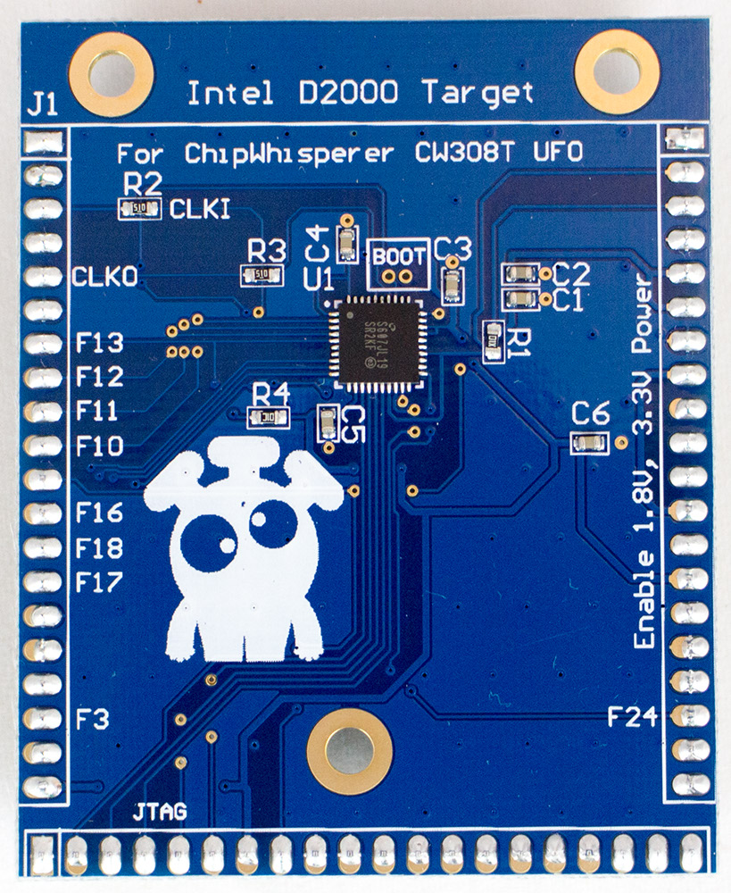
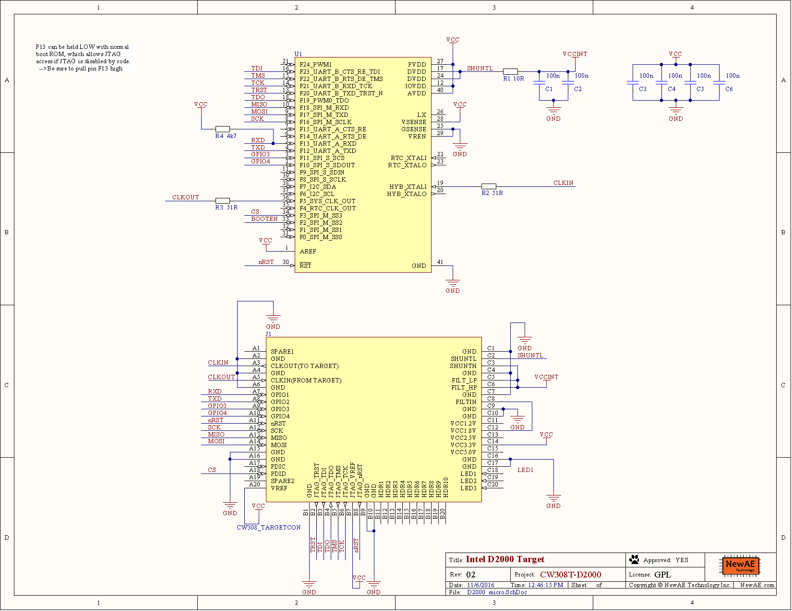

# CW308T-D2000

The D2000 target is a bit of an oddball. It's an x86 target, but is
really a microcontroller (internal flash etc).



---

## Specifications

| Feature | Notes/Range |
|---------|----------|
| Target Device | Intel Quark D2000 |
| Target Architecture | x86 |
| Vcc | 3.3V |
| Programming | JTAG |
| Hardware Crypto | No |
| Availability | Standalone |
| Status | Released |
| Shunt | 10Ω |

Available from [Mouser](https://www.mouser.com/ProductDetail/NewAE/NAE-CW308T-D2000?qs=r5DSvlrkXmIpxDv1CU6e4Q%3D%3D) and the [NewAE Store](https://store.newae.com/intel-d2000-x86-microcontroller-target-for-cw308/)

## Using Board

The CW308T-D2000 is used similar to any other CW308 Target Board. It
does not accept an external oscillator, instead it outputs it's own
oscillator for you to synchronize to. Specific caveats here:

  - Be sure to mount J3 at lowest setting which routes the "CLKFB" line
    to "HS1/IN".
  - You'll need to configure the ChipWhisperer to use an external clock
    input (EXTCLK or EXTCLK x4). This is taken care of by the D2000
    setup script.
  - The baud rate will need to be changed - it is scaled to be 115200 at
    32 MHz. Use the frequency counter to measure the actual frequency &
    scale baud rate appropriately. Depending on the ROM loaded the clock
    varies. This is taken care of by the D2000 setup script.
  - The TX/RX are opposite compared to the XMEGA. This is taken care of
    by the D2000 setup script.

The following shows an example setup script for this board:

``` python

scope.gain.gain = 45
scope.adc.samples = 25000
scope.adc.offset = 0
scope.adc.basic_mode = "rising_edge"
scope.clock.clkgen_freq = 7370000
scope.clock.adc_src = "extclk_x4"
scope.trigger.triggers = "tio4"
#TX/RX backwards from XMEGA
scope.io.tio1 = "serial_tx"
scope.io.tio2 = "serial_rx"
scope.io.hs2 = None

# Sample delay - you may need to increase this!
# Gives time for frequency measurement to occur in hardware.
time.sleep(0.5)

ext_freq = scope.clock.freq_ctr

if ext_freq > 10:

    baud = (115200 / 32E6) * ext_freq
    print "Based on extclk of %d Hz, setting baud to %d" % (ext_freq, baud)
    target.baud = baud

else:
    raise IOError("Did not detect external clock from D2000.
    Confirm jumpers and rerun, or increase delay before sample."
```

---

## Building Firmware

To build firmware for the D2000, you'll need to download the [Intel ISSM
Toolchain](https://software.intel.com/en-us/articles/issm-toolchain-only-download)
and uncompress it. The toolchain comes compressed/archived in the tar.gz
format, so you may need to download a program that can work with those
formats (such as 7-zip on Windows). Firmware is contained in
`hardware/victims/firmware/intel_quark/simpleserial_example/` and can be
built with make. Note that you'll need to specify where the toolchain is
located:

### **Specifying Toolchain Location**

If you're using `cmd` on Windows (as opposed to something like `Git
Bash` or `Cygwin`, you'll need to create a new environment variable
called `IAMCU_TOOLCHAIN_DIR` and set its value to the path to the
toolchain. For example, I uncompressed the toolchain to
`C:\Users\User\Downloads` and set the variable to
`C:\Users\User\Downloads\issm-toolchain-windows-2017-01-25\tools\compiler\gcc-ia\5.2.1\bin`.
Otherwise, running `export /path/to/toolchain/bin` should work on Mac,
Linux, Git Bash, Cygwin, etc.

### **Troubleshooting**

* No such file or directory when building on Windows

  - This is usually caused by the default make directory command (`md`)
not working. First, ensure that you have `mkdir` and cp on your system
by opening `cmd` and running them. Then open
`hardware/victims/firmware/intel_quark/qmsi/base.mk` and change:

``` makefile
# Any other version of Windows
mkdir = @md $(subst /,\,$(1)) > nul 2>&1 || exit 0
copy = @copy $(subst /,\,$(1)) $(subst /,\,$(2)) > nul 2>&1 || exit 0
```

to:

``` makefile
# Any other version of Windows
mkdir = @mkdir -p $(1) || exit 0
copy = @cp $(1) $(2) || exit 0
```

---

## Programming

An external programmer is needed for this target. The Quark D2000
dev-board can be used with jumper wires, or a standard OpenOCD
programmer can be used. The suggested programmer is the [Olimex
ARM-USB-OCD-H](https://mouser.com/ProductDetail/Olimex-Ltd/ARM-USB-OCD-H)
as is available from suppliers such as Mouser and Digi-Key (mouser link
provided).

### **OpenOCD Board Setup**

If using OpenOCD either stand-alone or as part of Intel ISSM, you'll
need to define a new board file. The file is based on
`scripts\board\quark_d2000.cfg` found in the following directory:
`C:\IntelSWTools\ISSM_2016.0.027\tools\debugger\openocd\scripts\board`
(adjust for version number changes).

You will find a line like the following in the original file:

` #default frequency but this can be adjusted at runtime`
` adapter_khz 1000`

Make a copy of the file, but change that to a slower speed (suggested is
125 kHz)

` #default frequency but this can be adjusted at runtime`
` adapter_khz 125`

Save this file as `quark_d2000_ufo.cfg`.

### **How to flash D2000 board using OpenOCD**

We'll modify the provided scripts from the Intel ISSM distribution
(compiler etc for D2000). Start a Windows command prompt and run the
following commands. You may have to change the directory of the first
command to match your version of Intel ISSM (eg.
C:\\IntelSWTools\\ISSM\_2016.0.027\\issm\_env.bat):

`C:\IntelSWTools\ISSM_2016.2.097\issm_env.bat`
`cd %ISSM_DEBUGGER_ROOT%\openocd`
`bin\openocd.exe -f scripts\interface\ftdi\olimex-arm-usb-ocd-h.cfg -f scripts\board\quark_d2000_ufo.cfg`

Note we specify two script files - the first had the JTAG connection
(the olimex-arm-usb-ocd-h.cfg), the second had the D2000. This should
result in an output like the following:

`Open On-Chip Debugger 0.8.0-dev-g7845893 (2015-11-26-18:12)`
`Licensed under GNU GPL v2`
`For bug reports, read`
`       `<http://openocd.sourceforge.net/doc/doxygen/bugs.html>
`Info : only one transport option; autoselect 'jtag'`
`adapter speed: 125 kHz`
`trst_only separate trst_push_pull`
`flash_rom`
`Info : clock speed 125 kHz`
`Info : JTAG tap: quark_d2000.cltap tap/device found: 0x0e786013 (mfg: 0x009, part: 0xe786, ver: 0x0)`
`Enabling lmt core tap`
`Info : JTAG tap: quark_d2000.lmt enabled`

At this point it will hold, waiting for new commands. There is two ways
to proceed:

#### **Connecting with GDB**

Connecting and programming with GDB may be preferred if you wish to also
do any debug. It however is more limited in what commands you can run.
If this does not work see the next section about using telnet commands.
Open a second command prompt, and run:

`C:\IntelSWTools\ISSM_2016.0.027\issm_env.bat`
`gdb`

You can then run the following within a GDB console:

`target remote :3333`
`monitor clk32M 125`
`monitor load_image C:\\chipwhisperer\\hardware\\victims\\firmware\\intel_quark\\quark_d2000_rom.bin 0x0`
`monitor load_image C:\\chipwhisperer\\hardware\\victims\\firmware\\intel_quark\\simpleserial_example\\release\\quark_d2000\\x86\\bin\\simpleserial_aes.bin 0x00180000`

The first load\_image is used for the ROM image. This should only be
done once - do not reload every time, only reload the application. The
boards as shipped come with a ROM image so you can skip that step if
using the NewAE example code.

Notes:

1.  The `monitor clk32M 125` sets a 125 kHz JTAG clock frequency. This
    may be too slow, but is recommended especially when loading ROM due
    to potential for misprogramming on the target board due to the shunt
    resistor. Note it takes a long time (\~60 seconds) to program the
    ROM code so don't abort it\!
2.  If the above fails, see the next note on recovering normal settings
    with the telnet interface.
3.  You can short F13 (GPIO1 on the ChipWhisperer-Lite) to GND to force
    the JTAG pins on. It is suggested to do this via the
    ChipWhisperer-Lite software (setting it as a GPIO output and then
    setting it low). This requires the 'ROM' code programmed in already.
4.  Do not reload the ROM code unless needed -- this is the boot code
    and if something gets corrupt it can brick the device.

#### **Connecting with Telnet to Monitor**

When running the `target remote :3333` or other commands above, you may
encounter errors that seem fatal. Do not fret, you can likely recover
everything using another mode. To do so:

1.  Power cycle the target board, and re-run the openocd command
    previously specified (assuming you have encountered errors and the
    system is in an unknown state).
2.  If this fails, set GPIO1 to LOW, and power cycle the target. Try
    connecting again.

Assuming the connect works, open a second command prompt and run

`telnet localhost 4444`

Note the port connected to is 4444 (not :3333) as before. This now
enters the monitor directly, and you can try running the following
commands:

`reset halt`
`set QUARK_D2000_OTPC_DATA_WRITE_ENABLED 1`
`mass_erase`
`clk32M 100`
`load_image C:\\chipwhisperer\\hardware\\victims\\firmware\\intel_quark\\quark_d2000_rom.bin 0x0`
`load_image C:\\chipwhisperer\\hardware\\victims\\firmware\\intel_quark\\simpleserial_example\\release\\quark_d2000\\x86\\bin\\simpleserial_aes.bin 0x00180000`

The following should be the example output of these commands:

`> reset halt`
`JTAG tap: quark_d2000.cltap tap/device found: 0x0e786013 (mfg: 0x009, part: 0xe786, ver: 0x0)`
`Enabling lmt core tap`
`JTAG tap: quark_d2000.lmt enabled`
`target state: halted`
`target halted due to debug-request at 0x0000ffff in real mode`
`target state: halted`
`target halted due to debug-request at 0x0000fff0 in real mode`
`> set QUARK_D2000_OTPC_DATA_WRITE_ENABLED 1`
`1`
`> mass_erase`
`Deleting  OTPC, OTPD and FLASH regions`
`0xb0100014: 00000001`
`> clk32M 100`
`adapter speed: 3 kHz`
`adapter speed: 100 kHz`
`JTAG tap: quark_d2000.cltap tap/device found: 0x0e786013 (mfg: 0x009, part: 0xe786, ver: 0x0)`
`Enabling lmt core tap`
`JTAG tap: quark_d2000.lmt enabled`
`target state: halted`
`target halted due to debug-request at 0x0000fff0 in real mode`
`> load_image C:\\chipwhisperer\\hardware\\victims\\firmware\\intel_quark\\quark_d2000_rom.bin 0x0`
`....8192 bytes written at address 0x00000000`
`downloaded 8192 bytes in 66.997505s (0.119 KiB/s)`
`> load_image C:\\chipwhisperer\\hardware\\victims\\firmware\\intel_quark\\simpleserial_example\\release\\quark_d2000\\x8`
`.2872 bytes written at address 0x00180000`
`downloaded 2872 bytes in 42.280869s (0.066 KiB/s)`

Note you can try the following if still having trouble:

1.  Use a slower JTAG clock speed. Be SURE you are using a custom .cfg
    file which specifies the slower JTAG speed on initial connect (and
    not just as part of the clk32M commands).
2.  Short the SHUNTH/SHUNTL pins.

---

## Schematic

See GIT Repo for PDF of schematic. Note there is a new "03C" rev that
changes the shunt resistor (R1) to a 1-ohm resistor. This results in a
much more reliable device, as the original 10-ohm shunt caused
occasional crashes. If you are using an older revision device, you can
mount a shunt/jumper between "SH-" and "SH+" on the UFO board to achieve
a similar effect.



---

## Board Layout

See GIT Repo for gerber files.
