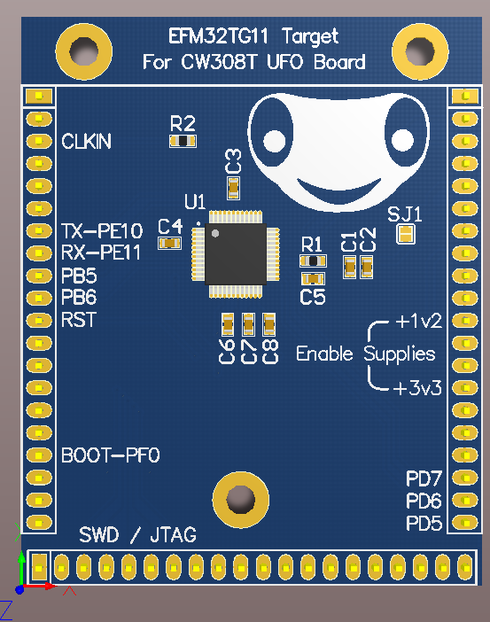

# CW308T-EFM32TG11

This board supports the Silicon Labs EFM32 Tiny Gecko 11
microcontroller. The chip mounted on the target board is the
EMF32TG11B3.

---

## Specifications

| Feature | Notes/Range |
|---------|----------|
| Target Device | EFM32TG11 |
| Target Architecture | Arm Cortex-M0+ |
| Vcc | 1.2V |
| Programming | Serial Bootloader |
| Hardware Crypto | Yes |
| Availability | Source files |
| Status | In development |
| Shunt | TBD |

## Power Supply

The core of the Tiny Gecko chip runs from a 1.2v supply. This is
supplied and filtered through the CW308T. The I/O buses are supplied
with 3.3v.

---

## Security Features

The Tiny Gecko family of microcontrollers implements many security
features including:

  - Hardware implementations of AES-128/256, SHA-224/256

  - Hardware CRC engine
  - Access control for peripherals

For a full list of security features see the product family data
sheet\[1\]

---

## Programming

A serial bootloader is implemented on the Tiny Gecko series of chips.
Details for the use of this feature are described in Silicon Labs
application note AN0042\[2\].

---

## Schematic and Layout

See GIT Repo for design files.

---

1.  <https://www.silabs.com/documents/public/data-sheets/efm32tg11-datasheet.pdf>
2.  <https://www.silabs.com/documents/public/application-notes/an0042-efm32-usb-uart-bootloader.pdf>
