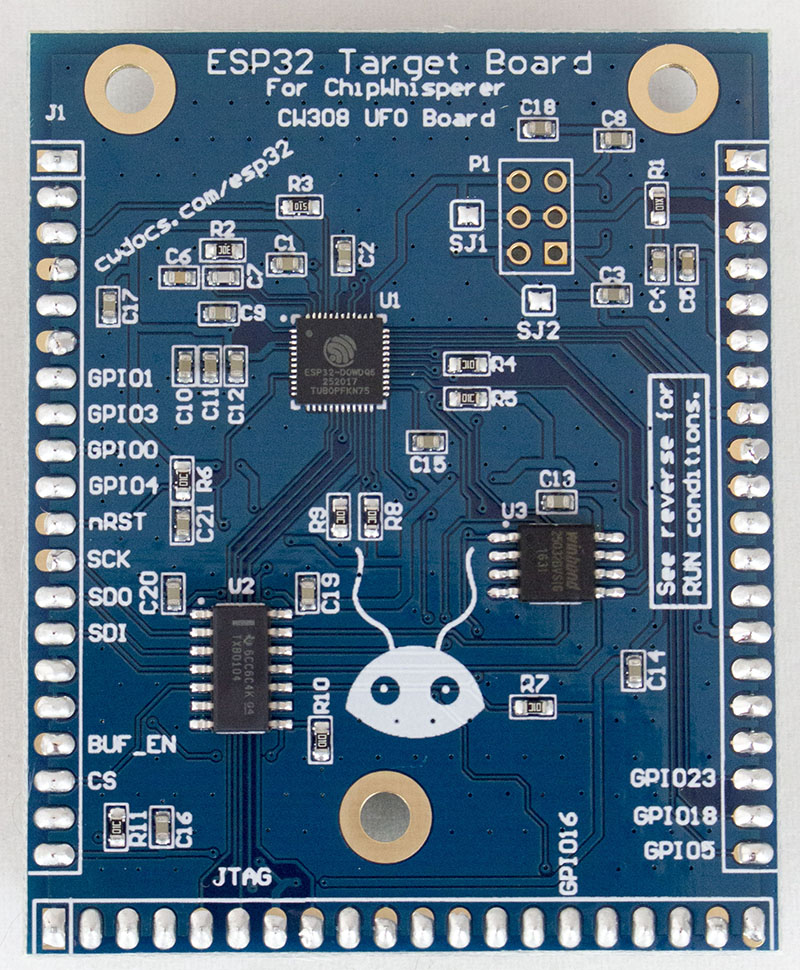

# CW308T-ESP32

The ESP32 is a super-low-cost IoT device with Bluetooth & WiFi support.
This target board does not break out any of the RF capabilities, and is
primarily concerned with testing portions of the device stand-alone
(such as secure boot, AES hardware accelerator, etc).

## Specifications

| Feature | Notes/Range |
|---------|----------|
| Target Device | ESP32 |
| Target Architecture | LX6 |
| Vcc | 3.3V |
| Programming | SPI |
| Hardware Crypto | Yes |
| Availability | Standalone |
| Status | Released |
| Shunt | 10Ω |

Available from [Mouser](https://www.mouser.com/ProductDetail/NewAE/NAE-CW308T-ESP32?qs=r5DSvlrkXmJS2elCEG0eoA%3D%3D).

---

## SPI Buffer

This device uses a Texas Instruments TXB0104 as a SPI buffer. This is a
bidirectional buffer chip, meaning you can use it in any of the
following ways:

  - Disable chip, allowing ESP32 to load/program the attached SPI flash
    chip.
  - Sniff the SPI bus, but with a buffer in-line to prevent your sniffer
    from affecting the SPI load process (or trigger on SPI packets).
  - Program the SPI chip using external programmer. To do this hold
    ESP32 in reset.
  - Use an external SPI chip (or emulator) to load the data for the
    ESP32. To do this you'll have to disconnect the CS pin of the SPI
    chip.

The direction is detected automatically.

---

## SPI Flash Device

The ESP32 needs an attached SPI flash. The production devices use a
W25Q32BVSSIG from Winbond, but this can be difficult to find from
regular distributors. If you are building your own device I suggest
using ISSI IS25WP032D-JBLE which is more widely available.

A variety of other devices will not work with the bootloader, meaning
you cannot easily program them. It's not known exactly what is needed
(they need to support DSPI at least), but for example
SST26VF016BT-104I/SN did not work.

---

## Example Application

An example application is provided in the GIT repository in the
[firmware/esp32](https://github.com/newaetech/chipwhisperer/tree/develop/hardware/victims/firmware/esp32)
directory. Note this hasn't yet been integrated into the full build
system. This application uses hardware AES.

---

## Schematic

For PDF see GIT repository.

