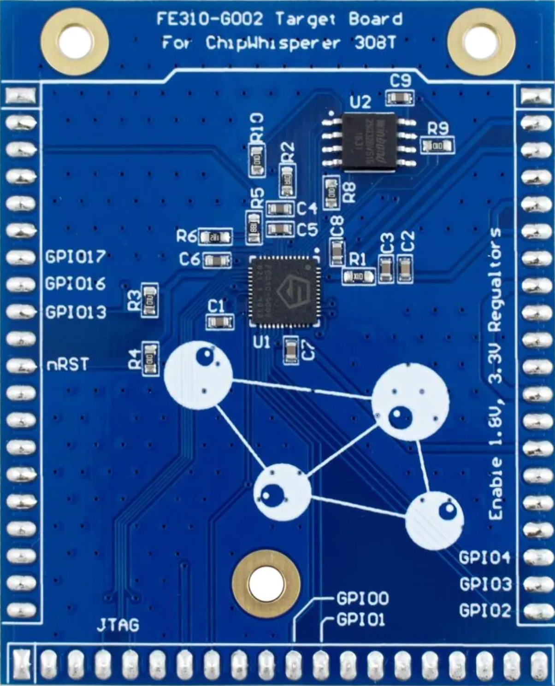
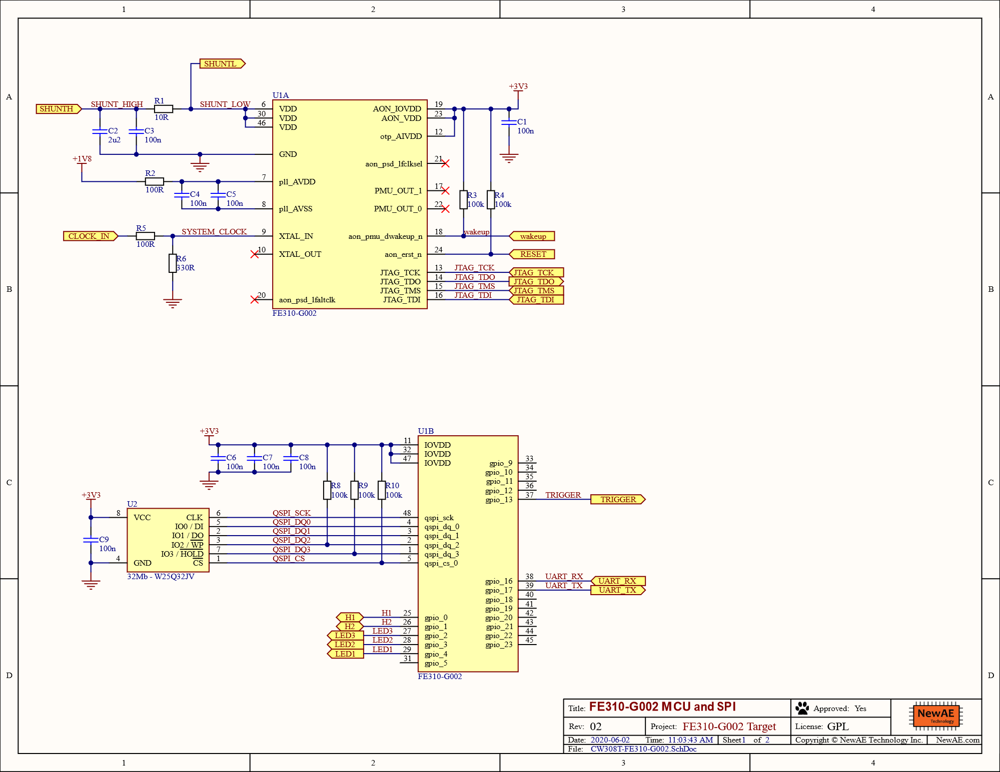
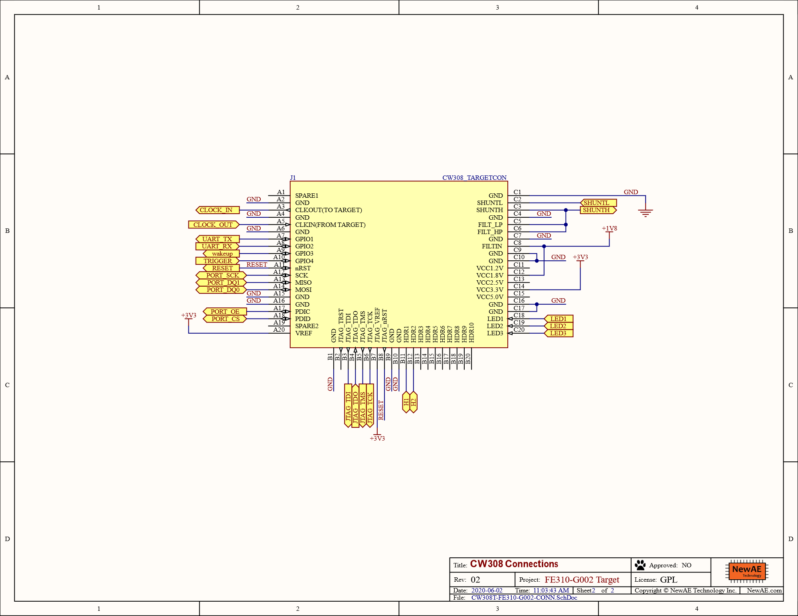

# CW308T-FE310

This board supports the SiFive FE310, which is a RISC-V based microcontroller.



## Specficiations

| Feature | Notes/Range |
|---------|----------|
| Target Device | SiFive FE310 |
| Target Architecture | 32-bit RISC-V |
| Vcc | 1.8V |
| Programming | JTAG |
| Hardware Crypto | No |
| Availability | Standalone |
| Status | Released |
| Shunt | 10Ω |

Available from:

 * [Mouser](https://www.mouser.ca/ProductDetail/NewAE/NAE-CW308T-FE310?qs=OlC7AqGiEDlqtLh9gWn7%252BQ%3D%3D)

---

## Power Supply

Enable the 1.8V regulator on the CW308 board and ensure that both the 3.3V and 1.8V LEDs are on.

---

## Clock

The FE310 must be run off of a 7.37MHz clock.

---

## Building Firmware

To build firmware for this target, you must download and install a 32-bit or 64-bit GCC compiler with
support for embedded RISC-V targets.

The recommended compiler is available from SiFive at https://github.com/sifive/freedom-tools/releases/tag/v2019.05.0

This firmware build can be very particular to the compiler version used and, as such, it is highly recommended
that you use the exact compiler version linked above.

Once the compiler is installed and available on the command line, firmware can be built using the ChipWhisperer
build system with `PLATFORM=CW308_FE310`.

---

## Programming

The CW308T_FE310 has a W25Q32JV 32MB SPI chip used as program memory which can be programmed over JTAG. An example
of a compatable JTAG programmer is a Segger J-Link. Ensure that the device is powered and has a valid
clock before programming.

As of ChipWhisperer 5.6.2, you can use [ChipWhisperer's MPSSE mode](https://chipwhisperer.readthedocs.io/en/latest/debugging.html) to program the FE310. The easiest way is to use the `run_openocd.sh` script included
in ChipWhisperer's `openocd` folder, along with the `fe310.cfg` file in that folder:

```sh
chipwhisperer/openocd/run_openocd.sh -p /path/to/fw.elf husky jtag -- -f "fe310.cfg"
```

---

## Schematic




