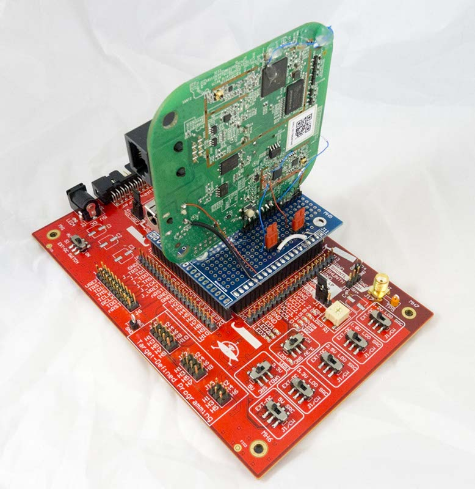
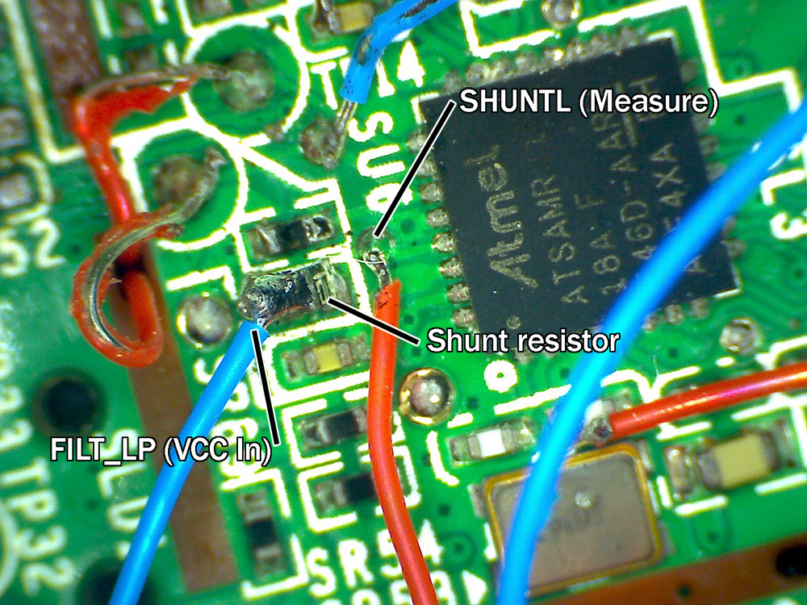
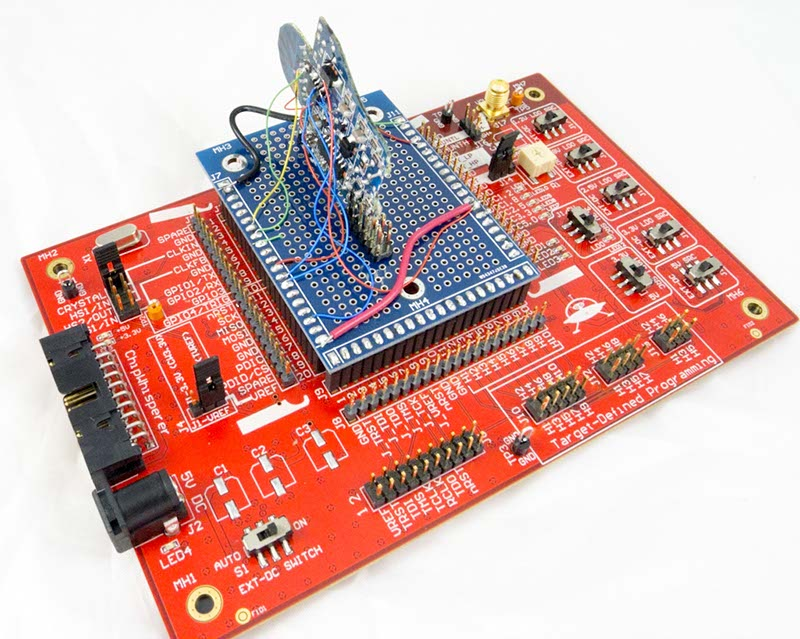
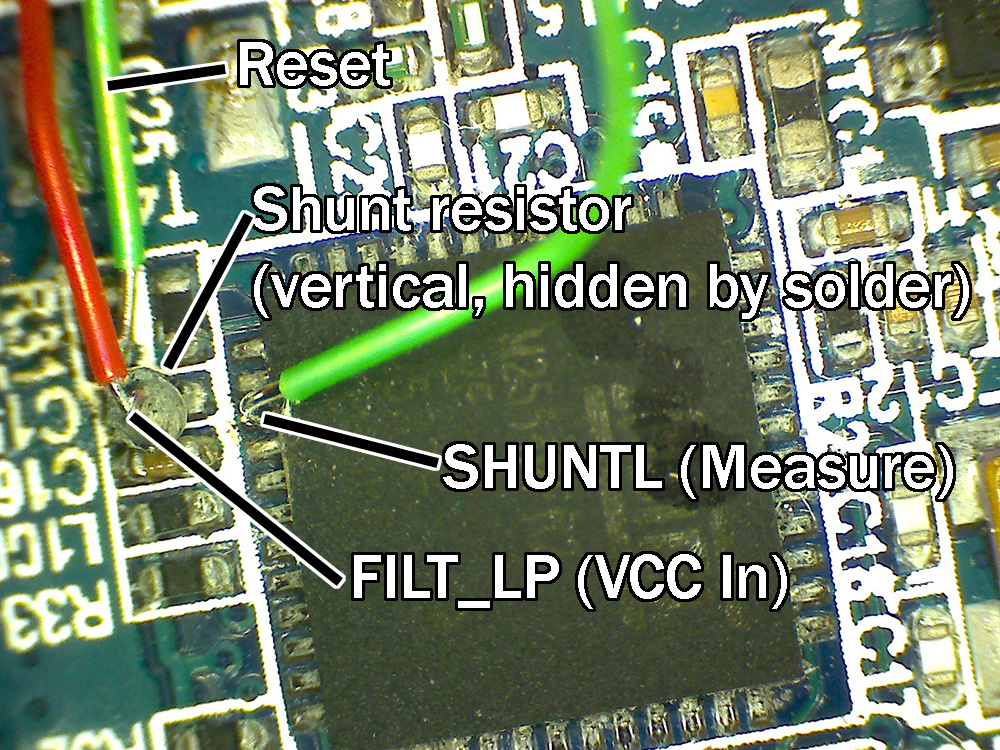
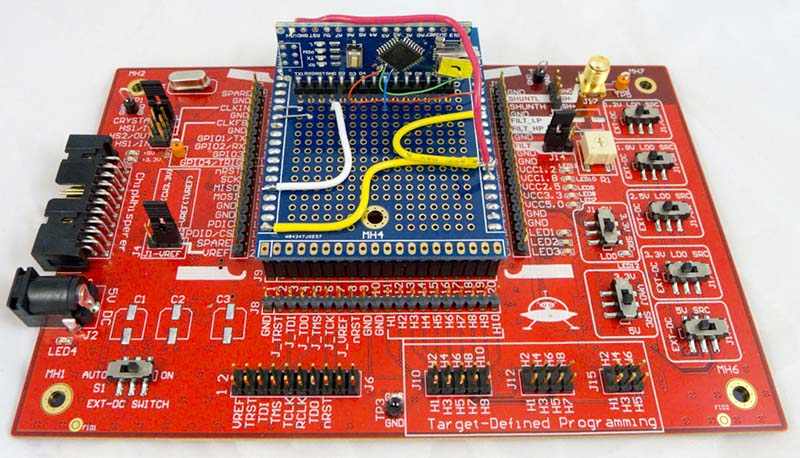
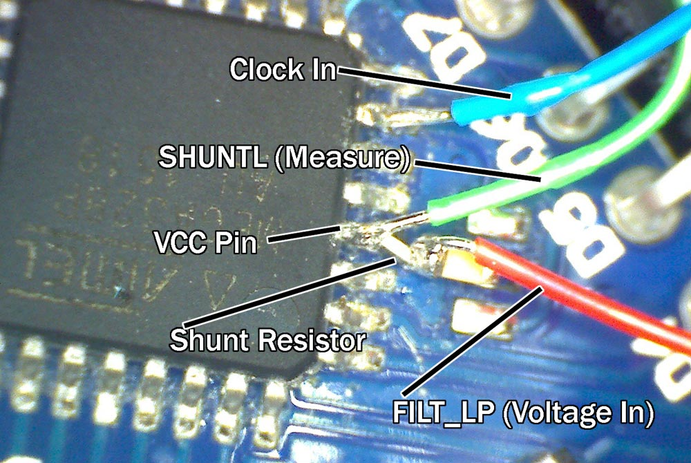

# CW308T-GENERIC

---

This is a basic prototype board which can be used for mounting other
chips on the [CW308 UFO Target](../CW308%20UFO.md). It can
also be used to mount small boards (see the examples for photos).

---

### Usage

If using the board, you MUST wire the I/O voltage to the VREF pin (lower
left, pin A20). If you fail to do this the diode clamps may stop I/O
lines from being drivable.

See the example photos below where you can see the 3.3V supply being
routed to the VREF pin.

---

### Examples

The following shows several examples of this board in use.

#### **Hue Bridge 2.0**

This shows an extreme example of mounting a board onto the victim board.
The actual analysis was being done on the SAMR21R on the main board, but
this provided mechanical stability to allow tacking wires onto that
area.

#### **Hue ATMega2564RF2R Based Bulb**

The SPI traffic was wired out as well in this example, and a
ChipWhisperer-Pro was used to trigger on SPI traffic.

#### **Riscure CTF Board**

This example allowed both power analysis and clock glitching to be
performed against the board. A small shunt resistor is soldered in-line
for the VCC pin.

