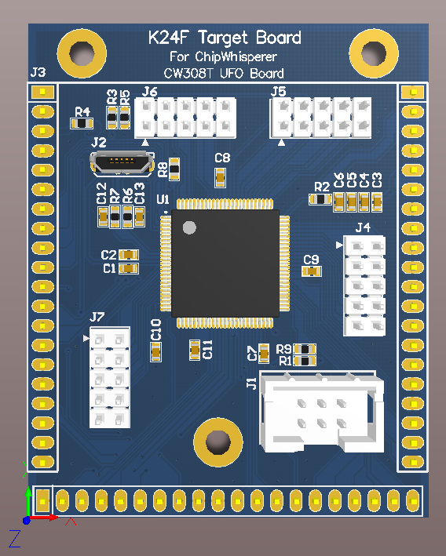

# CW308T-K24F

This board supports the NXP MK24FN1M0VLL12 microcontroller.

---

## Specifications

| Feature | Notes/Range |
|---------|----------|
| Target Device | NXP MK24FN1M0VLL12 |
| Target Architecture | Arm Cortex-M4 |
| Vcc | 3.3V |
| Programming | JTAG |
| Hardware Crypto | Yes |
| Availability | Gerbers/Source Files |
| Status | In development |
| Shunt | TBD |

## Power Supply

The K24F target runs from the 3.3v supply on the CW308T.

---

## Security Features

The K24F family of chips integrates many security features, including:

  - Hardware CRC
  - Hardware Random Number Generation
  - Hardware encryption using DES, 3DES, AES, MD5, SHA

---

## Programming

---

## Schematic and Layout

See GIT Repo for design files.
