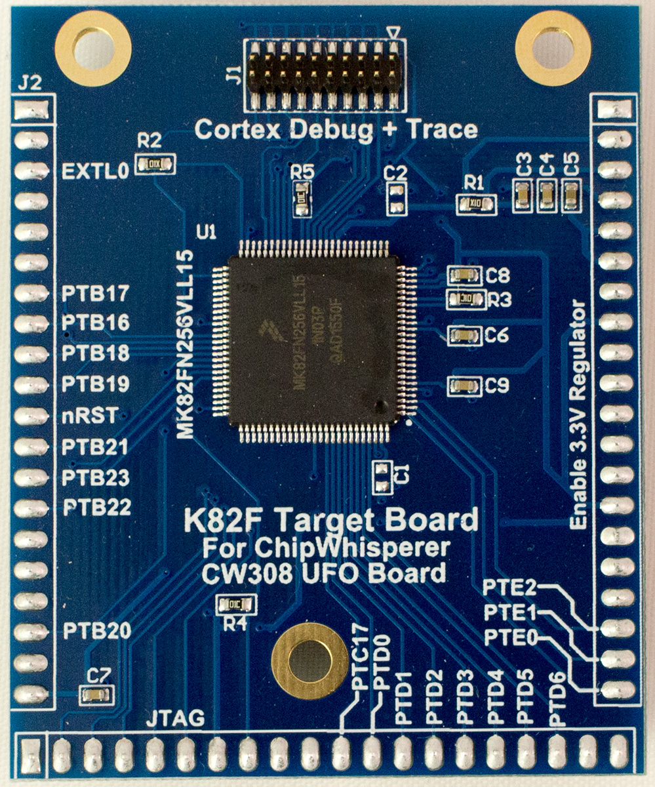

# CW308T-K82F

The Kinetis K82 contains a Cortex M4F core with various cryptographic and security features. This includes three (3!) separate AES engines, one of which has hardware masking support for side-channel (or ‘side band’ in the datasheet) protection.

In addition there is an AES accelerator for loading from flash memory, and a general-purpose higher-speed AES accelerator.

This target also contains a 20-pin Cortex trace port, allowing you to use trace features in the core to better understand program flow during fault events.

The Kinetis K82 has both 256KB of FLASH and SRAM, making it an ideal target for very resource-heavy algorithms.

---

## Specifications

| Feature | Notes/Range |
|---------|----------|
| Target Device | NXP MK82FN256VLL15 |
| Target Architecture | Arm Cortex-M4 |
| Vcc | 3.3V |
| Programming | JTAG |
| Hardware Crypto | Yes |
| Availability | Standalone  |
| Status | Production |
| Shunt | 10R |

## Power Supply

The K82F target runs from the 3.3v supply on the CW308T.

---

