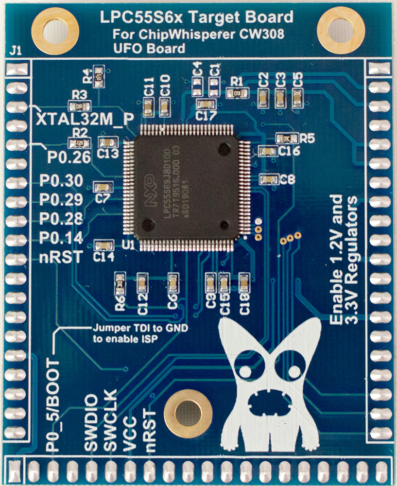

# CW308T-LPC55S69

The LPC556S69 board features the LPC55S69 from NXP. This
device has a dual-core Cortex-M33 core, which features many
advanced security features including a PUF and TrustZone-M.
This board requires an external programmer (such as Atmel
ICE or OpenOCD) to be used. The example firmware will
bring up the AES peripheral (which does not have DPA countermeasures)
along with running other normal demos.
The design files are available as part of the open-source Chip-
Whisperer example targets.

* NXP LPC55S6x in TQFP-100 package.
* JTAG port on CW308 UFO baseboard breaks out SWD pins to standard 20-pin JTAG header.
* Full design files are available under an open-source license.
* Default 10-ohm shunt resistor for high-SNR measurements, can be shorted with lower-value resistor when running higher frequencies or full dual-core mode.

---

## Specifications

| Feature | Notes/Range |
|---------|----------|
| Target Device | NXP LPC55S69 |
| Target Architecture | Arm Cortex-M33 |
| Vcc | 1.2V |
| Programming | JTAG |
| Hardware Crypto | Yes |
| Availability | Standalone  |
| Status | Production |
| Shunt | 10R |

## Power Supply

The LPC55S69 target runs from the 1.2v supply on the CW308T for core voltage, and 3.3V for I/O voltage.

---

