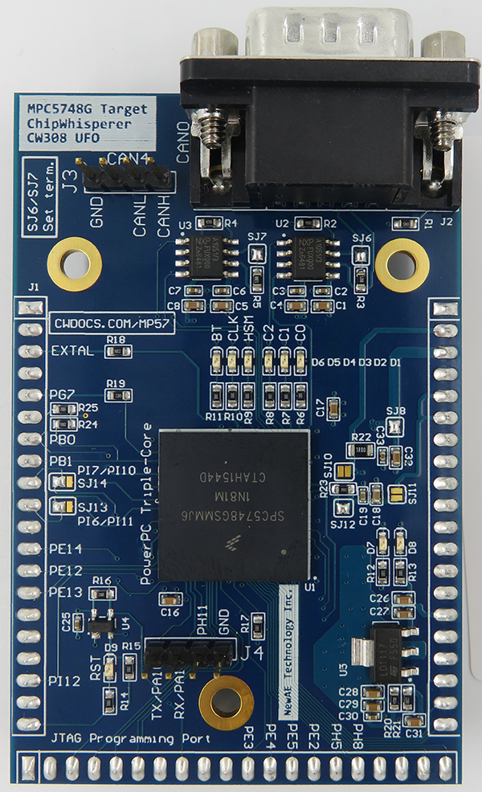
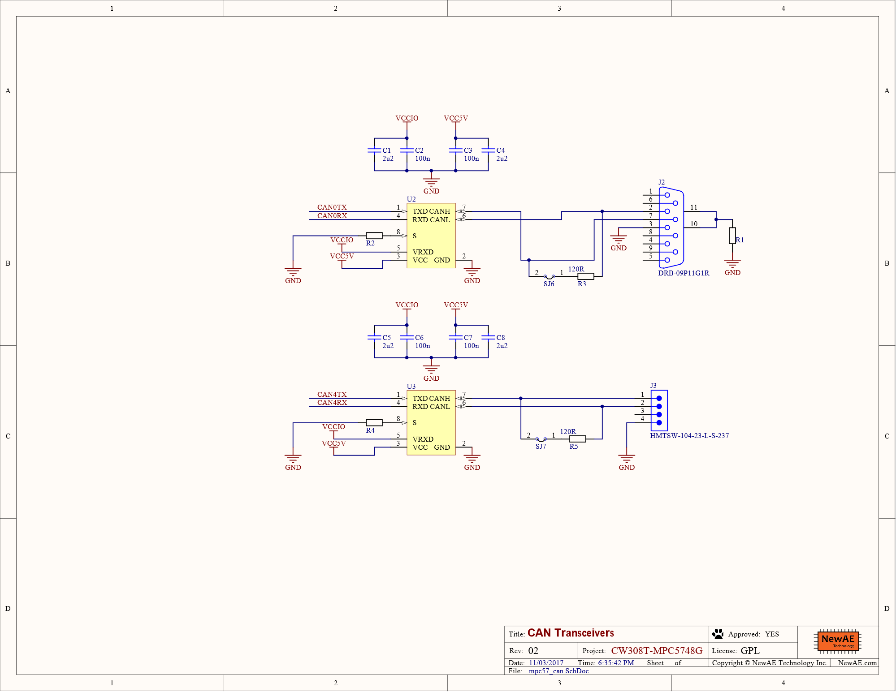
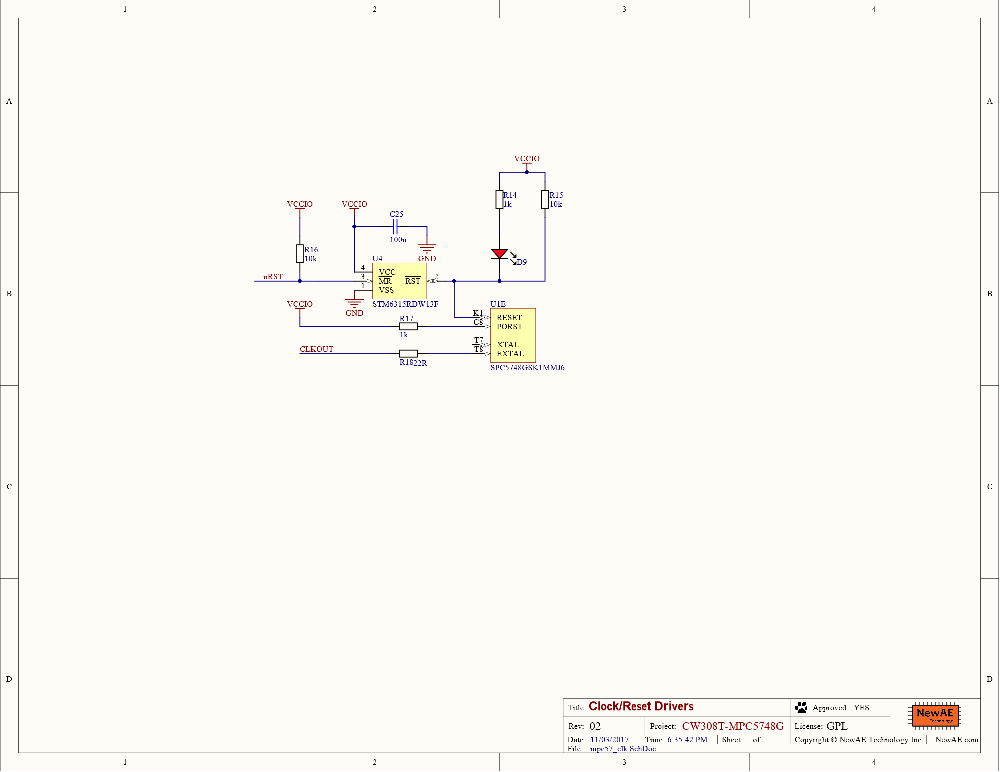
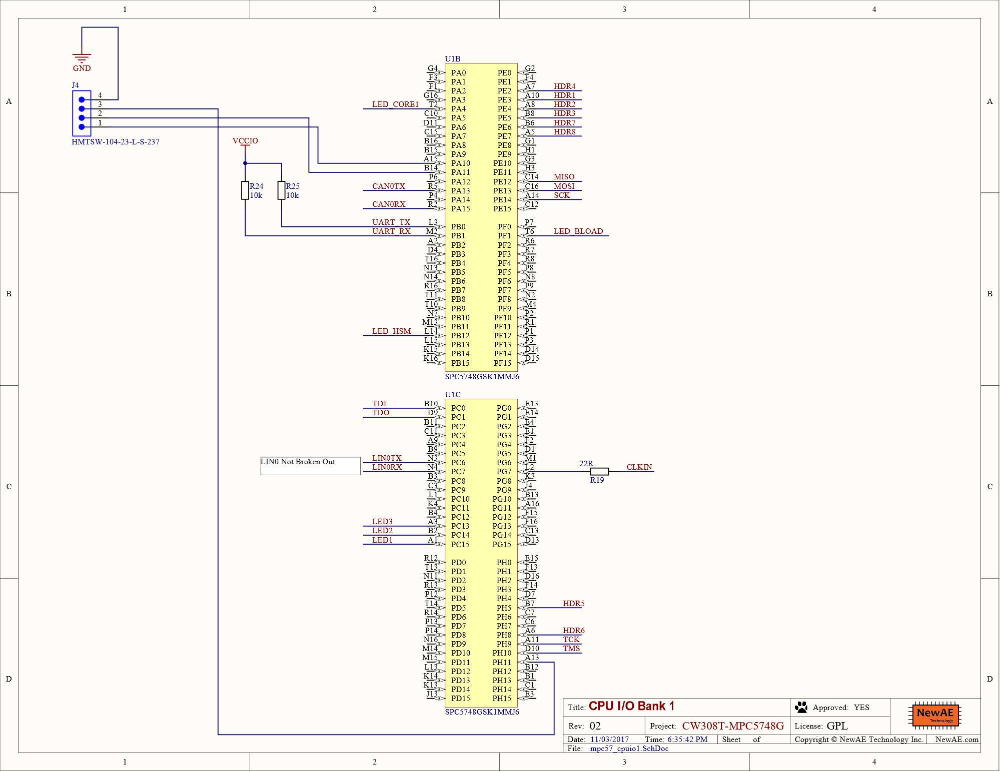
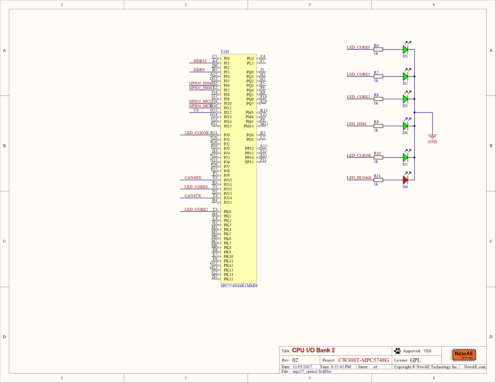
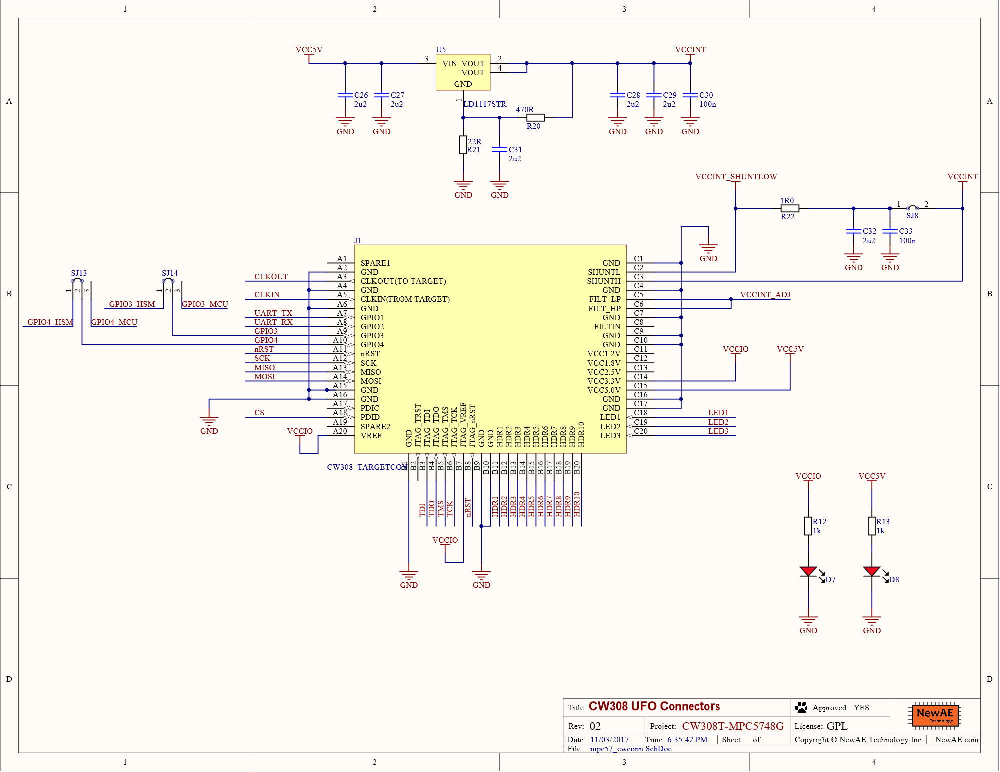
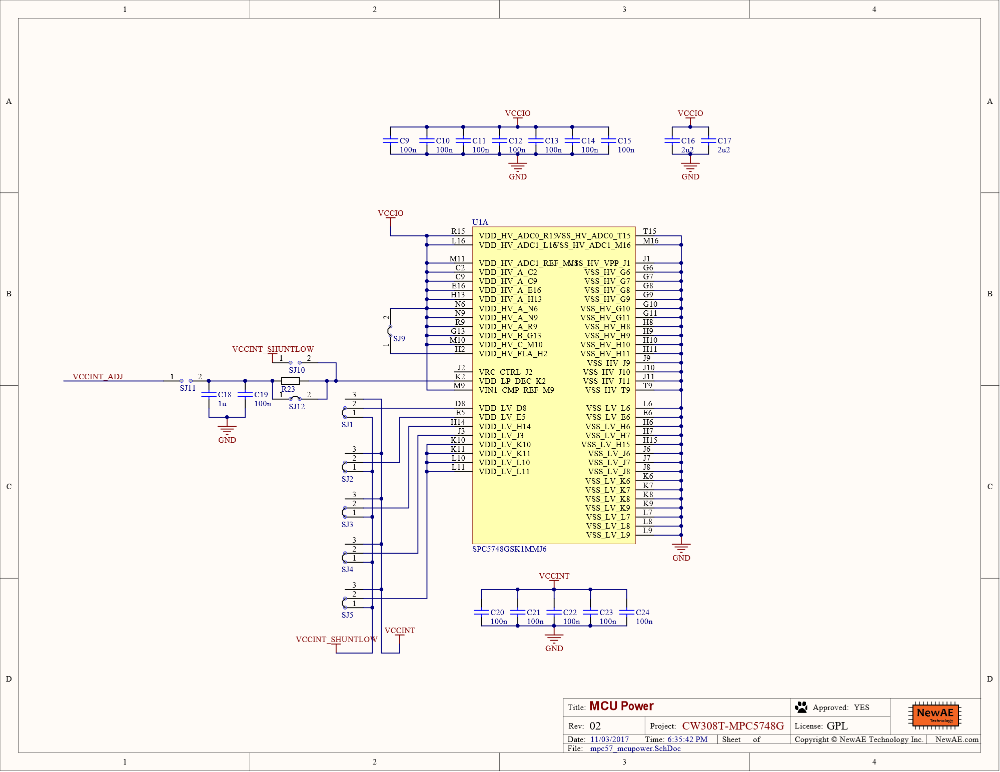

# CW308T-MPC5748G

The MPC5748G target uses the NXP MPC5748G device, which is a triple-core
PowerPC microcontroller for automotive applications. This target board
has a number of interesting features including:

  - Two CAN/CAN-FD interfaces, with with DB9.
  - Two serial ports (usable as LIN).
  - Various solder jumpers for variety of power analysis options.

!!! attention
    This target requires an external programmer for the MPC5748G to reload code.

!!! attention
    This target is not integrated into the ChipWhisperer "HAL" build system due to
    the multi-core support.

## Quick Links

* [Buy on Mouser](https://www.mouser.com/ProductDetail/NewAE/NAE-CW308T-MPC5748G?qs=r5DSvlrkXmLaM5xNpZhgpQ%3D%3D)
* [Download Schematic](https://github.com/newaetech/chipwhisperer-target-cw308t/raw/main/CW308T_MPC57/SCH_CW308T_MPC5748G_02.PDF)
* [Demo Application](https://github.com/newaetech/chipwhisperer-target-mpc5748g)

## Specifications

| Feature | Notes/Range |
|---------|----------|
| Target Device | MPC5748G |
| Target Architecture | Triple Core PowerPC |
| Vcc | 1.3V |
| Programming | JTAG |
| Hardware Crypto | Possible |
| Availability | Standalone |
| Status | Released |
| Shunt | 1Ω |

---

## Quick Start

### Hardware

To use this target, you should:

* Plug the target into a CW308 base-board.
* Ensure the CW308 has a 5V power supply - either by connecting to a ChipWhisperer-Pro, or using a 5V source on the 2.1mm DC power jack.

### Software

This Target requires special setup. An example script can be found at: https://github.com/newaetech/chipwhisperer-jupyter/blob/1ccd1b1fbd8a3295e1033efb37e53e1022d47cc5/Helper_Scripts/Setup_CW308_MPC5748G.ipynb

The demo application (see below) allows you to run various of the normal ChipWhisperer demos, along with other work.

---

## Demo Application

The demo application provides examples of:

  - Using serial interface (implements Simple-Serial).
  - Using CAN interface.
  - Enabling all three cores, and communicating between cores with
    shared memory.
  - Running software AES on main core.
  - Running password-check (XOR) on main core.
  - Setup of clock network for using external clock from ChipWhisperer.
  - Enabling the PASS module & passing a password to it (to allow DPA
    testing of PASS module).

This demo application is posted as a separate github repository at
<https://github.com/newaetech/chipwhisperer-target-mpc5748g>. The github
link includes additional documentation.

---

## Offered Variants

The product is available in one variant:

  - The "NORMAL" variant which is normally shipped (i.e., P/N
    NAE-CW308T-MPC5748G). This variant has the following setup:
      - HSM is not programmed. We cannot provide details on this usage
        without a NDA.

      - The four OTP password groups have been programmed with 4 known
        passwords you can use for experimentation.
      - Device lifecycle is progressed to the "OEM Production" stage.
        This will prevent you from doing certain updates to the memory,
        but for most "normal" uses will not prevent reloading of code
        etc. This progression is done since it is required to use the
        password/censorship features.
      - The demo application is loaded which includes ability to execute
        code loaded over the serial port and change/read memory
        locations (but is NOT a full bootloader).
      - Device censorship is disabled (this can be turned on using an
        external programmer).
      - The JTAG port has a known password, but is not locked (this can
        be turned on using an external programmer or via load
        functions).

---

## Programming

The device is designed to use an external programmer for reflashing, as
it does not include a bootloader. The suggested programmer (scripts are
provided in the GIT repo) is the PE-Micro which requires purchasing:

  - PEMicro USB Multilink or USB Mulilink FX
  - PEMicro PROGPPCNEXUS (Programmer SW only) or PEMicro PowerPC Nexus
    Development Kit (includes Debugger). You may be able to use a GDB
    server instead but we haven't tested this.

You can use the MPC5748G-DEVKIT instead with invasive hardware mods -
the devkit has an on-board programmer, but it uses buffers such it
cannot be routed to any available header pins. You would need to solder
small jumper wires to small SMD pins for this to work. However as the
dev-kit is very cheap, it may be worthwhile to scrap one and convert
into an external programmer.

---

## HSM Usage

The device features a HSM, but details of this are under NDA and cannot
be made public.

---

## Random Useful Tips

### **S32DS Version**

It is recommended to use S32DS Version 2017 or later. The default linker
scripts changed slightly in such a way that old scripts don't work with
the new version, and thus all scripts have been updated to work with the
latest release.

### **Disassembling Source**

If you are having trouble debugging, it can be useful to read out a
memory segment and dissassemble it. This is possible with the included
S32DS tools. The following shows the required command line:

` E:\nxp\S32DS_Power_v2017.R1\Cross_Tools\powerpc-eabivle-4_9\bin>powerpc-eabivle-objdump.exe -mpowerpc -Me200z4 -D -b srec -EB MPC5748G.s19 > MPC5748G.txt`

## Schematic

* [Download Schematic](https://github.com/newaetech/chipwhisperer-target-cw308t/raw/main/CW308T_MPC57/SCH_CW308T_MPC5748G_02.PDF)

