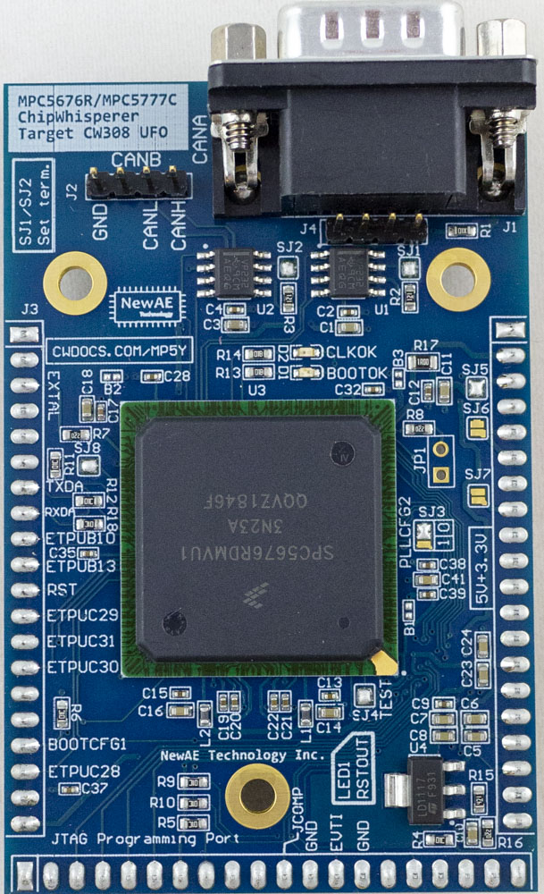
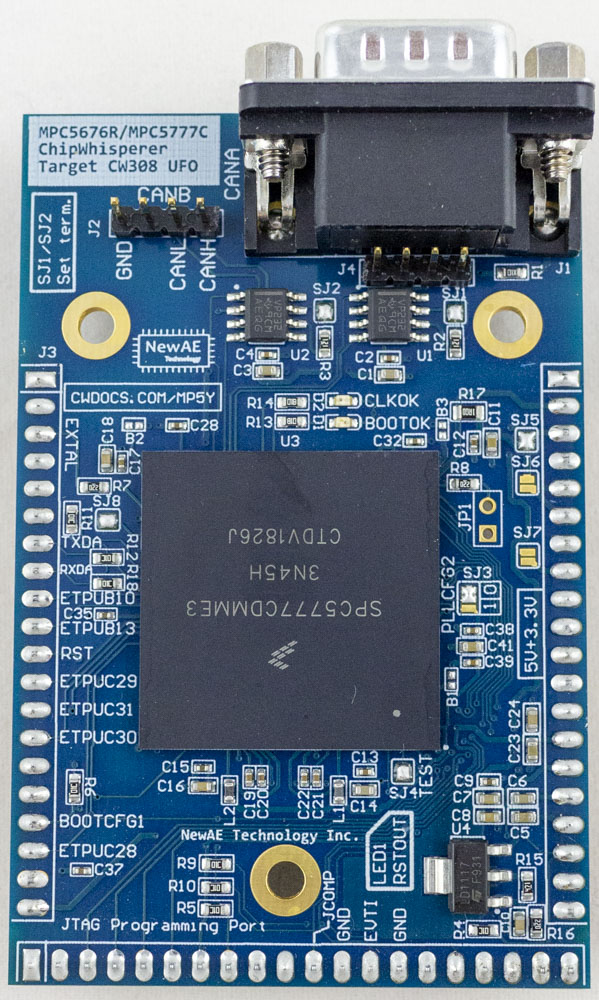

# CW308T-MPC5676R/MPC5777C

This target uses one PCB to support two different automotive chips: the MPC5676R, and the MPC5777C. These chips represent several different generations of PowerPC automotive devices. The later MPC5777C also includes SHE firmware in a security core.

Two CAN ports are connected out, along with various I/O. The ENGCLK output is available to synchronize to the internal clock during boot.

!!! attention
    This target requires an external programmer to reload code.

## Board Photos

### MPC5676R Version (SPC5676RDK3MVU1R)

### MPC5777C Versions (SPC5777CDK3MME3)

## Quick Links

* [Buy MPC5777C on Mouser](https://www.mouser.com/Search/Refine?Keyword=NAE-CW308T-MPC5777C)
* [Buy MPC5676R on Mouser](https://www.mouser.com/Search/Refine?Keyword=NAE-CW308T-MPC5676R)
* [Download Schematic](https://github.com/newaetech/chipwhisperer-target-cw308t/raw/master/CW308T_MPC5Y/NAE-CW308T-MPC5Y.PDF)

## Specifications 

| Feature | Notes/Range |
|---------|----------|
| Target Device | SPC5676RDK3MVU1R or SPC5777CDK3MME3 |
| Target Architecture | Triple Core PowerPC |
| Vcc | 1.3V |
| Programming | JTAG |
| Hardware Crypto | MPC5777C Only |
| Availability | Standalone |
| Status | Released |
| Shunt | 1Ω |

---

## Quick Start

### Hardware

To use this target, you should:

* Plug the target into a CW308 base-board.
* Ensure the CW308 has a 5V power supply - either by connecting to a ChipWhisperer-Pro, or using a 5V source on the 2.1mm DC power jack.
* Connect ChipWhisperer-Lite with script to setup clock etc.
* LED1 is the "RSTOUT" - you should be able to press the reset button on the CW308 and observe LED1 light up then go out. If LED1 is stuck on, the device is still in reset.

---

## Programming

The device is designed to use an external programmer for reflashing, as
it does not include a bootloader. The suggested programmer is the PE-Micro which requires purchasing:

  - PEMicro USB Multilink or USB Mulilink FX
	  - The "USB Multilink" is suitable for most uses, and is more reasonably priced.

Optionally you may want a stand-alone programmer, which requires:
  - PEMicro PROGPPCNEXUS (Programmer SW only) or PEMicro PowerPC Nexus
    Development Kit (includes Debugger).

### Bootloader

A bootloader is included on some devices. The MPC5676R has a loader which you can always enable, and will run provided code from SRAM, but it requires additional work for a full bootloader. It is highly suggested to use JTAG instead of the bootloader.

The MPC5777C requires JTAG for most uses, as the bootloader cannot be forced to run using only external pins.

---

## SHE Usage (MPC5777C ONLY)

Device includes Cryptographic Services Engine (CSE) that complies with Secure Hardware Extension (SHE) Functional Specification Version 1.1 security functions.

Details of interacting with this block are publicly available.

---

## Random Useful Tips

### **Disassembling Source**

If you are having trouble debugging, it can be useful to read out a
memory segment and dissassemble it. This is possible with the included
S32DS tools. The following shows the required command line:

` E:\nxp\S32DS_Power_v2017.R1\Cross_Tools\powerpc-eabivle-4_9\bin>powerpc-eabivle-objdump.exe -mpowerpc -Me200z4 -D -b srec -EB MPC5748G.s19 > MPC5748G.txt`

## Schematic

* [Download Schematic](https://github.com/newaetech/chipwhisperer-target-cw308t/raw/master/CW308T_MPC5Y/NAE-CW308T-MPC5Y.PDF)
