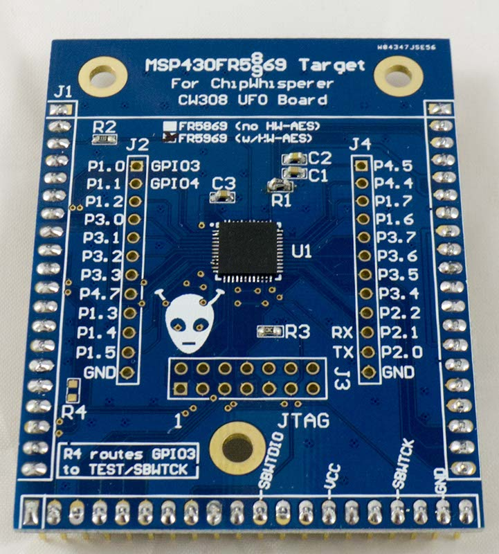
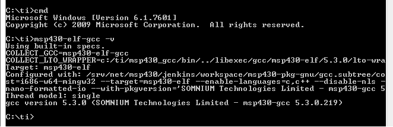

# CW308T-MSP430FR5

>This is a BETA target and not yet available. This page will continue to be updated until release. Gerbers are available in the GIT repo if you live dangerously.

---

## Specifications

| Feature | Notes/Range |
|---------|----------|
| Target Device | MSP430FR5(8/9)69 |
| Target Architecture | 16-bit Harvard |
| Vcc | 3.3V |
| Programming | TI MSP Programmer |
| Hardware Crypto | Possible |
| Availability | Gerbers/Source Files |
| Status | Released |
| Shunt | 51Ω |

## Hardware Description

This target board is designed to experiment with the MSP430FR5969 (which
has hardware AES), and MSP430FR5869 (without hardware AES). The same
footprint can be used with both parts - the MSP430FR5869 has the
advantage of being easier to export due to a lack of cryptographic
modules present.

The device can be programmed with an external programmer using JTAG or
Spy-Bi-Wire, or from the ChipWhisperer software using the serial BSL
(Bootstrap Loader). Using BSL requires an entry sequence that can be
generated by ChipWhisperer-Capture hardware.

---

## Side Channel Attacks

Many considerations of side-channel attacks on the MSP430FR5969 have
been presented by Amir Moradi and Gesine Hinterwalder in their paper
[Side-Channel Security Analysis of Ultra-Low-Power FRAM-based
MCUs](https://eprint.iacr.org/2015/199.pdf), which was presented at
[COSADE 2015](http://link.springer.com/chapter/10.1007%2F978-3-319-21476-4_16).
This includes considerations on the architecture of these devices, and
also presents an attack against the hardware AES peripheral. The
hardware attack has not yet been replicated on the ChipWhisperer-Lite
hardware, but this section will be updated once that occurs.

---

## Build Environment

The examples are designed to be built with GCC for the MSP430
(msp430-elf-gcc). You can download a build of GCC from [TI's
website](http://www.ti.com/tool/msp430-gcc-opensource), although you may
also have a build from another location. Downloading from TI will
require registering & agreeing to some export control conditions. The
following assumes you have installed this version of GCC.

If you want to use an external programmer, you can also download a
[Command-Line MSP430Flasher
program](http://www.ti.com/tool/msp430-flasher).

### **Include File Location**

Currently, the provided GCC does not seem to add the MSP430 header files
as a default include location. Instead you must specify the location of
these files in the Makefile - on Windows for example this defaults to
`C:\ti\msp430_gcc\include` . You will see one of the first lines of the
Makefile specifies this path:

`INC_PATH = C:/ti/msp430_gcc/include/`

### **Batch File for Building**

When running make, you'll need to have the msp430-gcc files on your
system path. Rather than modifying your path, you may wish to make a
batch file with the path on it. For Windows you can call this file
`tigcc.bat`, and for example the following shows including both GCC and
the flasher program:

`set PATH=%PATH%;C:\ti\msp430_gcc\bin;C:\ti\MSPFlasher_1.3.10`
` cmd`

Double-clicking on this file should give you a command prompt which now
has tools like `make` and `msp430-elf-gcc` in the path:

---

## Example Projects

---

## Using JTAG Programmer

The ChipWhisperer does not contain a JTAG programmer, but you can use
any MSP430 programmer instead. If you don't already have one, a
cheap/easy solution is to purchase a MSP-EXP430FR5969 which is TI's
MSP430FR5969 development kit. It contains an integrated
debugger/programmer which uses the 2-wire JTAG protocol.

To interface to the chip, remove the jumpers connecting to the target
section labeled RST and TST. Then using jumper wires connect these to
SBWTDIO and SBWTCLK respectively, as shown here (also be sure to connect
a ground reference):

Note if using the MSP430-BSL target on the ChipWhisperer-Lite it will
control the RST/TST lines as well, so you'll have to tristate those
lines from the ChipWhisperer-Lite.

---

## Schematic

NOTE: Schematic is marked as unapproved until hardware has been fully
validated.

See GIT Repo for PDF of schematic.

---

## Board Layout

See GIT Repo for gerber files.
