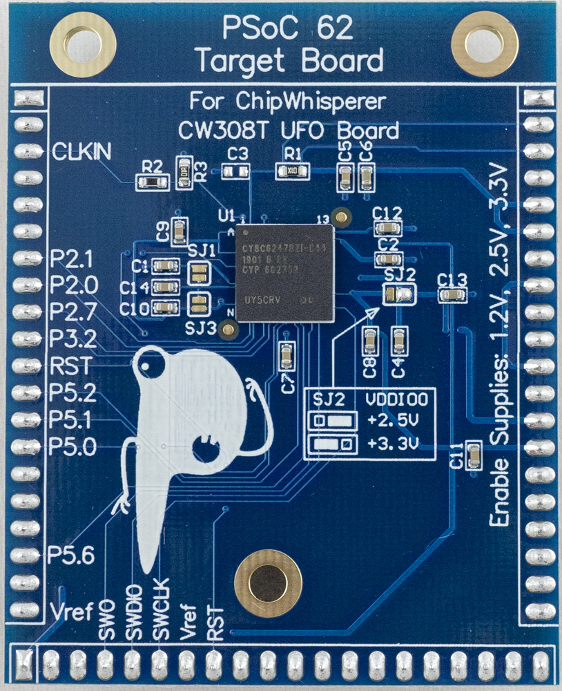

# CW308T-PSoC62

The PSoC62 board features the CY8C6247BZI-D44 from Cypress Semiconductors. This device features multiple secure boot features, and a seperate Cortex-M0 “security code” in addition to the Cortex-M4 “main processor.

The PCB layout should be compatible with the PSoC64 - the PSoC64 features effectively the PSoC62 with pre-programmed secure core memory.

This board requires an external JTAG/SWD programmer (such as OpenOCD or J-Link) for use, as does not include a bootloader.

The design files are available as part of the open-source ChipWhisperer example targets.

* CY8C6247BZI-D44 (PSoC62) in 124-BGA package features many security features, including E-Fuse boot options, boot verification, and a security co-processor.

* Total of 1MB of FLASH Memory, 288 KB SRAM, and 1KB EFUSE memory.

* Cortex-M4F main processor, and Cortex-M0+ co-processor used for security and secure boot, boots from ROM first.

* Multiple cryptographic accelerators including AES, 3DES, RSA, SHA-512, SHA-256 and ECC.

---

## Specifications

| Feature | Notes/Range |
|---------|----------|
| Target Device | Cypress CY8C6247BZI-D44 |
| Target Architecture | Arm Cortex-M4 + M0 |
| Vcc | 1.2V |
| Programming | JTAG |
| Hardware Crypto | Yes |
| Availability | Standalone  |
| Status | Production |
| Shunt | 10R |

## Power Supply

The PSoC62 target runs from the 1.2v supply on the CW308T for core voltage, and 3.3V for I/O voltage.

---

