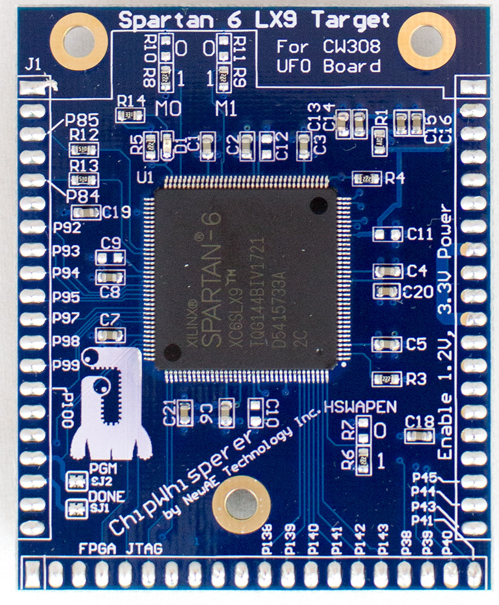
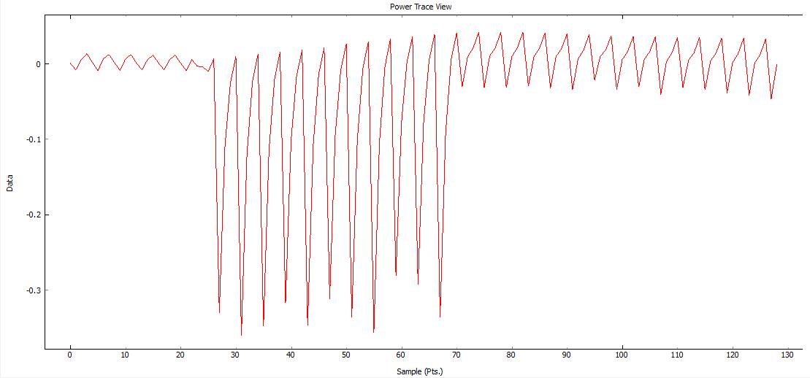
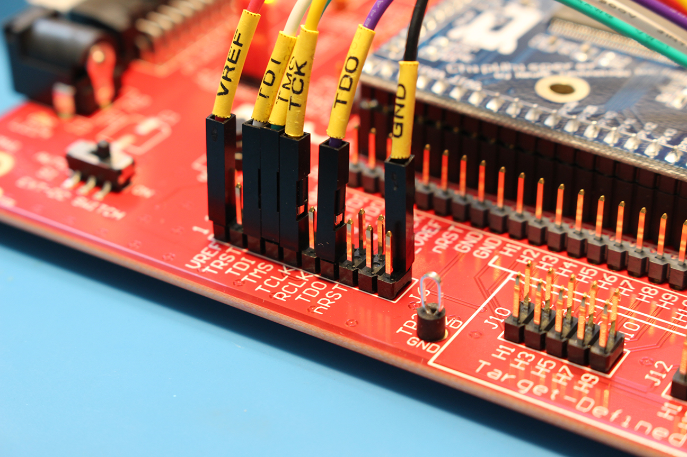
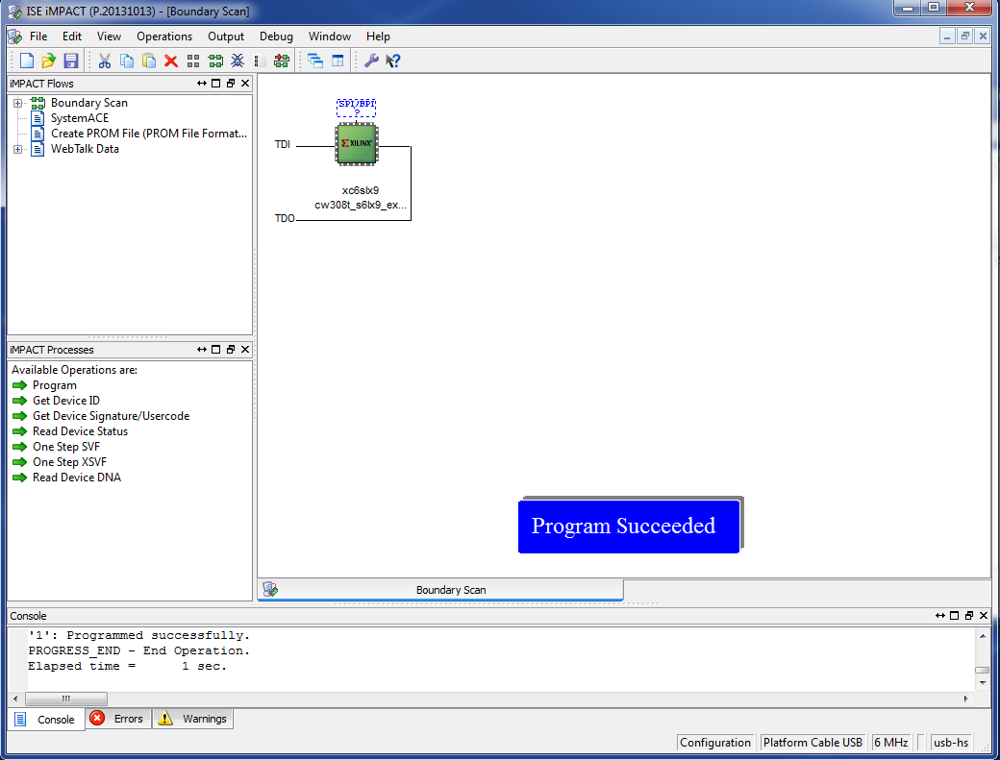
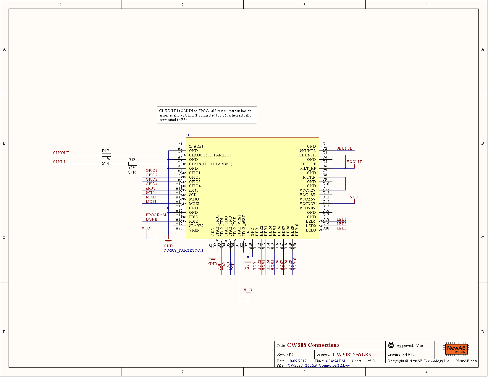
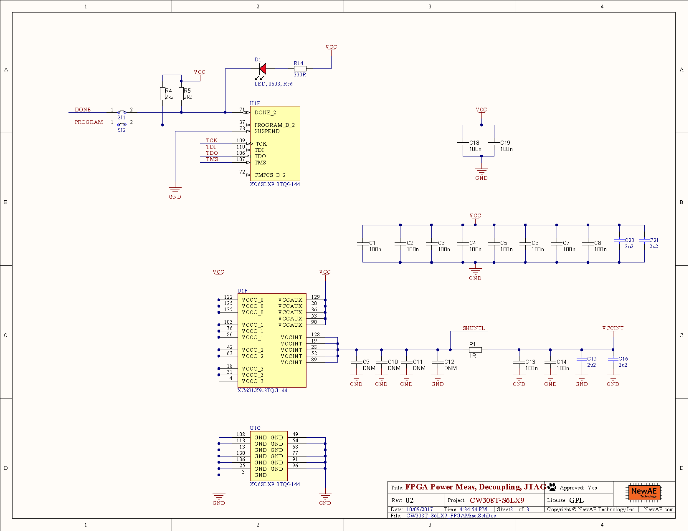
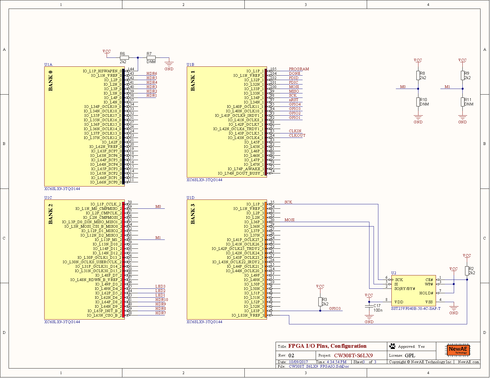

# CW308T-S6LX9

The S6LX9 target is a low-cost FPGA target. It uses the Xilinx Spartan 6
in TQFP package (XC6SLX9-2TQG144C), and can fit an entire AES core. The
example project includes the Simple-Serial interface which allows it to
function like any of our other example targets.

---

## Specifications

| Feature | Notes/Range |
|---------|----------|
| Target Device | Spartan 6 LX9 |
| Target Architecture | FPGA |
| Vcc | 1.2V |
| Programming | JTAG |
| Hardware Crypto | Yes |
| Availability | Standalone |
| Status | Released |
| Shunt | 1Ω |

Available from [Mouser](https://www.mouser.com/ProductDetail/NewAE/NAE-CW308T-S6LX9?qs=r5DSvlrkXmLB6Wv0H65vSg%3D%3DA)
and the [NewAE Store](https://store.newae.com/spartan-6-lx9-fpga-target-for-cw308/)

## Usage

The board includes a single red LED (D1) which is connected to the FPGA
"DONE" pin. This pin will be HIGH (and the LED on) when the FPGA is NOT
programmed. That is to say immediately on power-on, the LED will be on.
Once the FPGA is successfully programmed this LED will go out.

The FPGA pins are connected to the various headers on the board. The
JTAG header connects to the FPGA JTAG pins. The "Hx" pins, USART, and
SPI connect to arbitrary FPGA pins.

'''NB: You MUST enable the 1.2V regulator when using this board. The
1.2V power LED should be ON. This is easily done by toggling the
position of the 1.2V LDO switch (to either come from the 3.3V from
CW-Lite, or external power depending on your setup). '''

---

## Example Project

The GIT repo includes an example Xilinx ISE project, located at
[hardware/victims/cw308\_ufo\_target/spartan6lx9/ss\_aes\_ise](https://github.com/newaetech/chipwhisperer/tree/develop/hardware/victims/cw308_ufo_target/spartan6lx9/ss_aes_ise).
To use this project:

1.  Build the bitstream (or see the pre-built one in the repo at
    [cw308t\_s6lx9\_example.bit](https://github.com/newaetech/chipwhisperer/raw/develop/hardware/victims/cw308_ufo_target/spartan6lx9/ss_aes_ise/cw308t_s6lx9_example.bit))
1.  Use settings as in the 'Default XMEGA' or 'STM32Fx' targets (i.e.,
    clock jumpers, etc).
1.  Ensure you have turned on the 1.2V & 3.3V power supplies to the UFO
    target.
1.  Program the bitstream into the FPGA using a programming tool such as
    Xilinx Impact + USB Programmer cable.
1.  Connect to the ChipWhisperer scope and call `scope.default_setup()`
1.  The target supports SimpleSerial v1.0, meaning that it won't ACK. If using `capture_trace()`, call
    as follows: `cw.capture_trace(scope, target, text, key, ack=False)`
1.  Adjust the trigger offset settings - they should be changed to
    around \~750, and you can reduce the number of data points to \~128.

The waveform should look something like this:

---

## Known Issues

Note the -02 Revision of the PCB has swapped the markings of the
CLKIN/CLKOUT. The correct pinout is:

  - CLKIN connects to P84
  - CLKOUT connects to P85

The CLKIN pin is a _N clock pin. If you need the _P clock pin, you can
use a jumper on the CW308 board to route the clock input into the CLKOUT
pin.

---

## Programming

The ChipWhisperer will eventually support programming this target. Until
then, you will need an external programmer. This is connected via JTAG
to the pin headers:

Options for programmers include:

  - Xilinx Platform Cable USB or USB-II (Digikey/Mouser).
  - Clone JTAG programmers off AliExpress/E-Bay for low cost (search
    'Xilinx JTAG').
  - Digilent Inc HS1/HS2/HS3 Cables (NB: you may need separate jumper
    wires).

To use IMPACT:

  - Generate a new project.
  - Assign the .bit file to the FPGA (say 'no' to attached SPI flash
    chips).
  - Program.

---

## Schematic

See GIT Repo for PDF of schematic.

---

## Board Layout

See GIT Repo for gerber files.
