# CW308T-STM32F

The CW308-STM32F board is the perfect target for testing fault injection against TQFP-64 STM32F/STM32L
microcontrollers. Thanks to pin compatablity (mostly) between various devices, this single board
supports multiple STM32F/STM32L microcontrollers.

These boards are also available complete with different STM32 devices

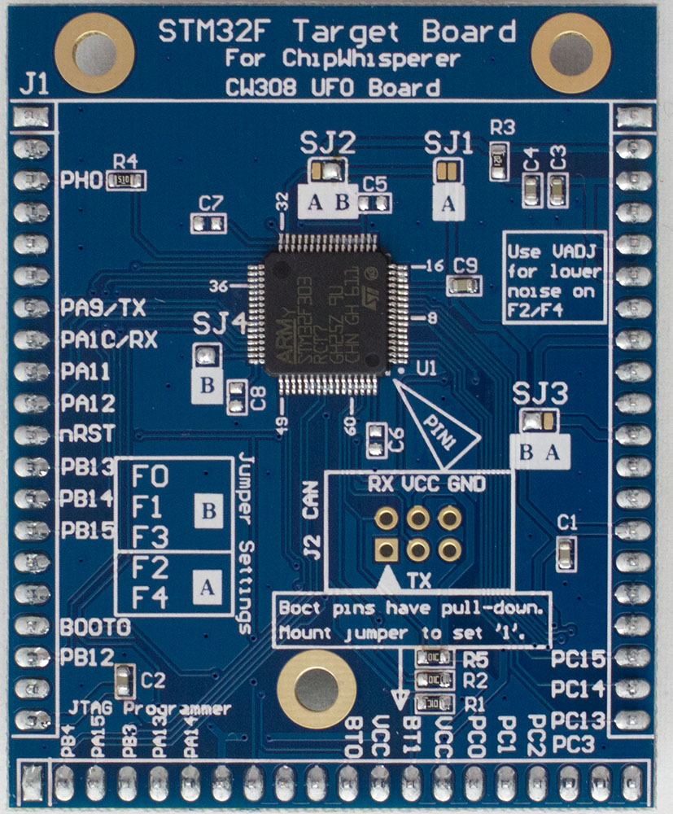

## Specifications

| Feature | Notes/Range |
|---------|--------------|
| Target Device | STM32F |
| Target Architecture | Arm Cortex M0, M3, M4 |
| Hardware Crypto | Possible |
| Programmer | STM32F Serial Bootloader, JTAG, SWD |
| Availability | Starter kits, Standalone |
| Status | Released |

* STM32F0: available from [Mouser](https://www.mouser.com/ProductDetail/NewAE/NAE-CW308T-STM32F0?qs=r5DSvlrkXmIzFRGmD1EBXw%3D%3D) and the [NewAE Store](https://store.newae.com/stm32f0-target-for-cw308-arm-cortex-m0-128kb-flash-8kb-sram/)
* STM32F1: available from [Mouser](https://www.mouser.com/ProductDetail/NewAE/NAE-CW308T-STM32F1?qs=r5DSvlrkXmJcYbIax%2Fpjxw%3D%3D) and the [NewAE Store](https://store.newae.com/stm32f1-target-for-cw308-arm-cortex-m3-128kb-flash-8kb-sram/)
* STM32F2 w/Hardware Crypto: available from [Mouser](https://www.mouser.com/ProductDetail/NewAE/NAE-CW308T-STM32F2HWC?qs=r5DSvlrkXmJrfkJWQlIRng%3D%3D)
* STM32F3: available from [Mouser](https://www.mouser.com/ProductDetail/NewAE/NAE-CW308T-STM32F3?qs=r5DSvlrkXmKbi9gG3XxX8g%3D%3D) and the [NewAE Store](https://store.newae.com/stm32f3-target-for-cw308-arm-cortex-m4-256kb-flash-40kb-sram/)
    * Also available in a bundle with the [CANoodler](../../Tools/CANoodler.md) from [Mouser](https://www.mouser.com/ProductDetail/NewAE/NAE-CW308T-STM32F3AUTO?qs=r5DSvlrkXmJPqn%252BacawA8Q%3D%3D) and the [NewAE Store](https://store.newae.com/stm32f3-target-for-cw308-automotive-bundle-w-canoodler/)
* STM32F4 (no hardware crypto): available from [Mouser](https://www.mouser.com/ProductDetail/NewAE/NAE-CW308T-STM32F4?qs=r5DSvlrkXmKQ5HF2DzuSkA%3D%3D) and the [NewAE Store](https://store.newae.com/stm32f4-target-for-cw308-arm-cortex-m4-1mb-flash-192kb-sram/)
* STM32F4 w/Hardware Crypto: available from [Mouser](https://www.mouser.com/ProductDetail/NewAE/NAE-CW308T-STM32F4HWC?qs=r5DSvlrkXmLrgVVFt%252BpyiQ%3D%3D)
* STM32L4 w/Hardware Crypto: available from [Mouser](https://www.mouser.com/ProductDetail/NewAE/NAE-CW308T-STM32L4?qs=OlC7AqGiEDlCVULataTd0w%3D%3D)

* The blank PCB is also available from [Mouser](https://www.mouser.com/ProductDetail/NewAE/NPCB-CW308T-STM32F-04?qs=r5DSvlrkXmKb3e62axJWHA%3D%3D) and the [NewAE Store](https://store.newae.com/blank-pcb-stm32fx-cw308-target/)

---

## Supported Devices

The STM32F board supports several STM32F devices in the TQFP-64 package.
Various solder jumpers need to bet set to either the "A" or "B" position
to select appropriate VCC supply for the different series. The following
table summarizes examples of suitable devices:

| **STM32F Series** | **Package** | **Device**         | **Hardware AES** | **Tested** | **Jumper** | **Flash** | **SRAM**  | **NAE P/N**                                               |
| ------------- | ------- | -------------- | ------------ | ------ | ------ | ----- | ----- | ----------------------------------------------------- |
| F0            | TQFP-64 | STM32F071RBT6  | No           | Yes    | B      | 128KB | 16KB  | NAE-CW308T-STM32F0                                    |
| F1            | TQFP-64 | STM32F100RBT6B | No           | Yes    | B      | 128KB | 8KB   | NAE-CW308T-STM32F1                                    |
| F2            | TQFP-64 | STM32F215RET6  | Yes          | Yes    | A      | 512KB | 132KB | NAE-CW308T-STM32F2HWC                                 |
| F3            | TQFP-64 | STM32F303RCT7  | No           | Yes    | B      | 256KB | 40KB  | NAE-CW308T-STM32F3                                    |
| F4            | TQFP-64 | STM32F415RGT6  | Yes          | Yes    | A      | 1MB   | 192KB | NAE-CW308T-STM32F4HWC                                 |
| F4            | TQFP-64 | STM32F405RGT6  | No           | Yes    | A      | 1MB   | 192KB | NAE-CW308T-STM32F4                                    |
| L4            | TQFP-64 | STM32L443RCT6  | Yes          | Yes    | B      | 256KB | 64KB  | NAE-CW308T-STM32L4 (this version has hardware crypto) |
| L5            | TQFP-64 | STM32L562RET6  | Yes          | Yes    | B      | 512KB | 256KB | NAE-CW308T-STM32L5HWC                                 |


### **VCC-Int Supply**

Several devices (F2, F4) have internal core voltage regulators. By
default the CW308 board attempts to provide power for these pins, but
the voltage may not be high enough to cause the internal regulator to
disable itself. In this case you can use the VADJ regulator to ensure
the internal regulator is disabled. See [Targets with Internal
Regulators](Targets_with_Internal_Regulators "wikilink") for details.

### **Pin-outs across TQFP Devices**

The following shows differences in pinouts between three groups of
devices. The left-most is the STM32F051RB, which uses the same 3.3V
VCORE as the STM32F1/F3. It has fewer VCC pins, so the I/O occupying
that are VCC/GND pins on the STM32F1 (such as PF6/PF7) are tied to
GND/VCC. The right-most part is the pinout of the STM32F2/F4. It has an
internal regulator, where the VCAP pins are the output of this regulator
(and input to the internal core logic).


Note for the devices with a 3.3V VCORE, you should not mount decoupling
capacitors C5/C6/C7/C8. You will still get some leakage with those
capacitors mounted, but a stronger signal is present without them.

---

## Hardware AES

The STM32F21x, and STM32F41x/43x have hardware crypto modules (AES, DES,
TDES) along with hardware hash (SHA1, MD5). Hardware crypto for the
STM32F4 has been integrated into the Hal build system on the develop
branch. To use the hardware crypto, call HW_AES128_Init() at the
beginning of your program. You can update the key with
HW_AES128_LoadKey(), encrypt plaintext with HW_AES128_Enc(), and
decrypt data with HW_AES128_Dec().

---

## CAN Connection

A 6-pin header is present for devices which have CAN hardware support
(not all devices have this). A CANoodler can be plugged in to provide
the physical transceiver. This header is not normally mounted, unless
the board is part of an 'automotive bundle'. The header is left
unmounted as it can impede sweeping a probe over the surface of the
chip.

---

## Programming Connection

### **ChipWhisperer Programmer via Bootloader**

See further down this page for details.

### **JTAG Programmer**

The 20-pin JTAG port (J6 on CW308 Board) can be used with the
[ST-LINK/V2](https://www.digikey.com/product-detail/en/stmicroelectronics/ST-LINK-V2/497-10484-ND/2214535)
which is a low-cost JTAG programmer.

It is also possible to use other JTAG programmers such as OpenOCD. The
following command worked with an Olimex OpenOCD programmer and their
[OpenOCD for
Windows](https://www.olimex.com/Products/ARM/JTAG/ARM-USB-OCD-H/)
software:

    openocd
      -f path/to/board/files/cw308.cfg
      -c init
      -c targets
      -c "halt"
      -c "flash write_image erase path/to/firmware.hex"
      -c "verify_image path/to/firmware.hex"
      -c "reset run"
      -c shutdown

where the contents of `cw308.cfg` are

    source [find interface/olimex-arm-usb-ocd-h.cfg]
    source [find target/stm32f4x.cfg]
    reset_config srst_only

---

## Example Projects

SimpleSerial builds for each of the STM32Fx Devices. Each device is a
separate HAL. These HAL modules have been copied from ST's HAL (not the
CUBE) and greatly reduced in size by deleting unused files (such as
headers for unused devices), and combining several C-source files into a
single low-level C-file.

Many example projects are available via Jupyter Notebooks:
<https://chipwhisperer.readthedocs.io/en/latest/tutorials.html>. Note
that all of these examples were created for the CWLITEARM (equivalent
STM32F3) target. You will need to make changes based on which target you
have to run the tutorials. For some tutorials, changing the PLATFORM
variable in the first block to the one you're using is enough to get the
tutorial working:

``` python
SCOPETYPE = "OPENADC"
PLATFORM = "CW308_STM32F4" #For STM32F4 target, was originally "CWLITEARM"
```

### **Building ST Example on Command Line**

The regular firmware build process works with the STM32 devices. For
example, to build \`simpleserial-aes\`, navigate to the folder
\`chipwhisperer\\hardware\\victims\\firmware\\simpleserial-aes\` and run
the following command on the command line:

`make PLATFORM=CW308_STM32F0 CRYPTO_TARGET=TINYAES128C`

If all goes well, this command will finish by printing the output file
size and the platform:

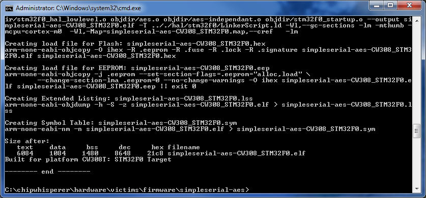

### **Programming via ChipWhisperer Bootloader**

The STM32Fx devices have a built-in bootloader, and the ChipWhisperer
software as of 3.5.2 includes support for this bootloader.

Important notes before we begin:

  - You MUST setup a clock and the serial lines for the chip. This is
    easily done by connecting to the scope and target, then running
    `default_setup()`:

<!-- end list -->

``` python
import chipwhisperer as cw
scope = cw.scope
target = cw.target(scope)
scope.default_setup()
```

  - On the STM32F1, you MUST adjust the clock frequency to 8MHz. The
    bootloader does not work with our usual 7.37 MHz clock frequency.
    **This 8MHz frequency does not apply to the code that you're running
    on the device. Once you're done programming, you'll need to set the
    frequency back to F\_CPU (likely 7.37MHz)** For example:

<!-- end list -->

``` python
scope.default_setup()
scope.clock.clkgen_freq = 8E6
#program target...
scope.clock.clkgen_freq = 7.37E6
#reset and run as usual
```

To access the bootloader you can perform these steps. They vary based on
if you have a "Rev 02" board or a "Rev 03 or Later" board. The revision
number is printed on the bottom side as part of the PCB part number
(STM32F-03 is Rev -03 for example).

#### **Rev -03 or Later**

Run the following python code once you have the scope and target set up:

``` python
prog = cw.programmers.STM32FProgrammer
cw.program_target(scope, prog, "<path to fw hex file>")
```

If you get errors during the programming process:

  - Retry the programming process with a lower baud rate:

<!-- end list -->

``` python
prog = cw.programmers.STM32FProgrammer
cw.program_target(scope, prog, "<path to fw hex file>", baud=38400)
```

  - If using a CW308 based STM, try mounting a jumper between the "SH-"
    and "SH+" pins at J16 (to the left of the SMA connector) on the UFO
    board. Retry programming with the jumper mounted.

---

#### Rev -02 Boards

The Rev -02 boards did not have all programming connections present.
They require some additional steps:

\# Setup the device as usual:

``` python
scope = cw.scope()
target = cw.target(scope)
scope.default_setup()
```

1.  Mount a jumper between the H1 and PDIC pins (again this is ONLY for
    the -02 rev).
      -
        

\# Reset the ARM device either by pressing the reset button (newer UFO
boards only), or by toggling power:

``` python
import time
scope.io.target_pwr = False
time.sleep(1)
scope.io.target_pwr = True
```

\# Program the device:

``` python
prog = cw.programmers.STM32FProgrammer
cw.program_target(scope, prog, "<path to fw hex file>")
```

1.  The device should program, it may take a moment to fully
    program/verify on larger devices.
2.  Remove the jumper between the H1/H2 pins.

\# Reset the ARM device either by pressing the reset button (newer UFO
boards only), or by toggling power:

``` python
import time
scope.io.target_pwr = False
time.sleep(1)
scope.io.target_pwr = True
```
---

### **Running ST Example with ST-Link**

If instead of using the bootloader, you want to use a ST-Link you can
instead plug your programmer into the 20 pin JTAG connector (J6 on the
UFO board):

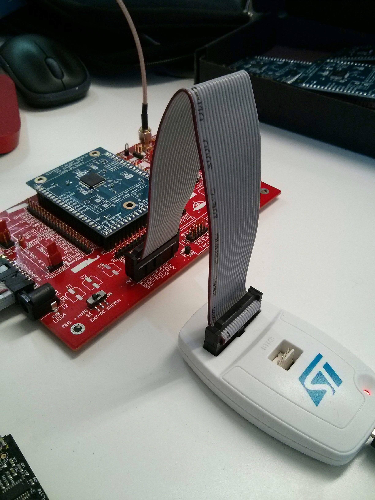

Then, the details of this step will depend on your programmer. If you're
using an ST-Link programmer, open the ST-Link utility and connect to the
device:

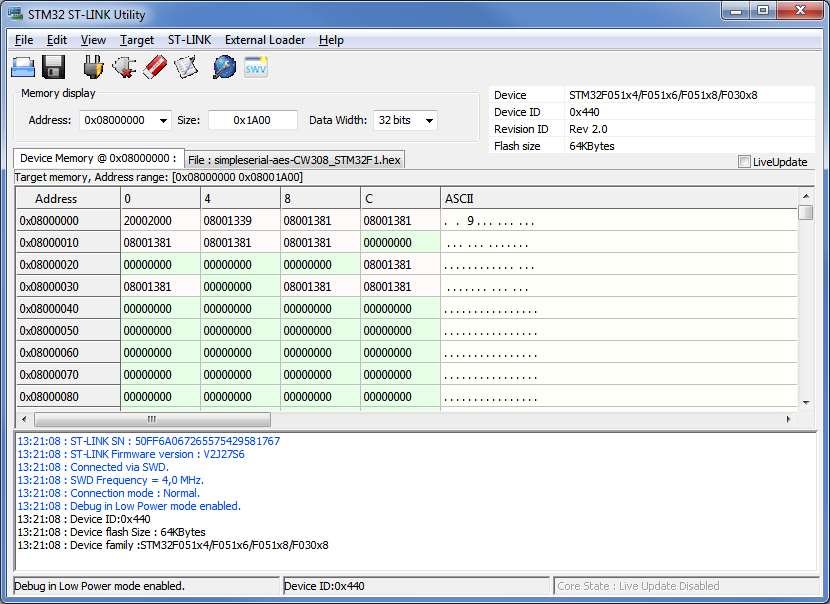

Load your \`.hex\` file and program the device with the Program and
Verify button:

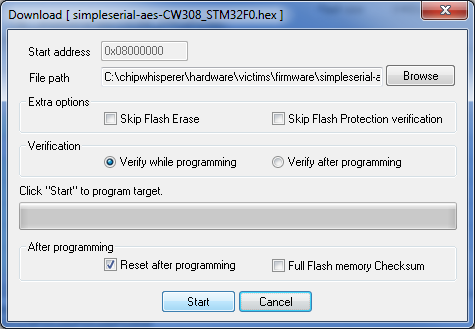

After this, you're ready to go - you can use the ChipWhisperer terminal
to talk to your target. You might need to reset the target before you do
anything else.

### **Building and Debugging via ST's System Workbench**

It's also possible to work on the example projects using [ST's System
Workbench IDE](http://www.st.com/en/development-tools/sw4stm32.html).
This IDE also supports debugging, which is helpful for working out all
the kinks in your firmware.

To build the ChipWhisperer examples in System Workbench:

1\. Create a new Mcu project by going to *File \> New \> C Project* and
selecting *'*Ac6 STM32 MCU Project*'.* When you get to Target
Configuration, click the Mcu tab and select the microcontroller that you
want to target:


2\. Link the external files into the project. To do this, under *File \>
Import*, select *File System*. In the
\`chipwhisperer\\hardware\\victims\\firmware\` directory, select all of
the relevant files and folders (Makefile in base folder, Makefile in HAL
folder, STM32Fx HAL folder).:

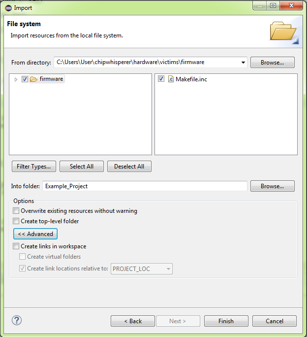

3\. Set up the build command. In *File \> Properties*, go to *C/C++
Build \> Behavior* and remove 'all**' from 'Build' and deselect 'Enable
parallel build'. Next, click the *Builder Settings* tab and deselect
'Use default build command' and 'Generate Makefiles Automatically'.
Enter the command you would normally enter on the command line and
change 'Build directory' to the folder you want to build in:

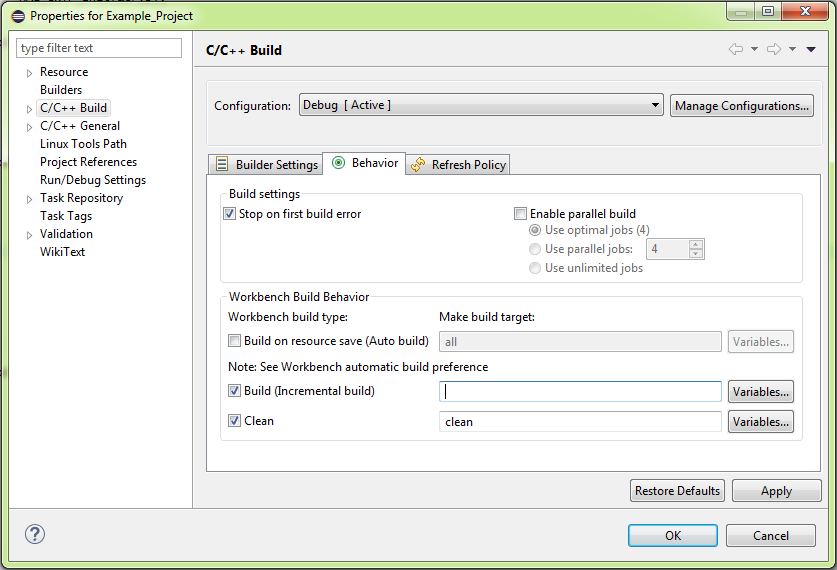


4\. Build the project and confirm that the build works from the output
in the IDE console.

Then, if you want to set up debugging:

1\. Go to *in File \> Properties* select Run/Debug Settings and create a
new debug configuration. Under Debugger, click 'Show generator
options...' and setup your Connection Setup based on your debugger.
Change 'Reset Mode' to 'Software System reset':

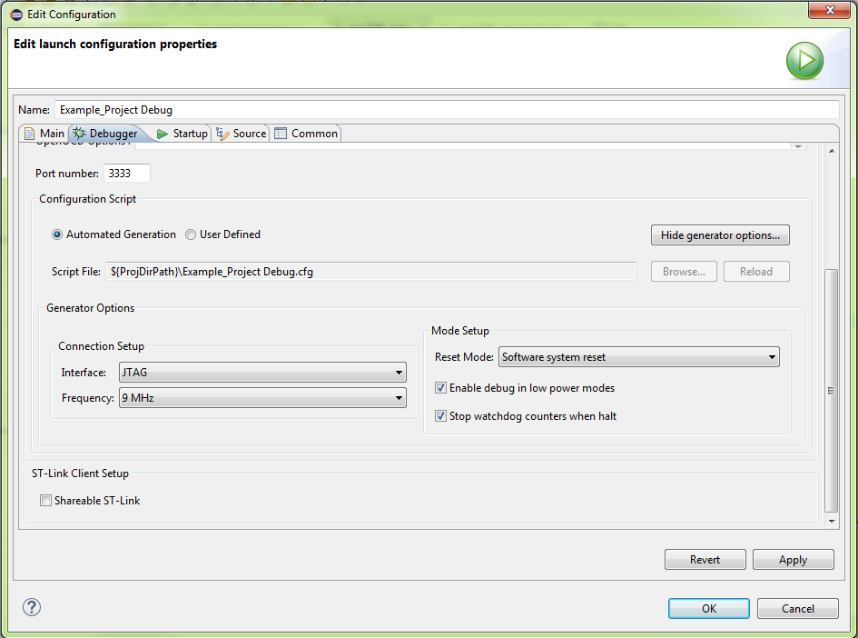

2\. Click Apply and enter debugging mode.

**Caveat**: the I/O register map in the debugger appears to use the last
known device (ie: if you debugged an STM32F4 project before your
Makefile project, it sticks with F4's registers). Check that the
registers' addresses are correct before you trust them\!

---

>## Schematic

The following variants are possible, see the table above for
SRAM/FLASH/HW-Crypto status:

| Variant | U1            | R3 (VCC-Shunt) | R4 (Clock) |
| ------- | ------------- | -------------- | ---------- |
| F0      | STM32F071RBT6 | 33-ohm         | 120-ohm    |
| F1      | STM32F100RBT6 | 22-ohm         | 51-ohm     |
| F2HWC   | STM32F215RET6 | 10-ohm         | 51-ohm     |
| F3      | STM32F303RCT7 | 12-ohm         | 51-ohm     |
| F4      | STM32F405RGT6 | 10-ohm         | 51-ohm     |
| F4HWC   | STM32F415RGT6 | 10-ohm         | 51-ohm     |

### **Rev -03 Schematic**

The current revision of the target is -03. The following shows this
schematic:

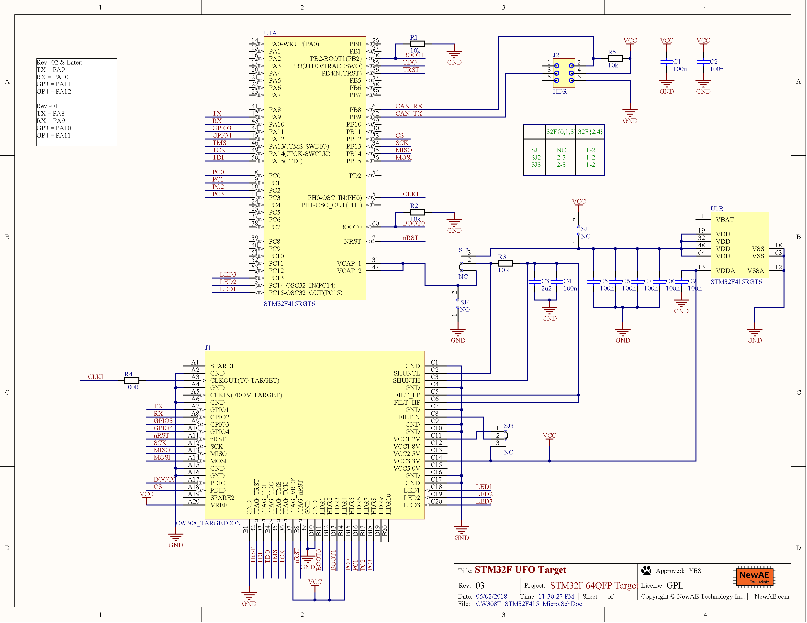

### **Rev -02 Schematic**

The original board sold was the -02 revision. The revision is part of
the part number, for example these boards will be marked STM32F-02. The
-02 revision also does not have the CAN connector:
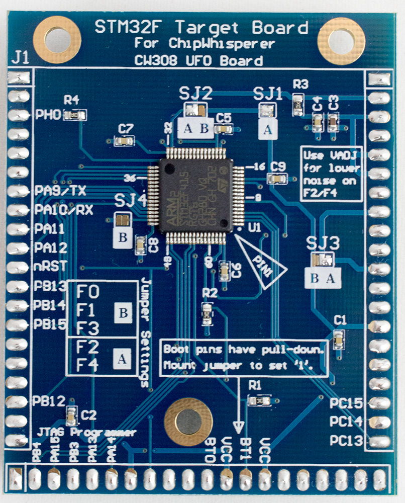

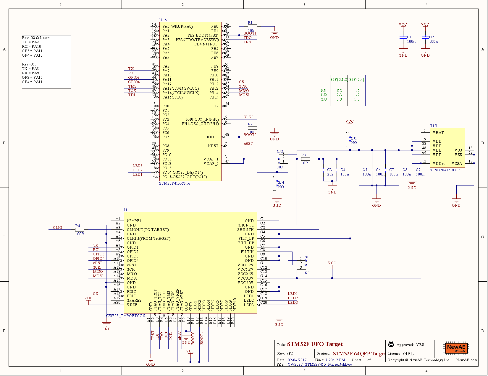
