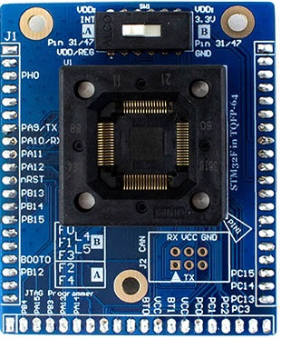
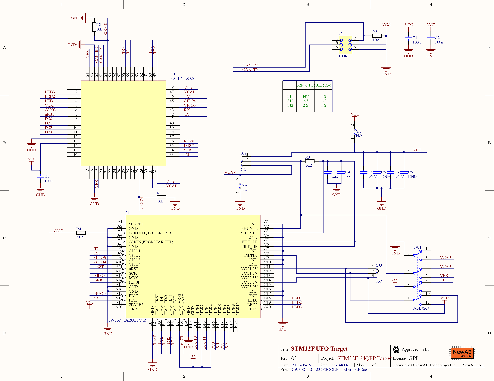

# CW308T-STM32F-SOCKET

The CW308-STM32F-SOCKET board is the perfect target for testing fault injection against TQFP-64 STM32F/STM32L
microcontrollers. Thanks to pin compatablity (mostly) between various devices, this single board
supports multiple STM32F/STM32L microcontrollers.

These boards do not ship with any microcontroller, but use a 64-pin TQFP socket.

## Specifications

| Feature | Notes/Range |
|---------|--------------|
| Target Device | STM32F |
| Target Architecture | Arm Cortex M0, M3, M4 |
| Hardware Crypto | Possible |
| Programmer | STM32F Serial Bootloader, JTAG, SWD |
| Availability | Starter kits, Standalone |
| Status | Released |

* Available from [NewAE Webstore](http://store.newae.com/stm32f-tqfp64-socket-target-for-cw308/)

---

## Supported Devices

The STM32F board supports several STM32F devices in the TQFP-64 package.
The switch needs to be set in either the "A" or "B" position
to select appropriate VCC supply for the different series. The following
table summarizes examples of suitable devices, in the following list these devices are available in fixed boards as well.

| **STM32F Series** | **Package** | **Device**         | **Hardware AES** | **Tested** | **Jumper** | **Flash** | **SRAM**  | **NAE P/N for Fixed PCB **                                               |
| ------------- | ------- | -------------- | ------------ | ------ | ------ | ----- | ----- | ----------------------------------------------------- |
| F0            | TQFP-64 | STM32F071RBT6  | No           | Yes    | B      | 128KB | 16KB  | NAE-CW308T-STM32F0                                    |
| F1            | TQFP-64 | STM32F100RBT6B | No           | Yes    | B      | 128KB | 8KB   | NAE-CW308T-STM32F1                                    |
| F2            | TQFP-64 | STM32F215RET6  | Yes          | Yes    | A      | 512KB | 132KB | NAE-CW308T-STM32F2HWC                                 |
| F3            | TQFP-64 | STM32F303RCT7  | No           | Yes    | B      | 256KB | 40KB  | NAE-CW308T-STM32F3                                    |
| F4            | TQFP-64 | STM32F415RGT6  | Yes          | Yes    | A      | 1MB   | 192KB | NAE-CW308T-STM32F4HWC                                 |
| F4            | TQFP-64 | STM32F405RGT6  | No           | Yes    | A      | 1MB   | 192KB | NAE-CW308T-STM32F4                                    |
| L4            | TQFP-64 | STM32L443RCT6  | Yes          | Yes    | B      | 256KB | 64KB  | NAE-CW308T-STM32L4 (this version has hardware crypto) |
| L5            | TQFP-64 | STM32L562RET6  | Yes          | Yes    | B      | 512KB | 256KB | NAE-CW308T-STM32L5HWC                                 |

### **VCC-Int Supply**

Several devices (F2, F4) have internal core voltage regulators. By
default the CW308 board attempts to provide power for these pins, but
the voltage may not be high enough to cause the internal regulator to
disable itself. In this case you can use the VADJ regulator to ensure
the internal regulator is disabled.

### **Pin-outs across TQFP Devices**

The following shows differences in pinouts between three groups of
devices. The left-most is the STM32F051RB, which uses the same 3.3V
VCORE as the STM32F1/F3. It has fewer VCC pins, so the I/O occupying
that are VCC/GND pins on the STM32F1 (such as PF6/PF7) are tied to
GND/VCC. The right-most part is the pinout of the STM32F2/F4. It has an
internal regulator, where the VCAP pins are the output of this regulator
(and input to the internal core logic).

Decoupling
capacitors C5/C6/C7/C8 are DNM, as they will weaken leakage on devices with a 3.3V core.

## Example Projects and Using Target

* See note above about setting switch SW1 to route correct power to the target device.

* General usage information is available on the [STM32Fx target board documentation page](../CW308T-STM32F/).

### Schematic

