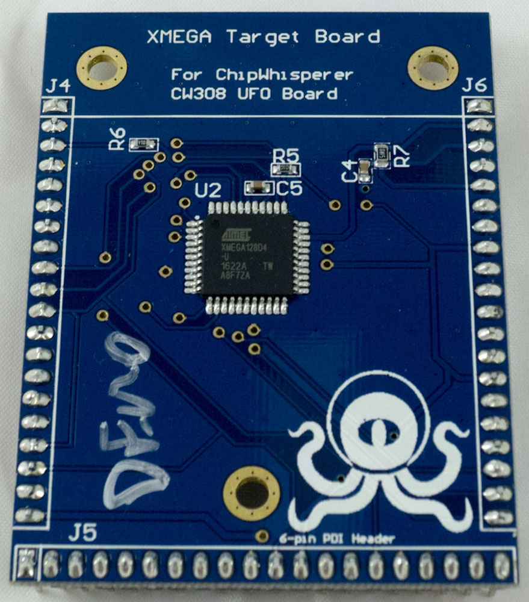
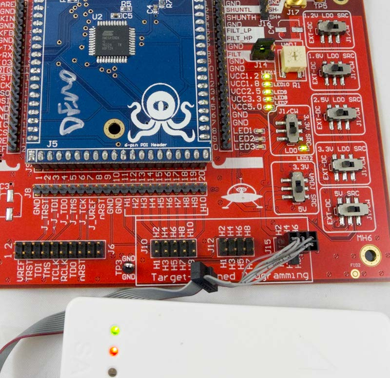

# CW308T-XMEGA

The CW308T-XMEGA fits an Atmel XMEGA device.

---

## Specifications
| Feature | Notes/Range |
|--------|-----------|
| Target Device | ATXmega128D4-AU |
| Target Architecture | 8-bit Harvard |
| Vcc | 3.3V |
| Programming | PDI |
| Hardware Crypto | Possible |
| Availability | Starter Kits, Standalone |
| Status | Released |
| Shunt | 51Ω |

Available from [Mouser](https://www.mouser.com/ProductDetail/NewAE/NAE-CW308T-XMEGA?qs=P1JMDcb91o4l0XcYi2IADA%3D%3D)
and the [NewAE Store](https://store.newae.com/xmega-target-for-cw308-8-bit-risc/)

>## I/O Connections

| **CW308 Pin** | **ATXMega Pin** | **Notes**                                                                             |
| --------- | ----------- | --------------------------------------------------------------------------------- |
| GPIO1     | PC3 (TXD0)  | Serial OUTPUT from AVR.                                                           |
| GPIO2     | PC2 (RXD0)  | Serial INPUT to AVR.                                                              |
| GPIO3     | PA1         | Spare pin.                                                                        |
| GPIO4     | PA0         | Trigger pin.                                                                      |
| CLKIN     | XTAL1       |                                                                                   |
| CLKFB     | PB3         | Can output clock on this pin. Useful for synchronizing to internal RC oscillator. |
| LED1      | PA5         |                                                                                   |
| LED2      | PA6         |                                                                                   |
| LED3      | PA7         |                                                                                   |
| PDID      | PDID        | In-System programming.                                                            |
| PDIC/nRST | nRST/PDIC   | In-System programming.                                                            |

---

>## Hardware AES

The XMEGA device that ships with most standard boards is the
ATXmega128D4-AU, the same device on the ChipWhisperer-Lite. This board
*does not* contain hardware AES to simplify compliance with export
rules.

The pin-compatible ATXmega128A4U-AU contains a hardware AES accelerator.
If you wish to attack this device, you can purchase the blank
CW308T-XMEGA PCB (or download gerbers from the GIT repository and make
them yourselves) and mount the appropriate XMEGA device.

---

>## Programming Header

The 6-pin programming heading can be used with the Atmel PDI interface.
The pinout of the 6-pin programming header on the main-board allows it
to work with standard Atmel ISP tools:

---

>## Schematic

