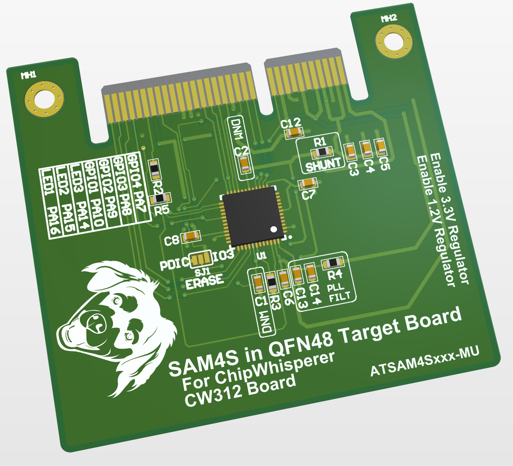

# CW312T-SAM4S

This board supports the Atmel SAM4S microcontroller. The default build
has the Atmel ATSAM4S2AA-MU, which has 128KB flash and 64KB SRAM.

---

## Specifications

| Feature | Notes/Range |
|---------|----------|
| Target Device | ATSAM4S2 |
| Target Architecture | Arm Cortex-M4 |
| Vcc | 1.2V |
| Programming | Bootloader or JTAG |
| Hardware Crypto | No |
| Availability | Standalone |
| Status | Released |
| Shunt | 10Ω |

## Power Supply

The Atmel SAM4S has an internal 1.2V regulator. This regulator is not
used in the board, instead power for the core is supplied by an external
LDO on the UFO board. Be sure to enable the 1.2V and 3.3V regulators on
the UFO board for the SAM4S board to function.

---

## Programming

The serial bootloader can be used to program this board. 

### **Using Atmel SAM-BA**

Atmel SAM4S has a built-in bootloader. This bootloader is ROM-Resident, and
a hardware "ERASE" pin is used to erase the user-programmable FLASH memory.
When the FLASH memory is empty, the bootloader runs by default.

The process of erasing the flash using the pin is handled automatically
by the ChipWhisperer programming scripts.

---

## Schematic

See GIT Repo for PDF of schematic.

---

## Board Layout

See GIT Repo for gerber files.
