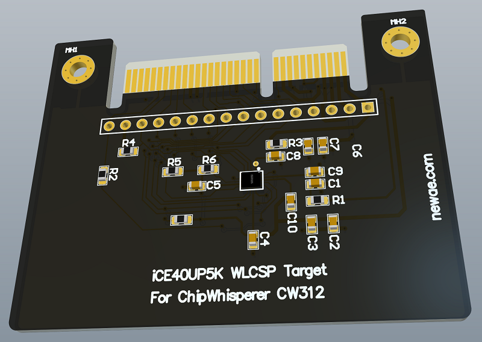
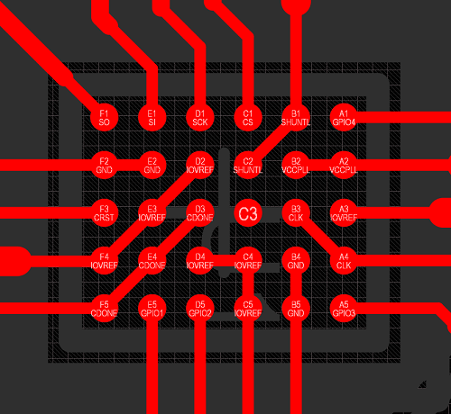
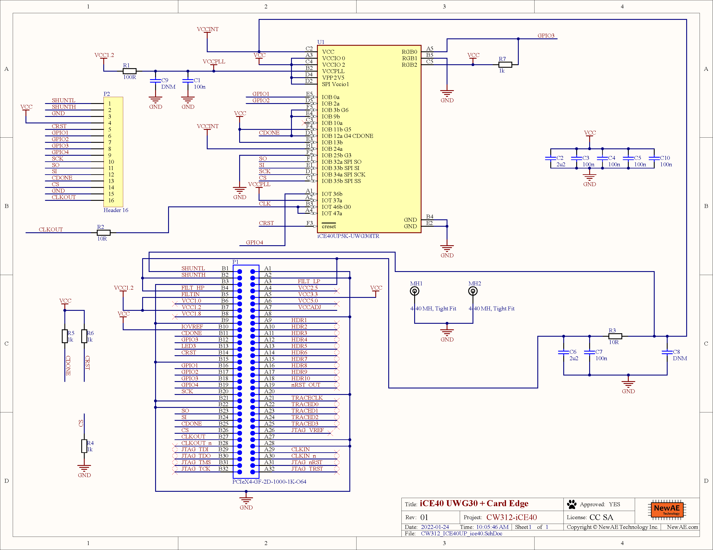

# CW312T-iCE40

iCE40 UltraPlus (UP5K) Target for ChipWhisperer, with CW312 edge connector.



## Available Pins

To simplify routing so that the board can be produced/ordered on "standard" processes, no fancy vias are used (vias under the BGA would require microvias or filled vias). This
results in many connections on the schematic to allow routing of pads out:



## neorv32 Soft-Core Processor

This device can be loaded with a [neorv32](https://github.com/stnolting/neorv32) soft-core RISC-V processor. The ChipWhisperer repo includes a pre-built core so you *don't* need to rebuild this core
under normal circumstances. The default core is configured with the following setup:

* External clock directly drives core (no PLL).
* Bootloader runs at 19200 baud with  7.3728 MHz input frequency.
* 64KB data memory, 64KB code memory.
* Two GPIO pins (GPIO0/1 in the core, maps to GPIO3, GPIO4 on the PCB). GPIO3 is open-drain and thus has a pull-up on the PCB.
* Internal reset on power-up, no external reset input.

### Running Pre-Built Core

The pre-built core is loaded by the [neorv32 programmer](https://github.com/newaetech/chipwhisperer/blob/develop/software/chipwhisperer/hardware/naeusb/programmer_neorv32.py) which is normally
called from the [programmer interface](https://github.com/newaetech/chipwhisperer/blob/develop/software/chipwhisperer/capture/api/programmers.py):

If using the Jupyter notebooks simplify specify the target as `CW308_NEORV32`. This will:

1. Use the [neorv32 HAL](https://github.com/newaetech/chipwhisperer/tree/develop/hardware/victims/firmware/hal/neorv32).
2. Use a `riscv32-unknown-elf-gcc` or `riscv64-unknown-elf-gcc` compiler (the 64-bit compiler normally can build for `rv32i` target we need).
3. Use the `cw.programmers.NEORV32Programmer` interface.

Using the standard interface the programming looks like:

```
cw.program_target(scope, prog, "simpleserial-aes-CW308_NEORV32.bin")
```

Where `prog` was set to `cw.programmers.NEORV32Programmer` in `Setup_Generic.ipynb`.

**NOTE**: As the iCE40 has no nRST pin by default, resetting the device is done by reconfiguring it. Note that
glitch attacks may result in corruption of the configuration RAM (CRAM) of the iCE40, so if using this target
for glitching it is suggested to reprogram it after **EVERY** attempt.

#### Lower-Level Programming Interface

The manual interface works as follows:

```
import chipwhisperer as cw
from chipwhisperer.hardware.naeusb.programmer_neorv32 import Neorv32Programmer
cw = cw.scope()
cw.default_setup()

neorv = cw.programmers.Neorv32Programmer()
neorv.open_port()
neorv.program("neorv32_exe.bin")
neorv.close_port()
```

This uses the `neorv32_exe.bin` name that the neorv makefiles build. It also programs the built-in soft-core.

### Rebuilding the Soft-Core

The board is part of the [neorv32-setups](https://github.com/stnolting/neorv32-setups) supported targets. To rebuild it:

* Install the toolchain (described [here](https://github.com/stnolting/neorv32-setups/tree/main/osflow#Prerequisites)).
* Checkout [neorv32-setups](https://github.com/stnolting/neorv32-setups)
* Run `make BOARD=CW312iCE40 MinimalBoot`

You can specify the resulting `neorv32_iCE40CW312_MinimalBoot.bit` as part of the programming step with:

```
neorv.open_port()
neorv.program("neorv32_exe.bin", bsfile="neorv32_iCE40CW312_MinimalBoot.bit")
neorv.close_port()
```

## Schematic

The schematic is available as a [PDF](https://github.com/newaetech/chipwhisperer-target-cw308t/raw/main/CW312T_ICE40UP/NAE-CW312T-iCE40.PDF) or below as an image:



## DIY Soldering/Build

The WLCSP device chosen for the iCE40 was used for several reasons:

* During pandemic silicon shortage it was more widely available.
* WLSCP allows usage for [BBI fault injection](https://eprint.iacr.org/2020/1228.pdf).

If building your own, we have had great success with "flux-only" soldering rather than worrying about the small pitch BGA paste.

To do this, put some liquid flux down, put the WLCSP package on the board (align it carefully), and heat with hot air (our). Watch the side of the
WLCSP package until it appears to have seated on all sides. Remove the hot air.

## CW308T Version

An earlier version of this board was [available with the CW308T pinout](https://github.com/newaetech/chipwhisperer-target-cw308t/tree/main/CW308T_ICE405). The iCE40 connections are identical.

The CW308T version was never produced by NewAE, but you can build your own if you prefer this layout.

The firmware HAL still uses the `CW308` name for this reason.