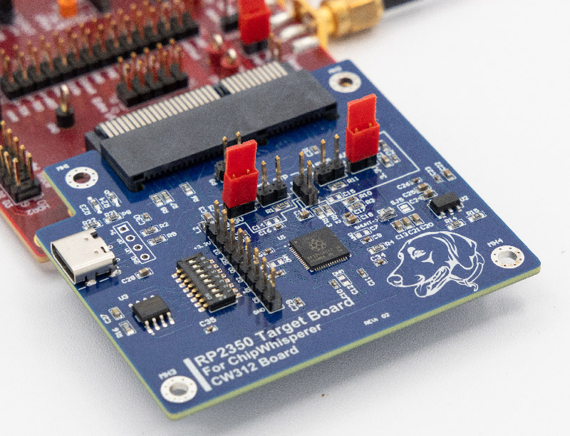

# CW312T-RP2350

This board supports the Raspberry Pi RP2350 microcontroller. It especially lets you experiment with features such as power analysis or fault injection, including testing the glitch detectors.

---

## Specifications

| Feature | Notes/Range |
|---------|----------|
| Target Device | RP2350 |
| Target Architecture | Arm & RISC-V |
| Vcc | 1.0V (on-board LDO) |
| Programming | Bootloader |
| Hardware Crypto | No |
| Availability | Standalone |
| Status | Released |
| Shunt | TBD |

## Power Supply

The RP2350 has an internal regulator. This regulator is not
used in the board, instead power for the core is supplied by an external
LDO on the board.

---

## Programming

The USB bootloader can be used by enabling the 12 MHz clock source. 

---

## Schematic

See GIT Repo for PDF of schematic.

---

## Board Layout

See GIT Repo for gerber files.
