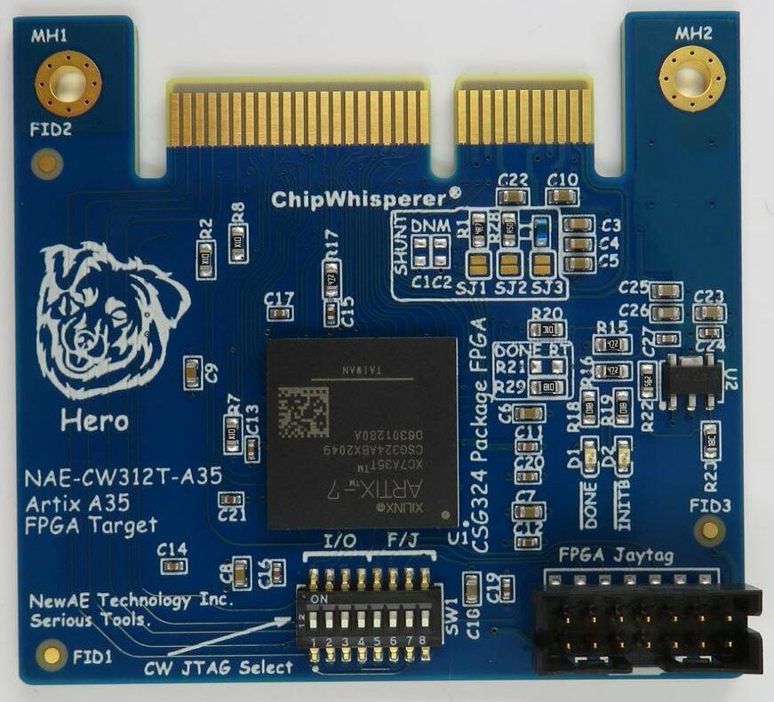

# CW312T-XC7A35

Xilinx Artix7 A35 Target for ChipWhisperer, with CW312 edge connector.



## JTAG Options
The target board has a Xilinx JTAG header (labeled "FPGA Jaytag" on the PCB)
which connects to the FPGA's JTAG port, for programming the FPGA via Xilinx
tools, or for using FPGA ILAs.

Additionally, the "CW JTAG Select" DIP switch provides some additional JTAG
routing options:
1. When switches 5-8 are "on", the JTAG header pins on the carrier CW313
   board (TDI, TDO, TMS, TCK) are routed to the FPGA's JTAG port.
2. When switches 1-4 are "on", the JTAG header pins on the carrier CW313
   board are routed to another set of FPGA pins (TDI, TDO, TMS, TCK to A11,
   C12, B11, B12 respectively), which allows connecting to e.g. a
   soft-core JTAG port.
Refer to the [schematic](#schematic) to see exactly how this is done.

## Shunt Selection
Because it's hard to have an optimal one-size-fits-all shunt for FPGA
targets, there are 3 shunts to choose from:

* 47 nH inductor

* 0.5 &Omega;

* 4.7 &Omega;

The active shunt is selected by a solder blob on SJ1, SJ2 or SJ3.

## Example Target Cores
The A35 target can run our example 
[AES](https://github.com/newaetech/chipwhisperer-jupyter/blob/master/demos/PA_HW_CW305_1-Attacking_AES_on_an_FPGA.ipynb), 
[pipelined AES](https://github.com/newaetech/chipwhisperer-jupyter/blob/master/demos/CW305_AES_pipelined.ipynb), and 
[ECC](https://github.com/newaetech/chipwhisperer-jupyter/tree/master/courses/sca204) 
cores. 

Pre-built bitfiles for all of these targets are included in the
ChipWhisperer repository, and can be explored via the notebooks (linked
above). To learn how to build these bitfiles yourself, head over to the
FPGA target area of the chipwhisperer repository
[here](https://github.com/newaetech/chipwhisperer/tree/develop/firmware/fpgas).

## Example Soft Cores
(ibex)=
### 1. Ibex
We also provide a bitfile for a pre-built 
[RISC-V Ibex core](https://github.com/lowRISC/ibex-demo-system).

To compile firmware for this target using our build infrastructure, set
`TARGET` to `CW312_IBEX`. This will pull in the 
[Ibex HAL](https://github.com/newaetech/chipwhisperer/tree/develop/firmware/mcu/hal/ibex).
Ensure you have a version of `riscv32-unknown-elf-gcc` [recommended by the
lowRISC project](https://github.com/lowRISC/lowrisc-toolchains/releases).
Then, compile target firmware 
[here](https://github.com/newaetech/chipwhisperer/tree/develop/firmware/mcu) 
as you would for any of our other targets.

Alternatively, you can also build target firmware from the 
[Ibex demo repository](https://github.com/lowRISC/ibex-demo-system#building-software)
following the Ibex methodology; there you will find our `simpleserial-aes` and
`basic-passwdcheck` firmware as examples.

After loading the FPGA bitfile (which can be done via the
[Setup\_Ibex.ipynb script](https://github.com/newaetech/chipwhisperer-jupyter/blob/master/Setup_Scripts/Setup_Ibex.ipynb), 
if using our pre-built bitfile), you'll need to program your target firmware
separately, using an external JTAG programmer connected to the A35's FPGA
JTAG port, *not the soft-core port* (e.g. connect your programmer
TDI/TDO/TCK/TMS to those header pins on the CW313 board, set DIP switches
5-8 to "on" on the A35 target board, and disconnect any other JTAG
programmer from the A35's "jaytag" header).

To program the firmware onto the FPGA soft-core, refer to the instructions
[here](https://github.com/lowRISC/ibex-demo-system#loading-an-application-to-the-programmed-fpga).
Those instructions run out-of-the-box on their default Arty FPGA platform;
you will likely need to modify their `load_demo_system.sh` script for your
own JTAG programmer.

Alternatively, you can avoid the firmware programming step by embedding your
target firmware into your FPGA bitfile; however, this requires you to build
the FPGA bitfile yourself (and re-building the bitfile every time you wish
to modify the firmware).

The pre-built Ibex core's UART link operates at 115200 baud when clocked at
100 MHz and is suitable for use with SimpleSerial v1 (the Ibex design
includes a PLL which expects a 100 MHz input clock; you can lower the clock
frequency and scale the baudrate accordingly, but only to a certain point
because the PLL will stop functioning correctly if the input clock frequency
is too far from 100 MHz).

### 2. Arm DesignStart
Look to our 
[Arm DesignStart repository](https://github.com/newaetech/CW305-Arm-DesignStart) 
for instructions on building and using a soft-core Arm Cortex target.


## Programming
The FPGA can be programmed with a Xilinx platform cable (or equivalent)
connected to the "Jaytag" port, as explained [above](#jtag-options).

It can also be programmed with a ChipWhisperer-Husky as follows:

```Python
import chipwhiserer as cw
scope = cw.scope()
from chipwhisperer.hardware.naeusb.programmer_targetfpga import CW312T_XC7A35T
fpga = CW312T_XC7A35T(scope)
fpga.program(<path-to-bitfile>, sck_speed=10e6)
```

When using our [example target cores and notebooks](#example-target-cores),
the notebooks automatically handle programming the correct bitfile for you
(via Husky).

## Schematic

The schematic is available
[here](https://github.com/newaetech/chipwhisperer-target-cw308t/blob/main/CW312T_XC7A35T/NAE-CW312T0XC7A35-04.PDF).

