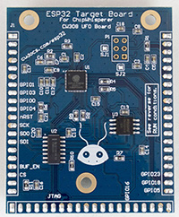
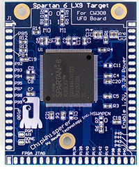
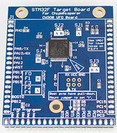
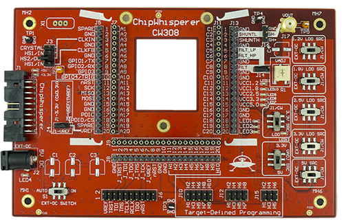

# ChipWhisperer CW308 Targets #

  

These are *targets* for the CW308 UFO Board. This repo contains gerbers, schematics, and source files (in Altium Designer format). Note **SOME BOARDS ARE UNTESTED**. All files are provided at your own risk. The CW308 UFO board is required for use (not part of this repo) as it supplies power, clock, programming headers etc:

Many of these target boards (along with UFO baseboard) can be purchased assembled via Mouser Electronics. Note all targets are available however, so if you want some of the latest targets you may need to build one.

Most (all?) of these boards support the ChipWhisperer example applications. That means a basic HAL is provided in [chipwhisperer/hardware/victims/firmware/hal](https://github.com/newaetech/chipwhisperer/tree/develop/hardware/victims/firmware/hal) . Some of the more unique boards do not build as part of that system due to complexity of porting (i.e., ESP32).

## Documentation ##

The documentation in each directory (the markdown README.md file) is mirrored to the ChipWhisperer.com main documentation page.

## Using Boards ##

To use the boards, you will require the following at minimum:

* CW308 UFO Baseboard
* Analysis/injection device: either (1) ChipWhisperer-Lite Capture or ChipWhisperer-Pro, or (2) oscilloscope.

If NOT using ChipWhisperer-Lite/Pro which have built-in power supply, serial comms, and clock generator:

* USB-Serial adapter (3.3V)
* Crystal on UFO board (included w/ UFO board)
* 2.1mm DC power jack and 5V power supply

For most boards you will also require:
* External programming tool.

The STM32Fx boards, XMEGA, and AVR boards can all be programmed from the ChipWhisperer platform. All other boards will require an external programmer at this time.

### Suggested programmers ###

* For ARM targets anything with 20-pin JTAG header such as J-Link, OpenOCD, etc.
* For PowerPC targets a PEMicro USB Multilink
* For Tri-Core targets DAP miniWiggler V3
* For ESP32 you only need a USB-Serial cable
* Others (Si4010, D2000, etc) may have unique requirements.

## FAQs ##

**Q**: Do these boards work stand-alone?

**A**: No. These boards require a CW308 UFO Base-Board. In addition you may need an external programmer to load code on many of them.

--

**Q**: What's the difference between these and dev-boards?

**A**: These boards are purpose-built for side-channel analysis. As such they have a shunt resistor mounted, along with missing decoupling capacitors to allow clean power measurements. You can hack up dev-boards to achieve this, but these CW308T boards make it considerably easier to do so, along with high repeatability.

--

**Q:** Why are these boards so expensive when there is nothing on it? I can buy a dev-kit with JTAG and everything for the cost of some of these boards!

**A:** Dev-boards have low cost as are produced in huge quantity and minimal profit margin. Due to the unique nature of our boards we typically are producing QTY 25-200 per "run", and many of the ICs alone are rather expensive at that point. For example a STM32F407 @ Qty 40 is $12 USD, and the "discovery" board with that chip mounted is only $20!

